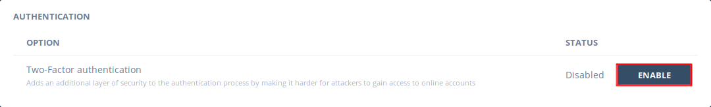
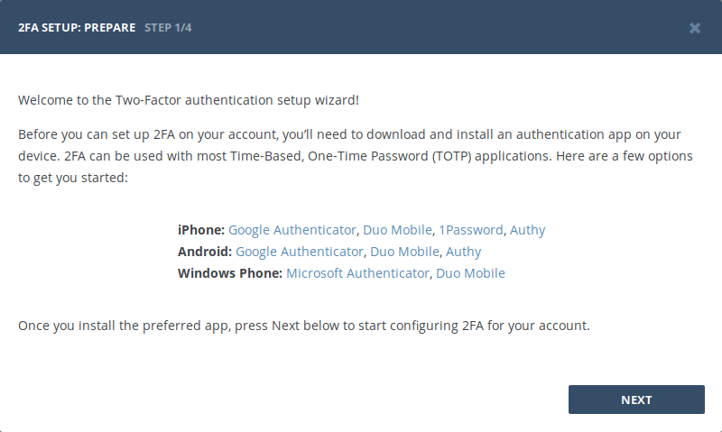
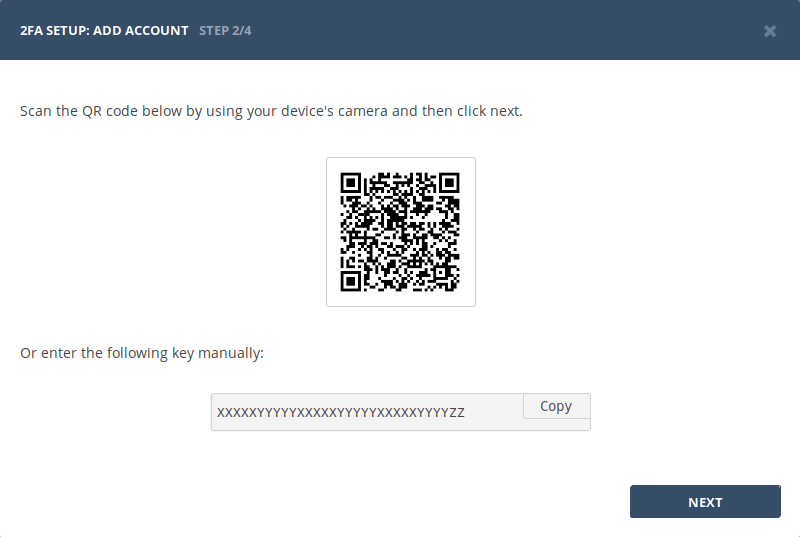
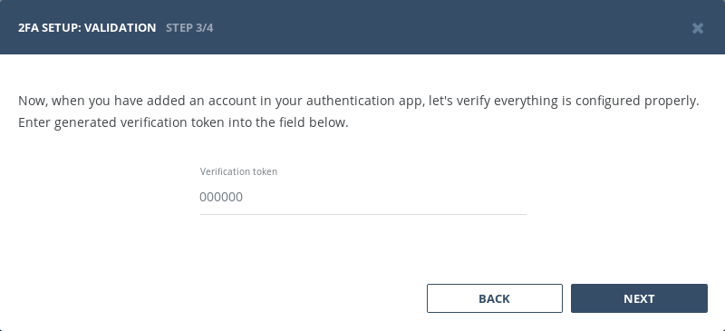
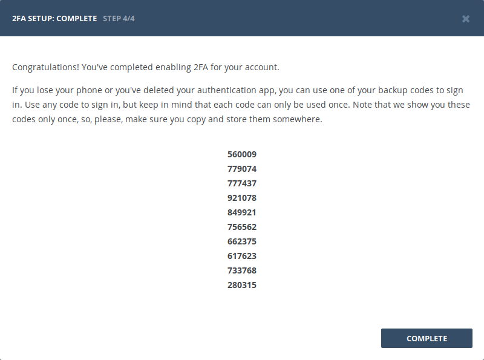

Two-factor authentication (also known as 2FA) is a type, or subset, of multi-factor authentication. It is a method of confirming users' claimed identities by using a combination of two different factors: 1) something they know, 2) something they have, or 3) something they are. 

Bugsee is using OTP protocol to request additional authentication information upon sign in.

## Configuration

Any user can enable two-factor authentication (2FA) to strengthen their account security. Navigate to your Bugsee [profile](https://app.bugsee.com/#/settings/user/profile) and in _"Authentication_" block click _"Enable_" next to the _"Two-Factor authentication"_.

On the first step, we offer a list of popular authentication apps Bugsee can work with. In fact, Bugsee is able to work with any auth app that supports OTP. If you already have such app installed, you may skip this step.

On the next step, Bugsee provides the information to configure your authentication application to work with Bugsee. Open you app and scan the shown QR code or manually specify the key if your app does not support QR codes.

Now, when you have configured your authentication application, it's time to check whether it was configured properly. Provide the verification token you authentication application is displaying for Bugsee on the next step.

If you have properly configured your authentication application and verification was passed successfully, 2FA will be enabled for your account and you will be provided with backup codes. Please, store them somewhere to later obtain access to your account if you will not be able to access your authentication application anymore.

Finally, click _"Complete"_ to close the wizard. Two-Factor authentication is now activated for your account.