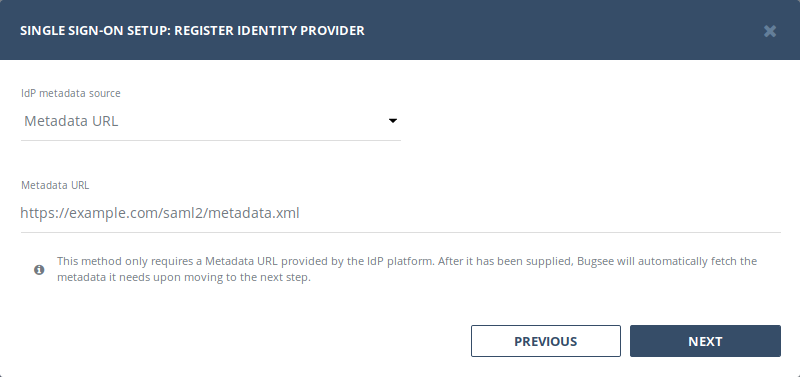
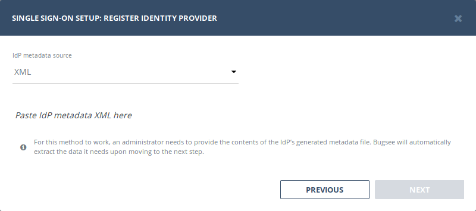
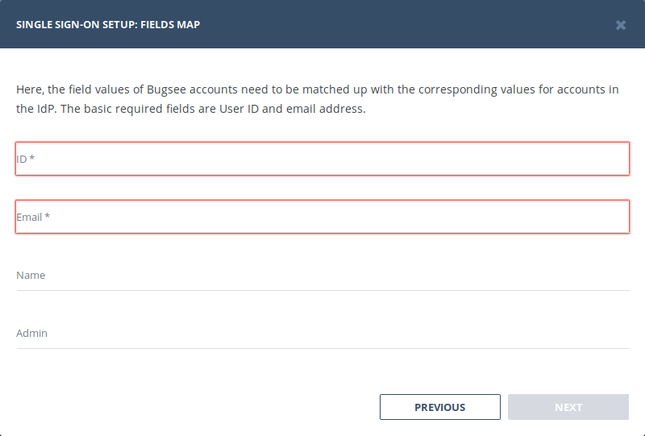
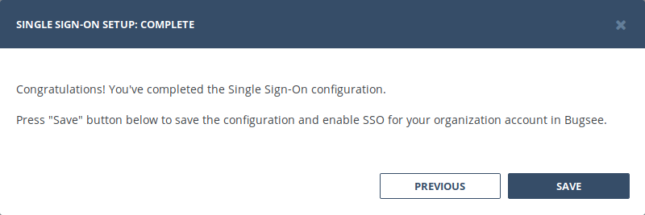
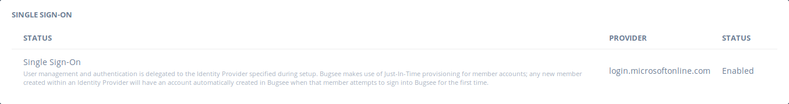

Bugsee provides a generic auth provider for SAML2 based authentication, which allows Admins of a Bugsee organization to manually configure any SAML2-enabled IdP system. Below are the general steps for integration.

## Setup

Bugsee supports the following SAML services:

Identity and Service Provider initiated SSO
Identity Provider initiated SLO (Single Logout)

### 1. Register Bugsee with IdP

Before connecting Bugsee to the Identity Provider (IdP), it’s important to first register Bugsee as an application on the IdP’s side. Bugsee's SAML endpoints are as follows, where the {organization_id} is substituted for your organization ID:


**Entity ID:**

```text
https://app.bugsee.com/{organization_id}
```
:::info
The **Entity ID** is a unique identifier for your organization’s Bugsee SAML application.
:::

<br />


**ACS:**

```text
https://api.bugsee.com/v2/auth/saml/acs/{organization_id}
```

:::info
**ACS** means Assertion Consumer Service, and is used for establishing a session based on rules made between your IdP and the service provider it is integrating with. Please note: Bugsee’s ACS endpoint uses HTTP-POST bindings
:::

<br />


**SLS:**

```text
https://api.bugsee.com/v2/auth/saml/sls/{organization_id}
```

:::info
**SLS** stands for Single Logout Service, and is used to address logout requests from the IdP.
:::

<br />


**Single Sign On URL:**

```text
https://app.bugsee.com/#/signin?sso_target={organization_id}
```

:::info
**Single Sign On URL** is used to start Service Provider initiated authentication right away. It forcefully instruct Bugsee to authenticate user into the specified organization.
:::

<br />


**Metadata:**

```text
https://api.bugsee.com/v2/auth/saml/metadata/{organization_id}
```

:::info
**Metadata** refers to the configuration data for an IdP or an SP. In this case, the Metadata endpoint in Bugsee refers to your Bugsee organization’s metadata on the Service Provider end.
:::


### 2. Register IdP with Bugsee

There are two methods for registering your IdP with Bugsee: Metadata and XML. Each method is described below and will produce the same end result.

#### Using Metadata URL

This method only requires a Metadata URL provided by the IdP platform. After it has been supplied, Bugsee will automatically fetch the metadata it needs.



#### Using Provider XML

For this method to work, an administrator needs to provide the contents of the IdP’s generated metadata file. Once the contents are pasted directly into the text field, Bugsee will do the rest.




Here’s an example of what the Metadata XML contents look like.

```xml
<?xml version="1.0" encoding="UTF-8"?>
<EntityDescriptor xmlns="urn:oasis:names:tc:SAML:2.0:metadata" ID="00000000-0000-0000-0000-272f3f1b048d" entityID="https://sts.windows.net/00000000-0000-0000-0000-53fb3b9ed0e3/">
    <IDPSSODescriptor protocolSupportEnumeration="urn:oasis:names:tc:SAML:2.0:protocol">
        <KeyDescriptor use="signing">
            <KeyInfo xmlns="http://www.w3.org/2000/09/xmldsig#">
                <X509Data>
                    <X509Certificate>...</X509Certificate>
                </X509Data>
            </KeyInfo>
        </KeyDescriptor>
        <SingleLogoutService Binding="urn:oasis:names:tc:SAML:2.0:bindings:HTTP-Redirect" Location="https://login.microsoftonline.com/00000000-0000-0000-0000-53fb3b9ed0e3/saml2" />
        <SingleSignOnService Binding="urn:oasis:names:tc:SAML:2.0:bindings:HTTP-Redirect" Location="https://login.microsoftonline.com/00000000-0000-0000-0000-53fb3b9ed0e3/saml2" />
        <SingleSignOnService Binding="urn:oasis:names:tc:SAML:2.0:bindings:HTTP-POST" Location="https://login.microsoftonline.com/00000000-0000-0000-a484-53fb3b9ed0e3/saml2" />
    </IDPSSODescriptor>
</EntityDescriptor>
```

### 3. Map IdP Attributes

:::warning
Metadata field names can vary from one provider to another. For example, Microsoft Azure AD refers to these very metadata fields as Claims, while AWS refers to them as Attributes. Similarly, one platform might use user.email, while another vendor uses emailaddress.
:::

Here, the field values of Bugsee members need to be matched up with the corresponding values for members in the IdP. The basic required fields are the IdP’s User ID and email address, but Bugsee can also optionally pull name and admin flag values from there as well.




### 4. Complete and save SSO configuration



Once the SAML integration flow is complete, the related section in Company settings page will reflect the status of a successful integration.



Bugsee uses Just-In-Time (JIT) provisioning, thus new members are registered with Bugsee automatically during their first login attempt with SAML SSO. These accounts will have their membership type set to User and will not have access to any app by default. Admins in your organization will have to grant each user access to the appropriate applications within Bugsee.


## Examples

- [Configuring SSO in AWS](instructions/config-aws/)
- [Configuring SSO in Azure](instructions/config-azure/)
- [Configuring SSO in Google Workspace](instructions/config-gsuite/)
- [Configuring SSO in JumpCloud](instructions/config-jumpcloud/)