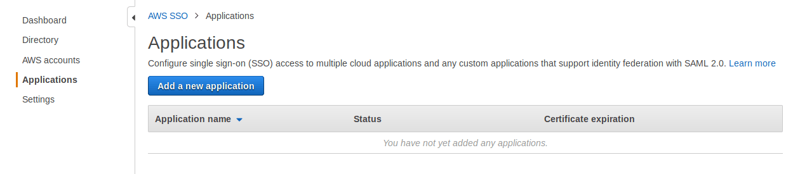
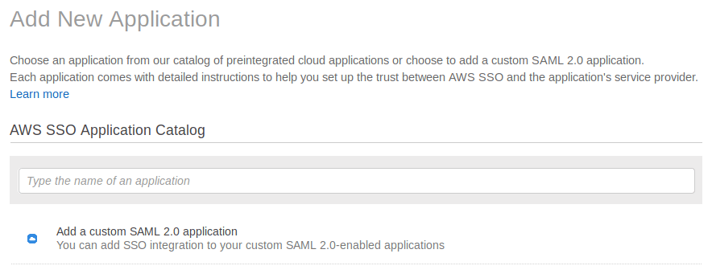
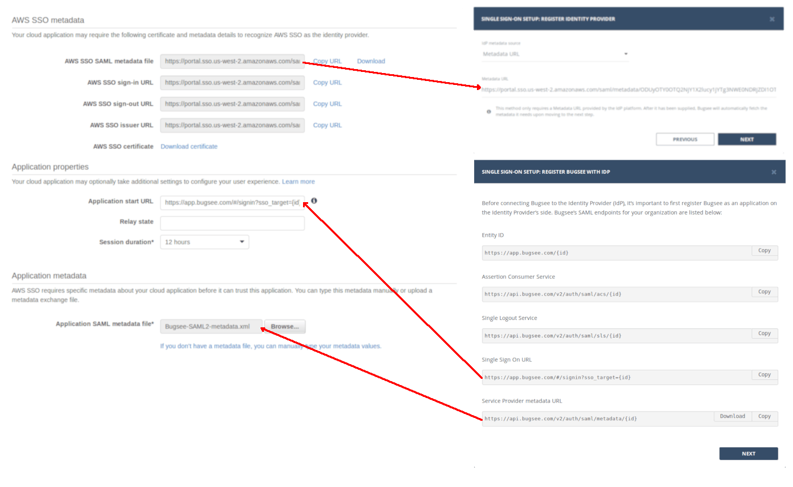
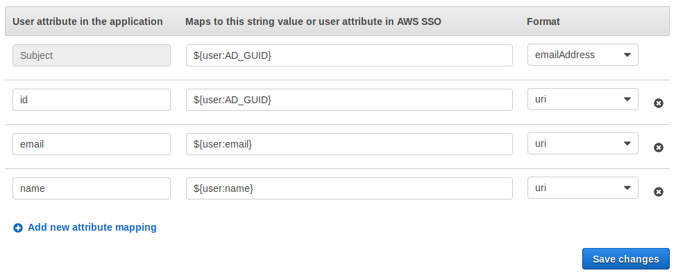

AWS Single Sign-On (SSO) is a cloud SSO service that makes it easy to centrally manage SSO access to multiple AWS accounts and business applications. You can read more about it on [AWS Single Sign-On website](https://aws.amazon.com/single-sign-on/).

## Configuration

Navigate to the SSO within your AWS console and switch to _Applications_ section.

Now Click _"Add a new application"_ and then click _"Add a custom SAML 2.0 application "_.

Fill _"Name"_ and _"Description"_ fields with the desired values

Next, you need to exchange metadata between Bugsee and AWS SSO. On the first step of Bugsee SSO setup wizard, click _"Download"_ for _"Service Provider metadata URL"_. Now use the downloaded file for _"Application SAML metadata file"_ in AWS SSO configuration page. Simultaneously, copy the url in _"AWS SSO SAML metadata file"_ field by clicking _"Copy URL"_ next to it. Paste that URL into _"Metadata URL"_ field in the second step of Bugsee's SSO setup wizard dialog.

Now click _"Save changes"_ at the bottom of the page.

As the next step, you need to configure attributes mapping to let SSO work. Switch to the _"Attribute mappings"_ tab and configure the fields in the following manner:

:::info
You can read more about possible attribute values [here](https://docs.aws.amazon.com/singlesignon/latest/userguide/attributemappingsconcept.html?icmpid=docs_sso_console).
:::

Copy the attributes names. You must provide the same names in the Bugsee's SSO setup wizard dialog when prompted. Also, as _"Format"_ for _"Subject"_ use _"emailAddress"_ and for the rest fields use _"uri"_.

That's all the steps required to configure SSO in AWS console. Complete the configuration of SSO in Bugsee and you're all set.