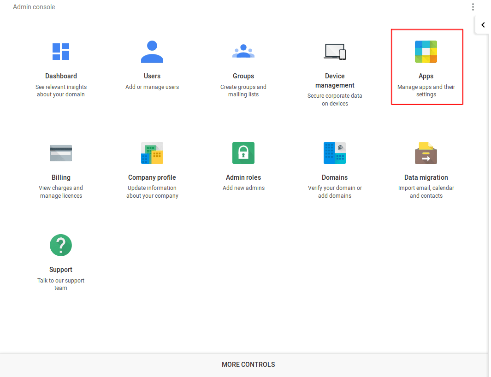
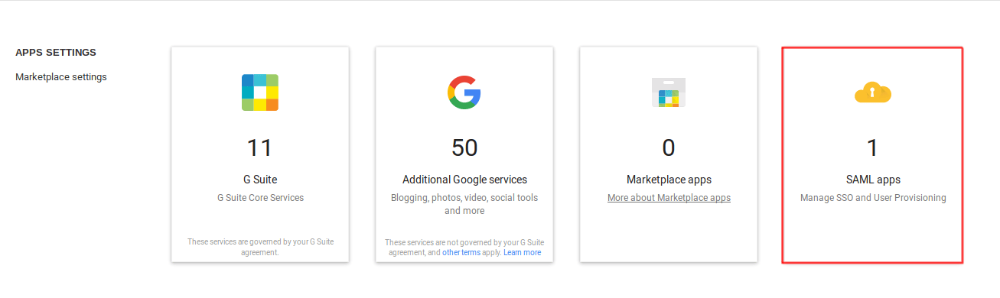
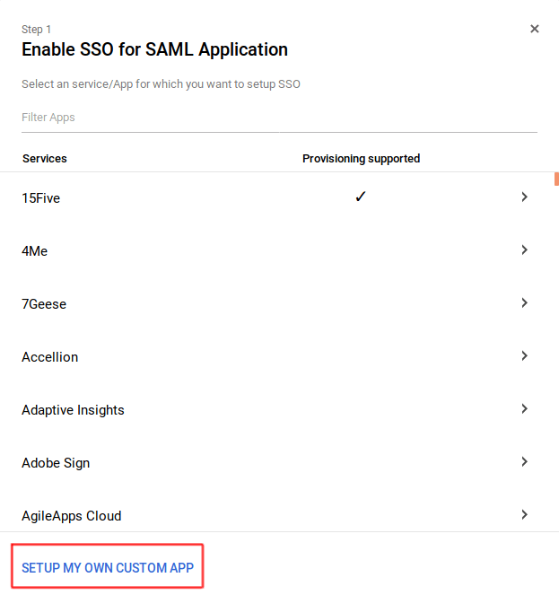
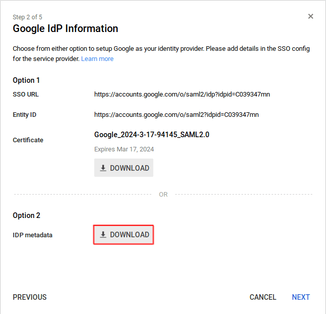
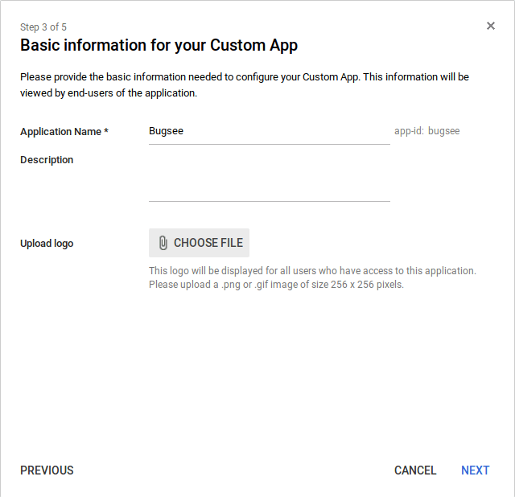
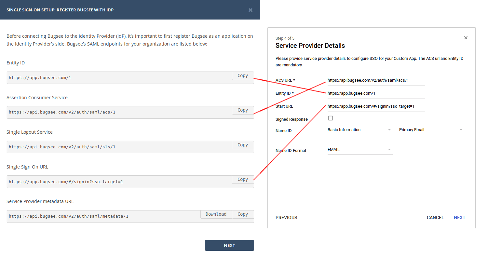
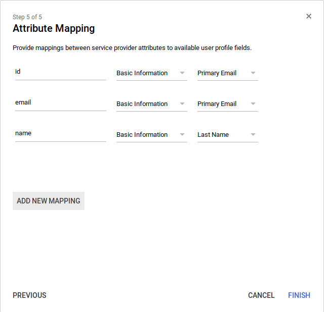
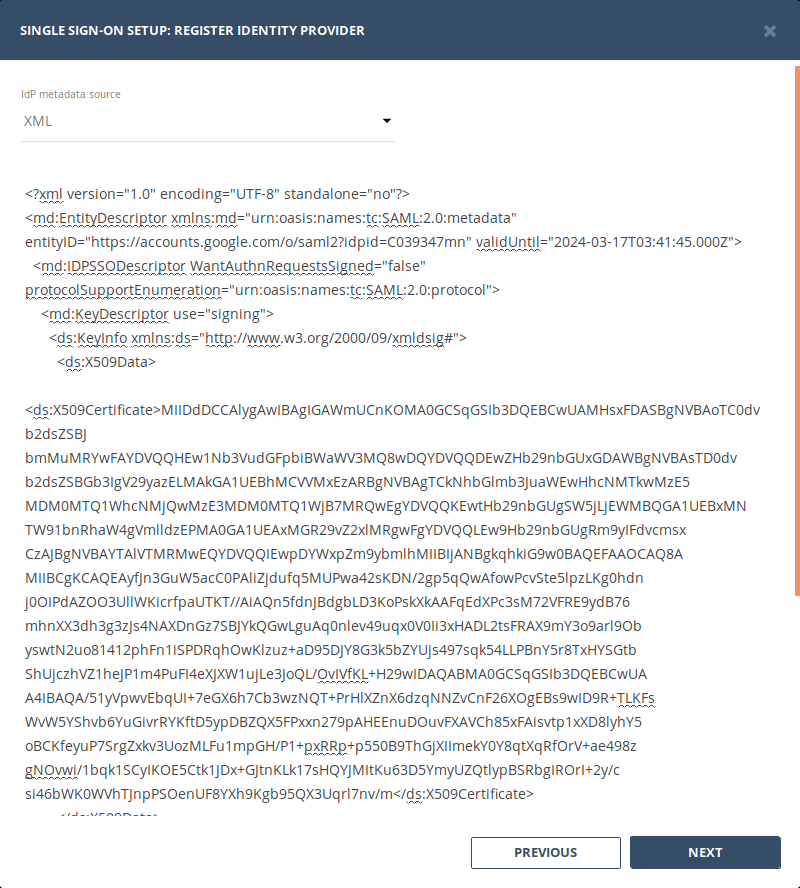

## Configuration

Go to your Google Workspace administration dashboard (Usually, it's [https://admin.google.com](https://admin.google.com)) and there, open "Apps" settings.

Next, navigate to the "SAML apps"

From there, click the _"plus"_ button at the bottom right corner of the page to bring up the _"Enable SSO for SAML Application"_ dialog. Within that dialog, click _"Setup my own custom app"_ at the bottom.

Click _"Download"_ button in _"Option 2"_ to download the XML metadata for the IdP. Keep it for now, we will use it later.

On the next step, fill the _"Application name"_, _"Description"_ and _"Logo"_.

Now, on _"Service Provider Details"_ step, you need to fill information available in _"SSO setup"_ wizard in Bugsee. Please, follow the instructions shown in the screenshot below.

Finally, on the _"Attribute Mapping"_ step, you need to list attributes that will be available to Bugsee (as Service Provider). Please, follow the instructions shown in the screenshot below. Copy the attributes names. You must provide the same names in the Bugsee's SSO setup wizard dialog when prompted.

:::info
Note that Bugsee is using single field to store user name, while Google Workspace does not provide similar one by default. In this tutorial, we use "Last name" as the target value for the "name" attribute.
:::

Now, remember the IdP metadata file you've downloaded. Open it, copy its contents. On the second step in _"SSO setup"_ wizard in Bugsee dashboard select _"XML"_ as Idp metadata source and paste the copied contents.

That's all the steps required to configure SSO in Google Workspace. Complete the configuration of SSO in Bugsee and you're all set.