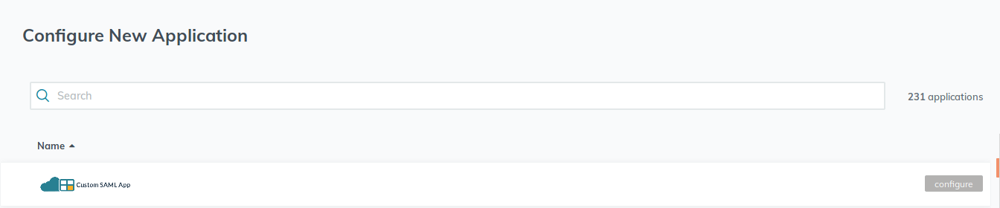
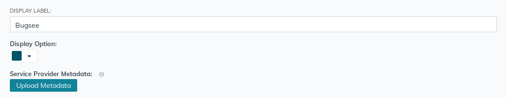
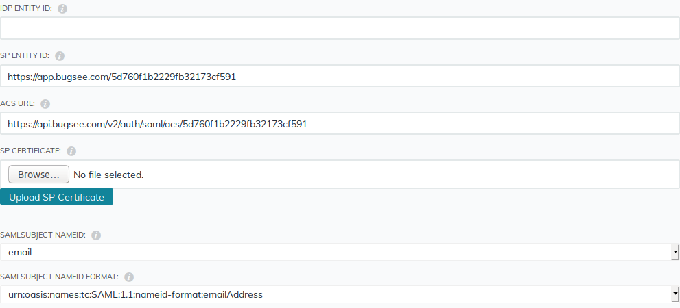
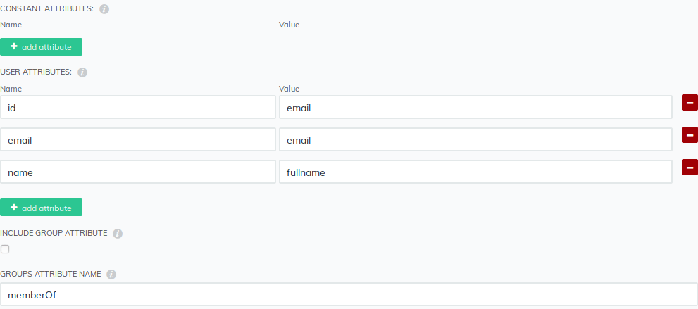
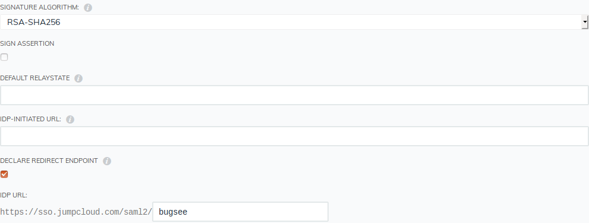
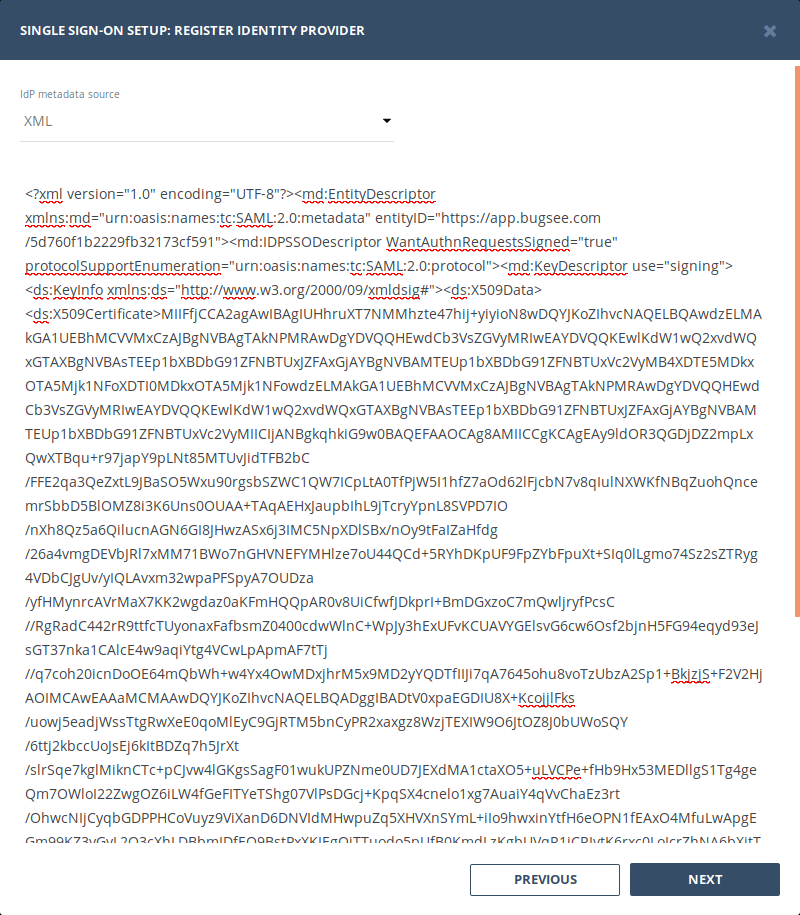
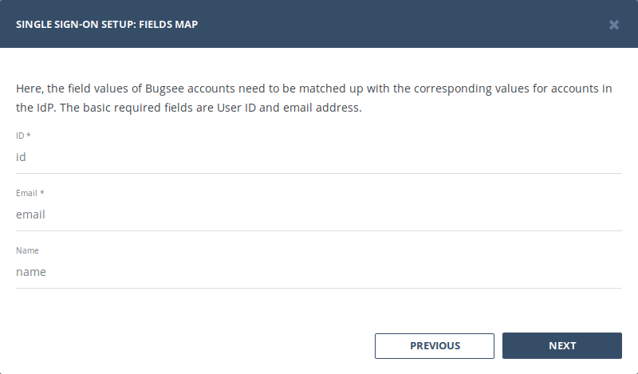

## Configuration

Navigate to your [JumpCloud](https://console.jumpcloud.com/#/applications) and switch to _"Applications"_ section. Click on the _"Plus"_ button (show in the screenshot below) to add new application.

In _"Configure New Application"_ pane, locate the _"Custom SAML App"_ item (usually it's the first item in the list) and click _"configure"_ button inside it.

Set **Bugsee** as the _"Display label"_ field value and optionally pick the color for that app. Now, in Bugsee's web dashboard, bring up the SSO setup wizard. On the first step of Bugsee SSO setup wizard, click _"Download"_ for _"Service Provider metadata URL"_. Now use the downloaded file for _"Service Provider Metadata"_ in JumpCloud application configuration page (Click _"Upload Metadata"_ and select the downloaded file).

Once upload completes, some of the fields will be populated automatically as shown. Notice, that _"IDP Entity ID_" is not filled. Just copy and paste the value from _"SP Entity ID"_ to _"IDP Entity ID_".

Next, we need to configure **user** attributes. They will contain information about the user being authenticated and must match to the values specified in the _"Fields Map_" step in Bugsee SSO setup wizard. Follow the visual instructions below.

Remember and/or make note of the attributes' names you've used. We will need them later in Bugsee SSO setup wizard.

:::info
You can read more about user attributes available in JumpCloud in their [Knowledge base article](https://support.jumpcloud.com/s/article/configuring-user-attributes-for-saml-connectors-2019-08-21-10-36-47)
:::

Now, make sure _"Sign assertion_" is not checked and _"Declare redirect endpoint"_ is, on the contrary, is checked. Fill in _"IdP-initiated URL"_ **only** if you want to force the _"SP-initiated authentication SSO"_ (Bugsee supports both SP- and IdP-initiated authentication SSO). As the last segment in _"IdP URL"_ put "bugsee".

Finally, click _"activate"_ button at the bottom and then _"continue"_ in the confirmation popup dialog.

Now you have your application configured in JumpCloud. Next, we will need to configure Bugsee to complete the SSO setup. Before we switch to Bugsee, we need to export IdP metadata for the created application in JumpCloud. You have two options:

- In the list of application in JumpCloud, set check next to the newly created one Bugsee application. Then in the top-right corner, click _"export metadata"_ button.
- Click the newly created application in JumpCloud to bring up its configuration settings pane. At its bottom, click _"export metadata"_ link.

Once you have the metadata file, switch over to Bugsee web dashboard to continue configuring SSO there. Click _"Next"_ to switch to the second step. Select _"XML"_ for the _"IdP metadata source"_ and paste the contents of the downloaded IdP metadata file from JumpCloud into corresponding field.

Click _"Next"_. Now, at the _"Fields Map"_ step, we need to put the names of the fields we have defined in the application settings in JumpCloud. Put the values like it's shown below

Finally, go through the remaining steps in the wizard (which are very simple) and you're done with configuring SSO.