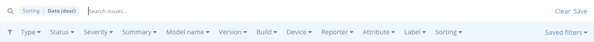
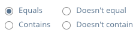
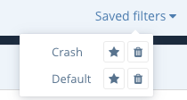

Bugsee has versatile and flexible search capabilities. To let you precisely configure your query, Bugsee provides easy to use yet powerful UI. You can see the search bar from issues list at the screenshot below.

It's divided into two zones: input area and filters area. Input area contains visual labels that show you currently active filters. There is also free text search input in that area. Use it to look for items by providing desired search term.

Filters area contains all the possible set of fields eligible to be used as search params. Depending on the field type it can let you check multiple options, single option and provide a value in a free-text form. Additionally, when a free-text form is used, you can adjust the comparison technique. Available options are shown at the screenshot below.

Sometimes, you want to persist you search criteria to reuse at a later time. "Saved filters" were designed exactly for that. If you want to save you search criteria and reuse it later, just click "Save" in the right side of the search bar. Provide meaningful name for the search criteria you're about to save and click "Save" inside the popup. Now, you will see the saved search criteria in the "Saved filters" dropdown whenever you open it.

If you want some criteria to be applied by default, you can click at star icon in the corresponding row within the list of saved configurations. As you may guessed, clicking at the trash icon will let you delete the assigned configuration.