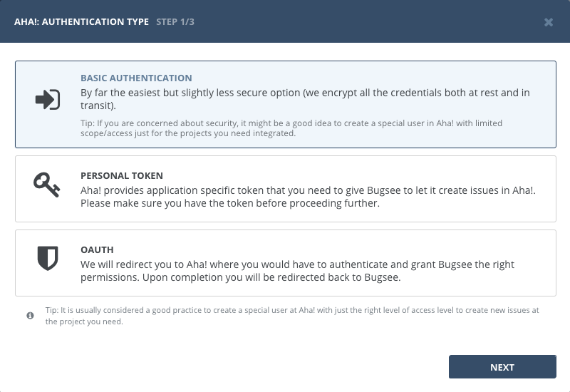
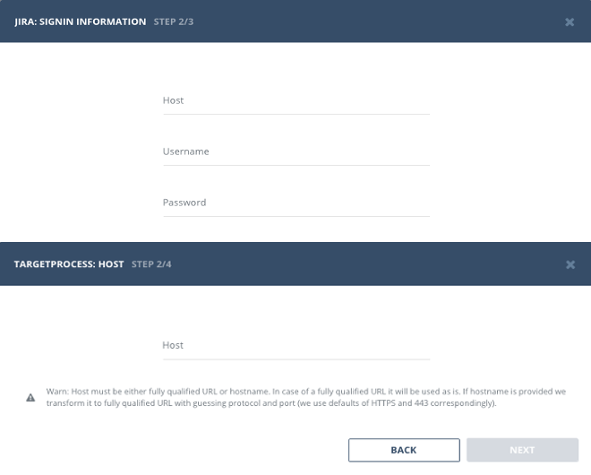
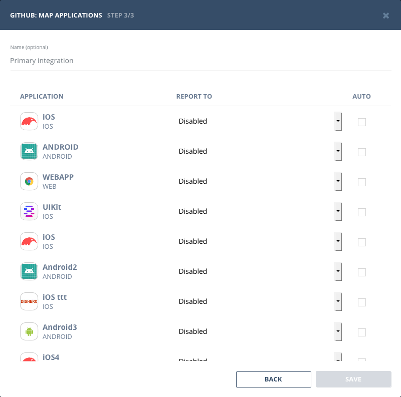
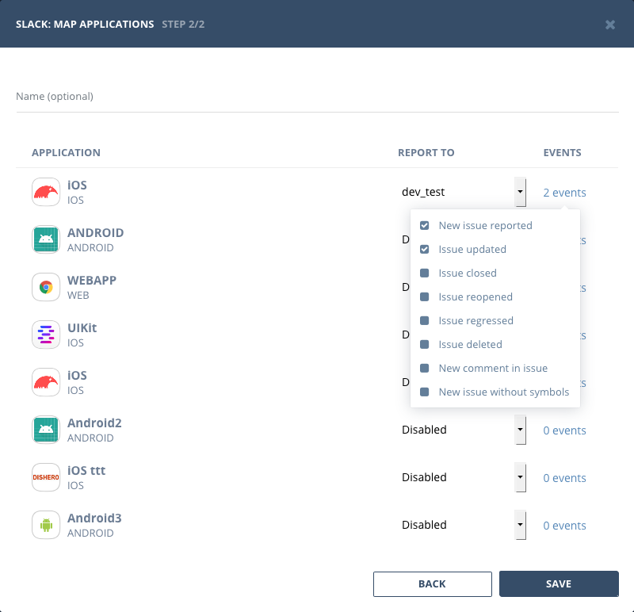

## Overview

We've designed the setup flow for integrations to be based upon wizards with sets of simple steps. Mostly integration flows have similar steps sequence, but there can be some discrepancies as requirements differ from one integration to another.

The absolute minimal set of steps is (they do not correlate with wizard titles):

- Authentication
- Mapping applications

## Generic steps

### Authentication type selection

Regardless of the integration, its setup starts with selection of authentication type (all the available authentication types in [integrations authentication](/integrations/auth/) section). Bugsee supports:

- Basic authentication
- Token based authentication
- OAuth

### Authentication

In case of either basic or token based types, _Authentication_ step will display a form where authentication info must be provided. There can be some variations in the fields required to be filled.

If remote service allows self-hosting (on-premise) or uses sub-domains, wizard will display _"Host"_ field. It must be filled with correct URL pointing to the remote service location.

### Mapping applications

When authentication step is successfully completed, wizard proceeds to the final step - applications mappings. Here, you should establish connection between Bugsee applications and remote service entities (projects, applications, boards, etc).

If you plan to create multiple integrations using single provider (e.g. 3 GitHub integrations), it's recommended to name each of them uniquely so that you will be able to easily identify each of them later. To give integration a name, fill the _"Name"_ fields at the top of the dialog window with the appropriate value. Use screenshot below as a reference. To let you identify an integration even better you can specify color which will be used when displaying icons/indicators for the corresponding integration.

Mapping can be disabled for any application by selecting _"Disabled"_ from the list. In that case no data will be pushed when something happens in corresponding Bugsee application.

Un-check _"Auto"_ option to prevent Bugsee from automatically pushing data to remote service when related event is triggered (it is checked by default for non-disabled mappings).

Another option available for each mapped application is custom recipes. They allow you to customize the data pushed to remote service. You can learn more about them [here](/integrations/recipes/recipes/).

Note, that mapping step will differ depending on a tool type you're integrating with. For bug tracking and collaboration tools (Jira, GitHub, etc) integration flow is always issue-based. That is, all the data and actions are bound to issue. That final step for these tools will look like this:

However, for messengers and other notification tools (Slack, Hipchat, Microsoft Teams) integration flow is event-based. Such tools do not have an entity within themselves we can bound data to, that's why we just send notifications when some event occurs. You can check/uncheck events for each application you want receive notifications about. The step for these tools will look like this:

