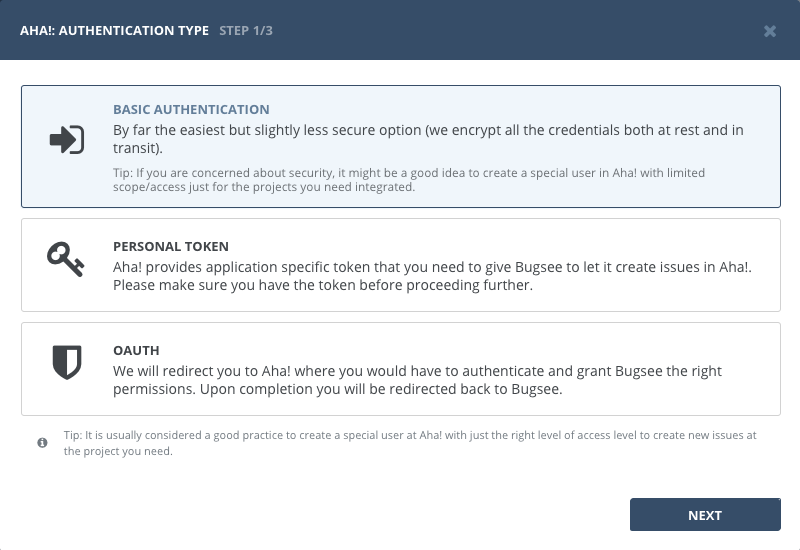
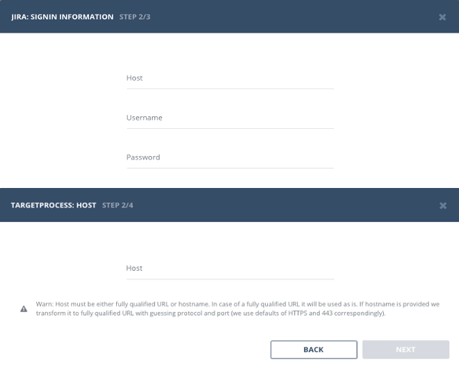
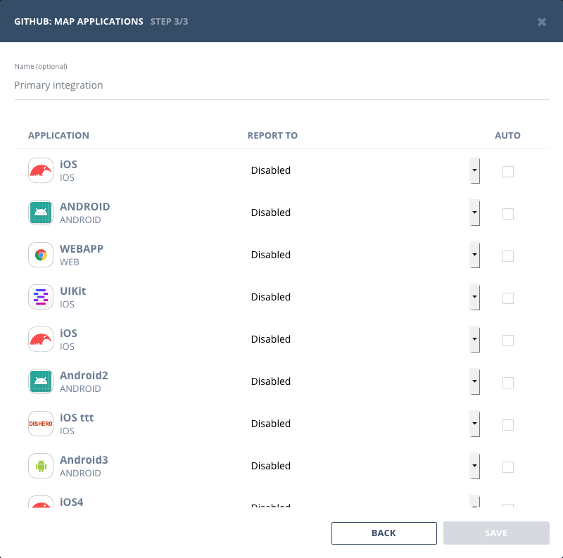
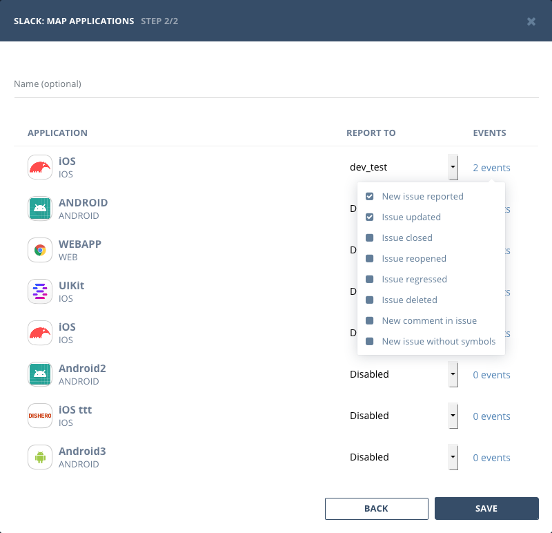

## Overview

We've designed the setup flow for integrations to be based upon wizards with sets of simple steps. Most integration flows have a similar sequence of steps, but there can be some discrepancies as requirements differ from one integration to another.

The absolute minimal set of steps is (they do not correlate with wizard titles):

- Authentication
- Mapping applications

## Generic steps

### Authentication type selection

Regardless of the integration, its setup starts with selection of authentication type (all the available authentication types in [integrations authentication](/integrations/auth/) section). Bugsee supports:

- Basic authentication
- Personal token
- OAuth

Not every integration offers all three — the wizard only shows the methods that tool supports, and where only one is available the step is skipped. Jira additionally asks whether your instance is Cloud-based or on-premise, and offers both OAuth 2.0 and the deprecated OAuth 1.0a. The [integrations index](/integrations/) lists the methods available for each integration.

### Authentication

In case of either basic or token based types, _Authentication_ step will display a form where authentication info must be provided. There can be some variations in the fields required to be filled.

If remote service allows self-hosting (on-premise) or uses sub-domains, wizard will display _"Host"_ field. It must be filled with correct URL pointing to the remote service location.

### Mapping applications

When authentication step is successfully completed, wizard proceeds to the final step - applications mappings. Here, you should establish connection between Bugsee applications and remote service entities (projects, applications, boards, etc).

If you plan to create multiple integrations using single provider (e.g. 3 GitHub integrations), it's recommended to name each of them uniquely so that you will be able to easily identify each of them later. Fill in the _"Name (optional)"_ field at the top of the dialog window with the appropriate value. Use screenshot below as a reference. To let you identify an integration even better you can set _"Color (optional)"_, which is used when displaying icons/indicators for the corresponding integration. Both apply to the integration as a whole, not to an individual application mapping.

Mapping can be disabled for any application by selecting _"Disabled"_ from the list. In that case no data will be pushed when something happens in corresponding Bugsee application.

Un-check _"Auto"_ option to prevent Bugsee from automatically pushing data to remote service when related event is triggered (it is checked by default for non-disabled mappings).

Another option available for each mapped application is custom recipes. They allow you to customize the data pushed to remote service. Use _"Add recipe"_ / _"Edit recipe"_ in the row's menu; a row that already has one is marked with an _"R"_ badge. You can learn more about them [here](/integrations/recipes/recipes/).

Each mapped application also has a _"Relay"_ option, which is off by default. Turn it on to forward [Notification Relay](/sdk/android/notification-relay/) messages sent with `Bugsee.notify` to this mapping. Relayed notifications are independent of the events described below, and of the _"Auto"_ option.

When integrating with Jira, the mapping row additionally offers an _"Issue type"_ selector controlling which issue type new reports are created as. Leave it on _"(auto-detect)"_ to let Bugsee pick a suitable type from the target project.

Note, that mapping step will differ depending on a tool type you're integrating with. For bug tracking and collaboration tools (Jira, GitHub, etc) integration flow is always issue-based. That is, all the data and actions are bound to issue. That final step for these tools will look like this:

However, for messengers and other notification tools (Slack, Microsoft Teams) integration flow is event-based. Such tools do not have an entity within themselves we can bound data to, that's why we just send notifications when some event occurs. You can check/uncheck events for each application you want receive notifications about. The step for these tools will look like this:

