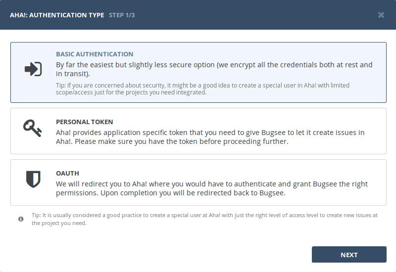
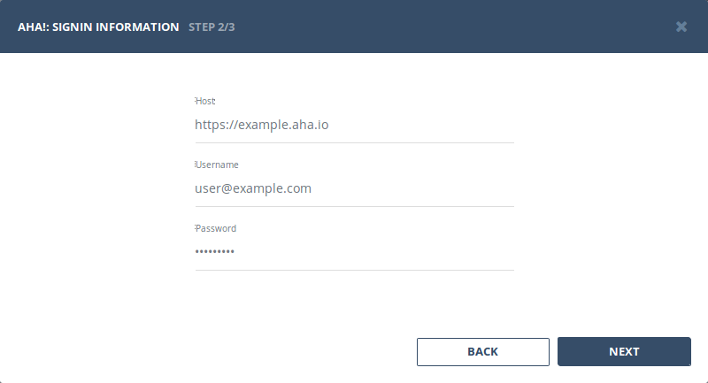
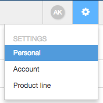
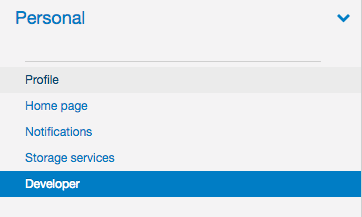
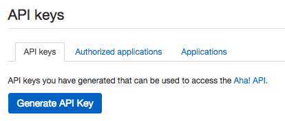
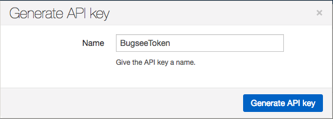
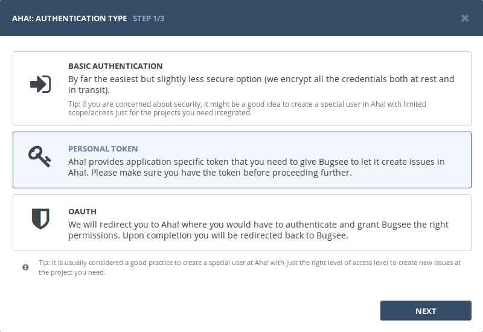
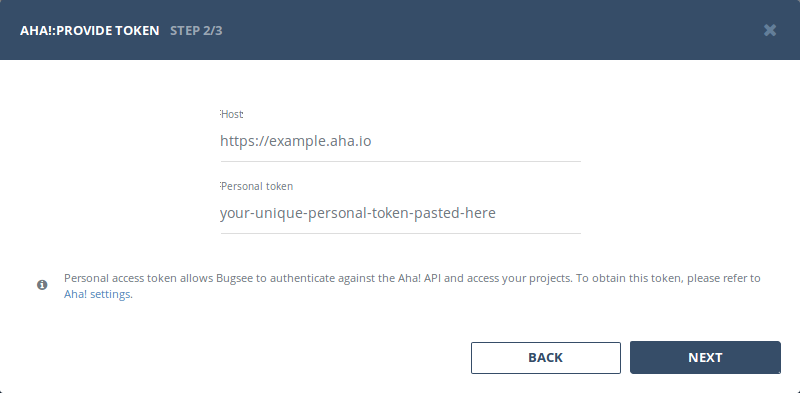
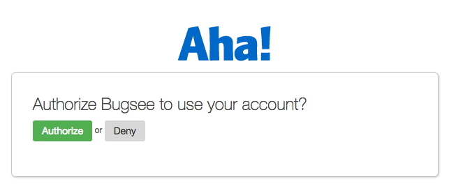

## Authentication

### Supported authentication methods

- [Basic (username and password)](#basic-authentication)
- [Personal token](#personal-token)
- [OAuth](#oauth)


### Basic authentication

:::info
No custom configuration required in Aha! for this type of authentication.
:::

Select "Basic authentication" in the first step of integration wizard. Click "Next".



Provide valid host (URL to your Aha!), username and password.




### Personal token

To proceed with this authentication type you need to obtain API token from Aha!. Steps below will instruct you how to do that.

Go to _Personal_ page of your Aha! settings.



Then in left pane switch to _Developer_ section.



Now switch to _API keys_ tab and click _Generate API Key_ button.



Give it some unique name and click _Generate API Key_ button within that dialog.



Click _Generate API key_ to create new token. Don't forget to copy it.

Now, when you've obtained a token, let's configure integration in Bugsee.

Start Bugsee integration wizard and select _"Personal token"_ authentication type. Click _"Next"_.



Provide valid host (URL to your Aha!) and paste generated token.




### OAuth

Select "OAuth" in the first step of integration wizard. Click _Next_.


You will be presented with dialog asking you to authorize Bugsee. Click _Authorize_ to allow Bugsee access your Aha!




## Configuration

There are no any specific configuration steps for Aha!. Refer to <a href="/integrations/configuration/">configuration</a> section for description about generic steps.


## Custom recipes

Bugsee can accommodate all these customizations with the help of [custom recipes](/integrations/recipes/recipes/). This section provides a few examples of using custom recipes specifically with Aha!. For basic introduction, refer to custom recipe [documentation](/integrations/recipes/recipes/).

### Setting tags field

By default Bugsee creates and updates Aha! ideas with Bugsee issue _labels_ as Aha! _tags_. But _labels_ list can be overridden inside your custom recipe. For example you can add some new _label_ (Aha! _tag_) to existing ones:

```javascript
function create(context) {
	// ....

    return {
    	// ...
    	labels: [...issue.labels, "My awesome tag"]
    };
}

function update(context, changes) {
	const result = {};
	// ...
    
    if (changes.labels) {
        result.labels = [...changes.labels.to, "My awesome tag"];
    }

	return {
        issue: {
            custom: {}
        },
        changes: result
    };
}
```
