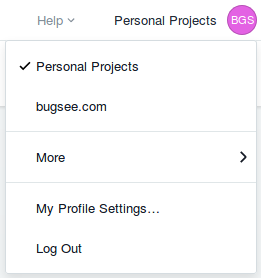
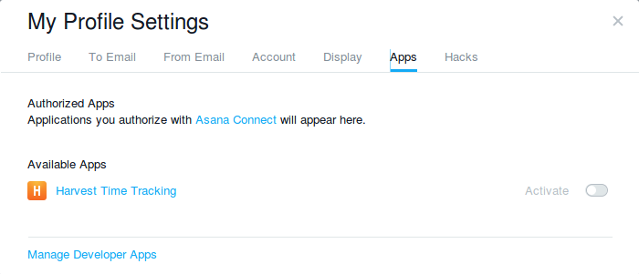
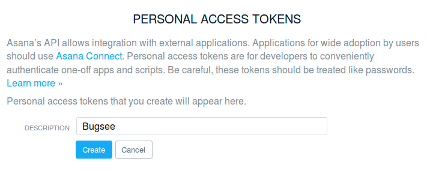
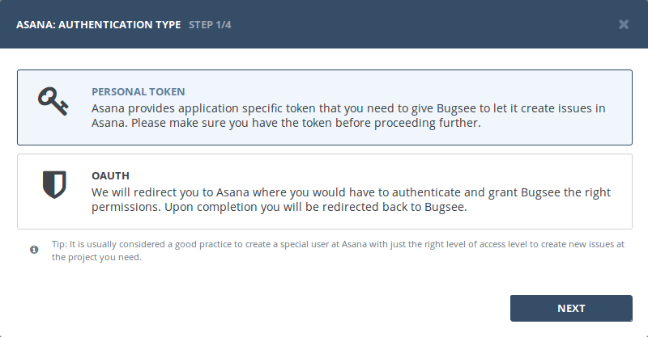
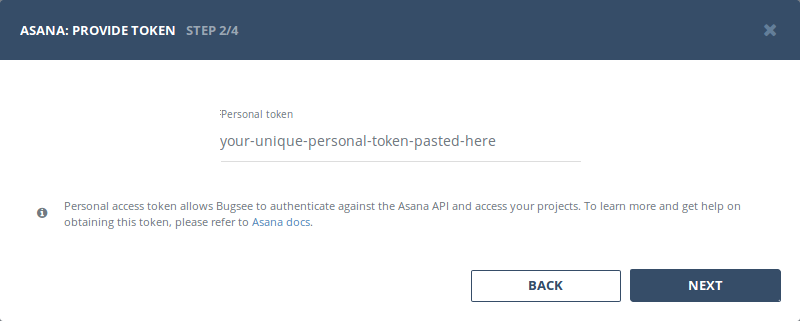
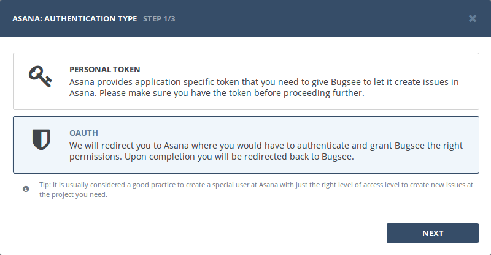
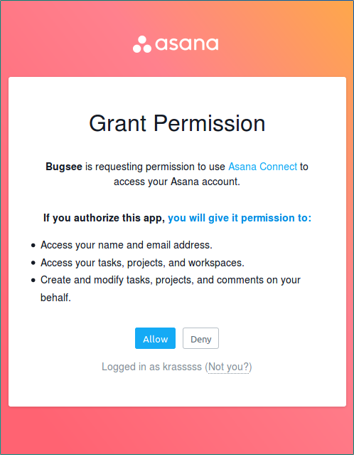
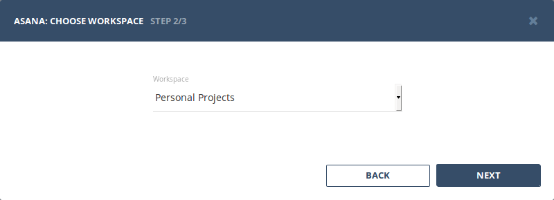
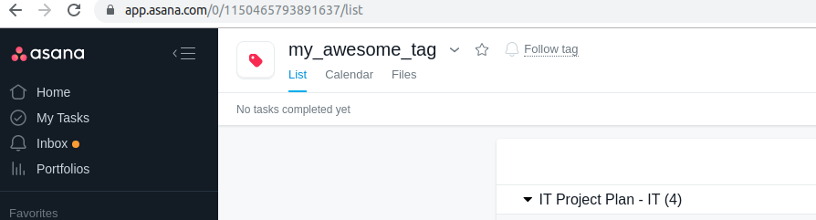

## Authentication

### Supported authentication methods

- [Personal token](#personal-token)
- [OAuth](#oauth)


### Personal token

To proceed with this authentication type you need to obtain API token from Asana. Steps below will instruct you how to do that.

Open Asana. Reveal user menu by clicking on your avatar icon in header and then click _"My Profile Settings..."_ there.



In _"My Profile Settings"_ popup switch to _Apps_ tab. Click _"Manage Developer Apps"_ at its bottom.




Now, we're interested in _"Personal Access Tokens"_ area. Click _"+ Create New Personal Access Token"_ link in there. Provide your token with unique name and finally click _"Create"_.



Don't forget to copy the token. Once hidden, it won't appear again any more.

Now, when you've obtained a token, let's configure integration in Bugsee. Select _"Personal token"_ authentication type and click _"Next"_.



Paste generated token into _"Personal token"_ field and click _"Next"_ to proceed.




### OAuth

Select _"OAuth"_ authentication type and click _"Next"_.



You will be presented with the following window asking you to grant Bugsee permissions to access you Asana. Click _"Allow"_ to give Bugsee requested permissions.



## Configuration

:::info
We describe here only specific configuration steps for Asana. Generic steps are described in [configuration](/integrations/configuration/) section. Refer to it for more details.
:::

All the projects in Asana are bound to workspaces. So, if you have more than one workspace, you will be prompted to choose the workspace:




## Custom recipes

Bugsee can accommodate all these customizations with the help of [custom recipes](/integrations/recipes/recipes/). This section provides a few examples of using custom recipes specifically with Asana. For basic introduction, refer to custom recipe [documentation](/integrations/recipes/recipes/).

### Setting tags field

Bugsee can't map its own issues _labels_ field to Asana _tags_. But you can specify appropriate _tags_ via _custom_ field inside custom recipes:

```javascript
function create(context) {
	// ....

    return {
    	// ...
    	custom: {
    		// This example sets tag by its ID
    		tags: ["1150465793891637"]
    	}
    };
}
```


You can find ID of the tag in URL of your tag's page:

