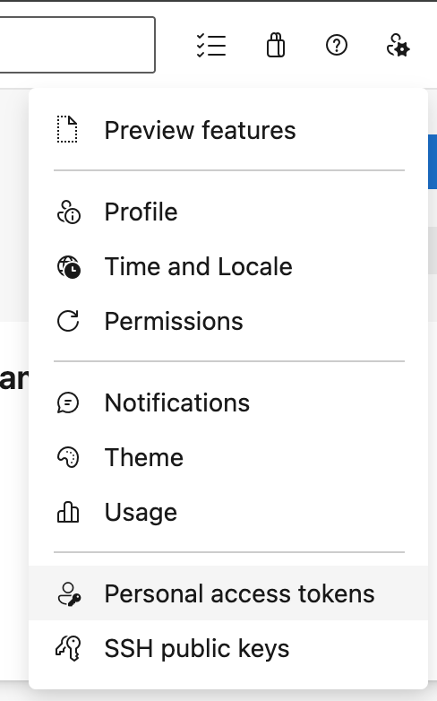
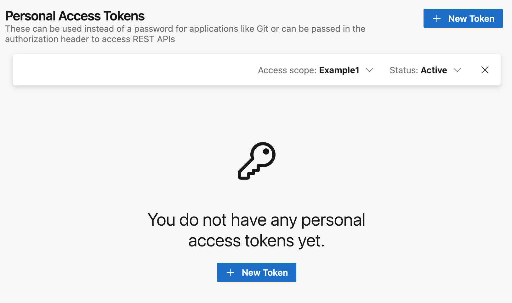
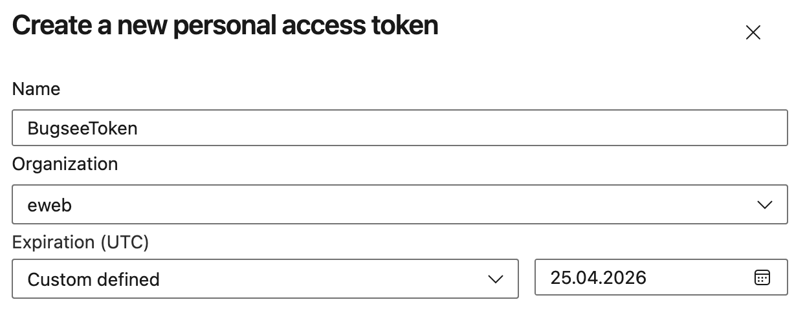
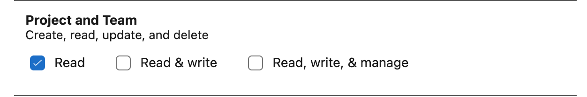
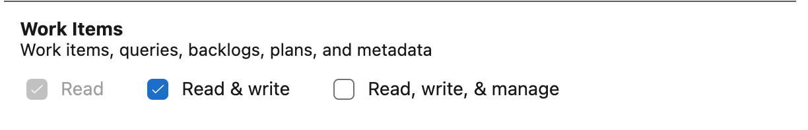

## Authentication

### Supported authentication methods

- [Personal token](#personal-token)


### Personal token

To proceed with this authentication type you need to obtain a personal access token from Azure DevOps. Steps below will instruct you how to do that.

Sign in to your Azure DevOps organization (https://dev.azure.com/{yourorganization}).

Click the user settings icon in the top right corner, then select **Personal access tokens**.



Click **+ New Token** to create a personal access token.



Name your token, select the organization, and set an expiration period.



Under Scopes, select **Show all scopes** and enable **Project and Team (Read)** and **Work Items (Read & write)**.





Click **Create**. Make sure to copy the token — you won't be able to see it again.

Now, when you've obtained a token, let's configure the integration in Bugsee.

Provide the organization URL (e.g. `https://dev.azure.com/{yourorganization}`) and paste the generated token.


## Configuration

There are no specific configuration steps for Azure DevOps. Refer to <a href="/integrations/configuration/">configuration</a> section for description about generic steps.

## Custom recipes

Bugsee can accommodate all the customizations required for your Azure DevOps instance with the help of [custom recipes](/integrations/recipes/recipes/). This section provides a few examples of using custom recipes with Azure DevOps. For basic introduction, refer to custom recipe [documentation](/integrations/recipes/recipes/).

### Setting tags field

By default Bugsee creates and updates Azure DevOps bugs with Bugsee issue _labels_ as Azure DevOps _tags_. But _labels_ list can be overridden inside your custom recipe. For example you can add some new _label_ (Azure DevOps _tag_) to existing ones:

```javascript
function create(context) {
	// ....

    return {
    	// ...
    	labels: [...issue.labels, "My awesome tag"]
    };
}

function update(context, changes) {
	const result = {};
	// ...

    if (changes.labels) {
        result.labels = [...changes.labels.to, "My awesome tag"];
    }

	return {
        issue: {
            custom: {}
        },
        changes: result
    };
}
```

### Setting custom fields

Custom fields for Azure DevOps must be set as an array of objects ({ op, path, value }) inside the "fields" attribute, like shown below:

```javascript
function create(context) {
	// ....

    return {
    	// ...
    	custom: {
    		fields: [
                {
                    op: 'add',
                    path: '/fields/System.Reason',
                    value: 'New task'
                }
            ]
    	}
    };
}
```
