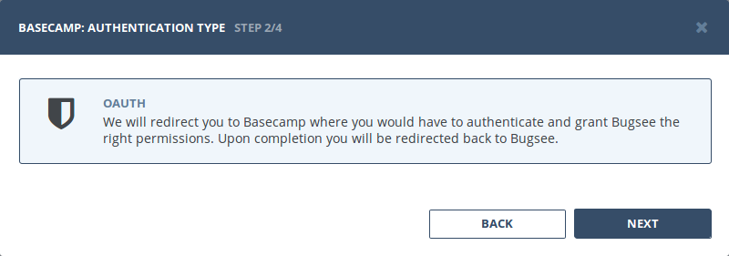
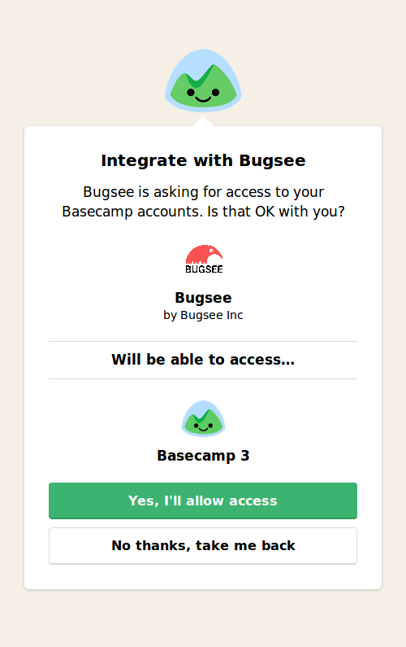
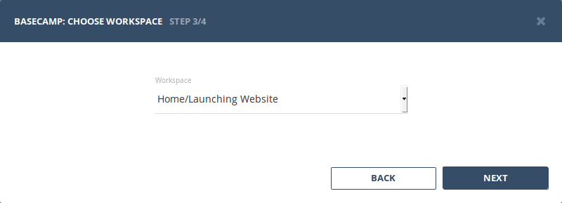

Integration with Basecamp is based on To-Do lists. Each time new issue is reported to Bugsee, we create new To-Do item in Basecamp.

Make sure you have at least one To-Do list in your Basecamp account to map Bugsee application to it. You can use any existing list or create a new one.

## Authentication

### Supported authentication methods

- [OAuth](#oauth)

### OAuth

Select _"OAuth"_ authentication type and click _"Next"_.

You will be presented with the following window asking you to allow Bugsee access to your Basecamp. Click _"Yes, I'll allow access"_ to give Bugsee requested permissions.

## Configuration

:::info
We describe here only specific configuration steps for Basecamp. Generic steps are described in [configuration](/integrations/configuration/) section. Refer to it for more details.
:::

We use a notion of workspace here as an alias for a project in Basecamp. While applications in Bugsee are mapped to To-Do lists in Basecamp. So, you need to select workspace to load To-Do list from it on a mapping step.

