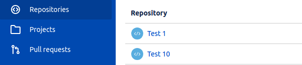
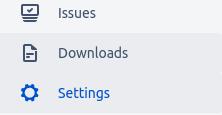
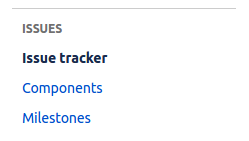
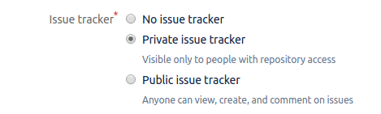
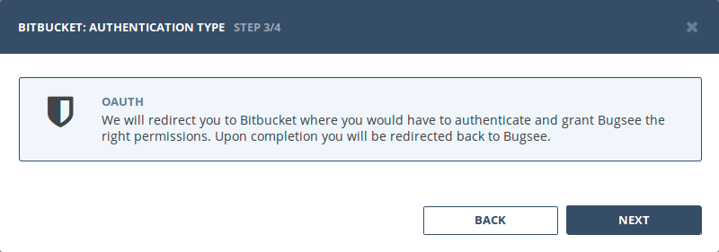
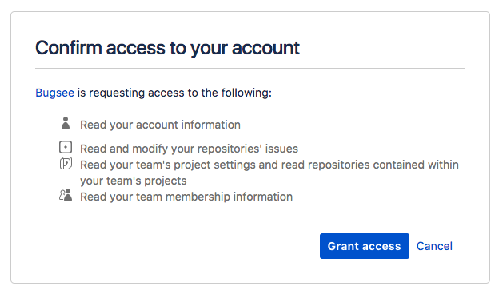

To push issues from Bugsee to Bitbucket you must have properly configured issue trackers in all target repositories. Follow the steps below to validate your configuration.

## Prepare

Navigate to your [Bitbucket account](https://www.bitbucket.com) and open the repository you want to check.

Open repository settings section:

Select "Issue tracker" section in settings navigation pane:

Ensure that option "Issue tracker" is set to anything other than "No issue tracker":

## Authentication

### Supported authentication methods

- [OAuth](#oauth)

### OAuth

Select _"OAuth"_ authentication type and click _"Next"_.

You will be presented with the following window asking you to grant Bugsee access to your Bitbucket. Click _"Grant access"_ to give Bugsee requested permissions.

## Configuration

There are no any specific configuration steps for Bitbucket. Refer to <a href="/integrations/configuration/">configuration</a> section for description about generic steps.