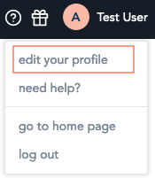
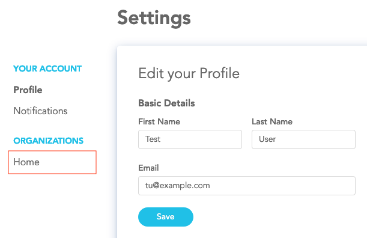
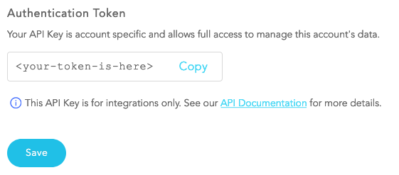
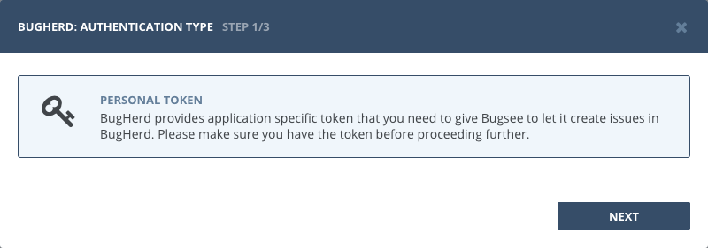
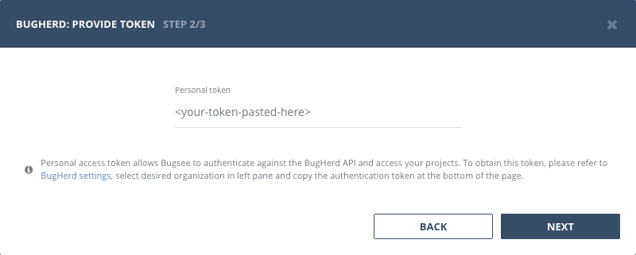

## Authentication

### Supported authentication methods

- [Personal token](#personal-token)

### Personal token

To proceed with this authentication type you need to obtain API token from BugHerd. Steps below will instruct you on how to do that.

Navigate to BugHerd and log in. Reveal user menu by clicking on your avatar icon at the top right and then click _"edit your profile"_.

Then, in the left pane click the organization you want to obtain token for.

Finally, scroll the page down to the _"Authentication Token"_ section. Copy the token inside the input field.

Now, when you've obtained a token, let's configure integration in Bugsee.

Start Bugsee integration wizard and select _"Personal token"_ authentication type. Click _"Next"_.

Paste generated token into _"Personal token"_ field and click _"Next"_ to proceed.

## Configuration

There are no any specific configuration steps for BugHerd. Refer to <a href="/integrations/configuration/">configuration</a> section for description about generic steps.
