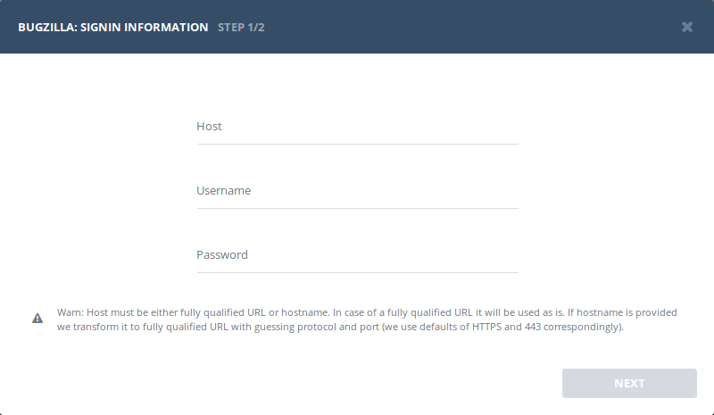

## Authentication


### Supported authentication methods

- [Basic (username and password)](#basic-authentication)


### Basic authentication

:::info
No custom configuration required in Bugzilla for this type of authentication.
:::

Provide valid host (URL to your Bugzilla), username and password.




## Configuration

There are no any specific configuration steps for Bugzilla. Refer to <a href="/integrations/configuration/">configuration</a> section for description about generic steps.


## Custom recipes

Bugsee can accommodate all these customizations with the help of [custom recipes](/integrations/recipes/recipes/). This section provides a few examples of using custom recipes specifically with Bugzilla. For basic introduction, refer to custom recipe [documentation](/integrations/recipes/recipes/).

### Setting labels field

By default Bugsee creates and updates Bugzilla bugs with Bugsee issue _labels_ as Bugzilla _keywords_. But _labels_ list can be overridden inside your custom recipe. For example you can add some new _label_ (Bugzilla _keyword_) to existing ones:

```javascript
function create(context) {
	// ....

    return {
    	// ...
    	labels: [...issue.labels, "My awesome keyword"]
    };
}

function update(context, changes) {
	const result = {};
	// ...
    
    if (changes.labels) {
        result.labels = [...changes.labels.to, "My awesome keyword"];
    }

	return {
        issue: {
            custom: {}
        },
        changes: result
    };
}
```
