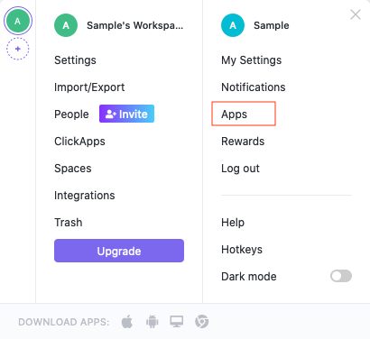
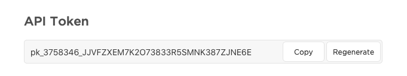
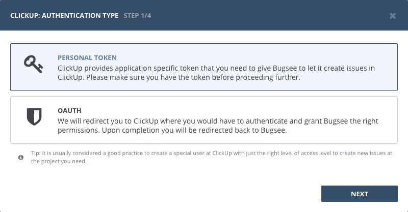
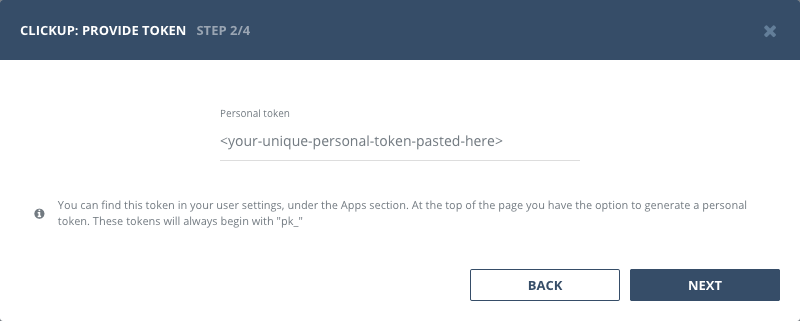
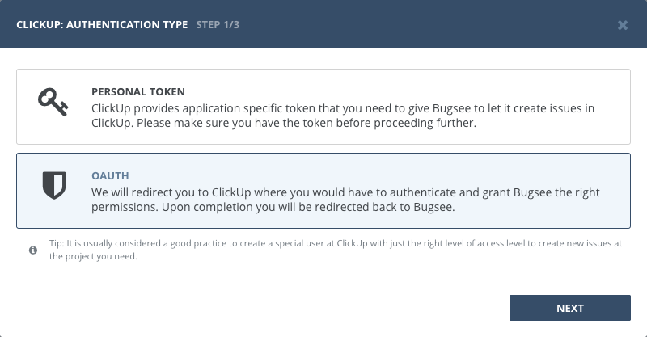
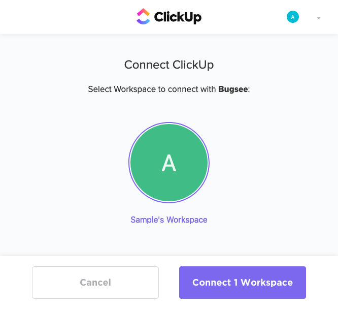
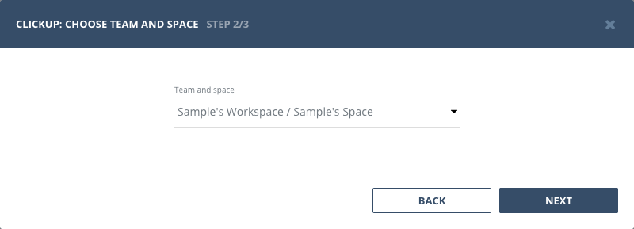

## Authentication

### Supported authentication methods

- [Personal token](#personal-token)
- [OAuth](#oauth)


### Personal token

To proceed with this authentication type you need to obtain API token from ClickUp. Steps below will instruct you how to do that.

Open ClickUp. Reveal user menu by clicking on your avatar icon in at the left bottom and then click _"Apps"_ there.



In presented screen, click _"Generate"_ button to create new token and then copy it.



Now, when you've obtained a token, let's configure integration in Bugsee. Select _"Personal token"_ authentication type and click _"Next"_.



Paste generated token into _"Personal token"_ field and click _"Next"_ to proceed.




### OAuth

Select _"OAuth"_ authentication type and click _"Next"_.



You will be presented with the following window asking you to select workspaces you want to grant Bugsee access to. Once you select all the desired workspaces click _"Connect N workspaces"_ to proceed.



## Configuration

:::info
We describe here only specific configuration steps for ClickUp. Generic steps are described in [configuration](/integrations/configuration/) section. Refer to it for more details.
:::

ClickUp has the following structure: _"Team"_ -> _"Space"_ -> _"Folder"_ -> _"List"_ -> _"Task"_. So, we provide one more step in integration setup wizard that asks you to pick the _"Team"_ and _"Space"_ pair to fetch folders and lists from. Please, pick one and click _"Next"_ to proceed.




## Custom recipes

Bugsee can accommodate all these customizations with the help of [custom recipes](/integrations/recipes/recipes/). This section provides a few examples of using custom recipes specifically with ClickUp. For basic introduction, refer to custom recipe [documentation](/integrations/recipes/recipes/).

### Setting proper status for tasks

Bugsee can't set proper status (open or closed) for all the types of tasks ClickUp posses. As it differs from one type of the space/list to another and there is no API endpoint to inquire that. So, you can define that using custom recipe as follows:

```javascript
function create(context) {
	// ....

    return {
    	// ...
    	custom: {
    		// for some tasks this is 'open', for some others it's 'open'
    		status: 'open'
    	}
    };
}
```