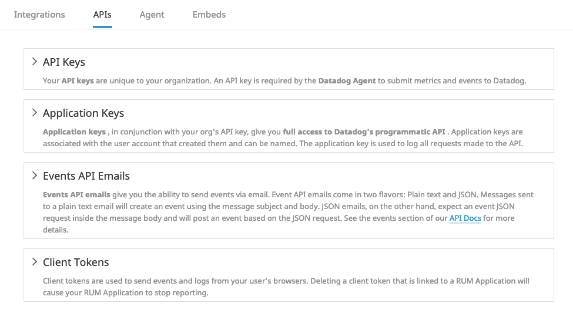
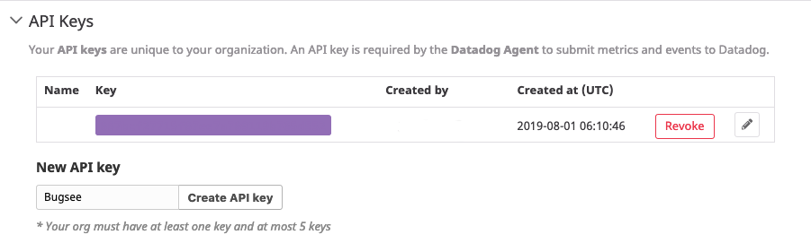
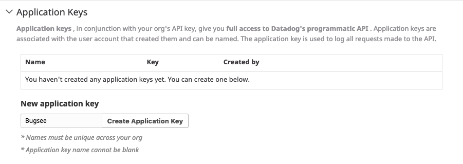
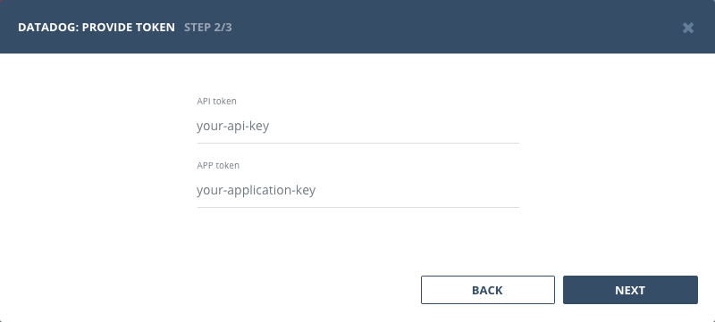

## Authentication

### Supported authentication methods

- [Personal token](#personal-token)


### Personal token

To proceed with this authentication type you need to obtain API and application tokens from Datadog. Steps below will instruct you how to do that.

Navigate to your [Datadog API settings](https://app.datadoghq.com/account/settings#api) page.



Expand _"API keys"_ section, specify "Bugsee" for the _"New API key"_ input field and click _"Create API key"_ button to create your new API key. Copy the created key, as it will be required to later configure Datadog integration in Bugsee.



Now, expand _"Application keys"_ section, specify "Bugsee" for the _"New application key"_ input field and click _"Create Application key"_ button to create application key. Copy the created key, as it will be required to later configure Datadog integration in Bugsee.



Now, when you've obtained a token, let's configure integration in Bugsee.

Start Bugsee integration wizard paste the token into. Click _"Next"_.



There are no any entities to which you can map Bugsee applications in Datadog. Instead, you will be offered with single static option of _"Events stream"_. You should select it for all the Bugsee applications you want to receive events for.


## Custom recipes

Bugsee can accommodate all these customizations with the help of [custom recipes](/integrations/recipes/recipes/). This section provides a few examples of using custom recipes specifically with Datadog. For basic introduction, refer to custom recipe [documentation](/integrations/recipes/recipes/).

### Setting tags field

By default Bugsee creates Datadog events with Bugsee issue _labels_ (_tags_). But _labels_ list can be overridden inside your custom recipe. For example you can add some new _label_ to existing ones:

```javascript
function create(context) {
	// ....

    return {
    	// ...
    	labels: [...issue.labels, "My awesome tag"]
    };
}
```
