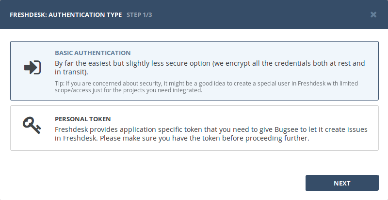
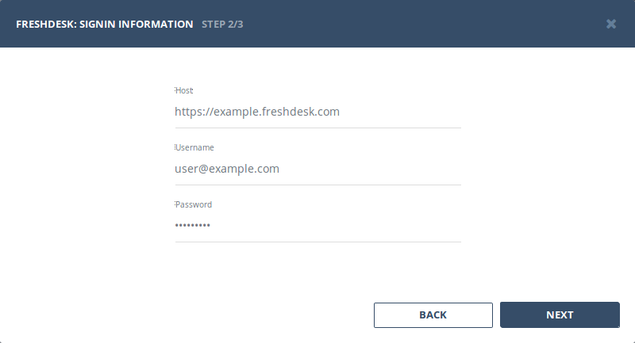
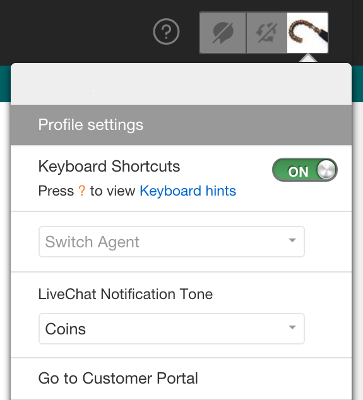
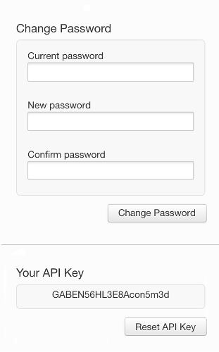
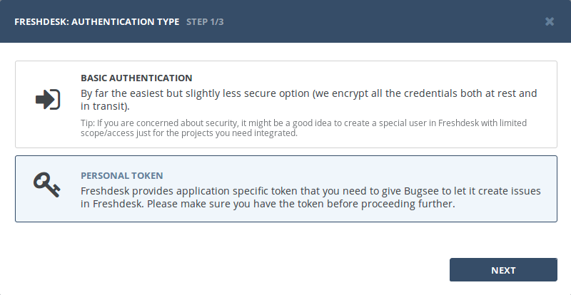
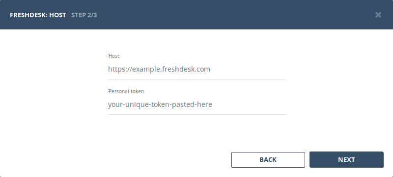

## Authentication

### Supported authentication methods

- [Basic (username and password)](#basic-authentication)
- [Personal token](#personal-token)


### Basic authentication

:::info
No custom configuration required in Freshdesk for this type of authentication.
:::

Select "Basic authentication" in the first step of integration wizard. Click "Next".



Provide valid host (URL to your Freshdesk), username and password.




### Personal token

To proceed with this authentication type you need to obtain API token from Freshdesk. Steps below will instruct you how to do that.

Click on your _"Profile Picture"_ in the top right and then click _"Profile Settings"_ in revealed menu.



In your profile settings page, in the right pane under _"Change Password"_ block, you'll find _"Your API Key"_ area. Copy token from it.



Now, when you've obtained a token, let's configure integration in Bugsee.



Provide valid host (URL to your Freshdesk) and paste generated token.




## Configuration

There are no any specific configuration steps for Freshdesk. Refer to <a href="/integrations/configuration/">configuration</a> section for description about generic steps.


## Custom recipes

Bugsee can accommodate all these customizations with the help of [custom recipes](/integrations/recipes/recipes/). This section provides a few examples of using custom recipes specifically with Freshdesk. For basic introduction, refer to custom recipe [documentation](/integrations/recipes/recipes/).

### Setting labels field

By default Bugsee creates and updates Freshdesk tickets with Bugsee issue _labels_ as Freshdesk _tags_. But _labels_ list can be overridden inside your custom recipe. For example you can add some new _label_ (Freshdesk _tag_) to existing ones:

```javascript
function create(context) {
	// ....

    return {
    	// ...
    	labels: [...issue.labels, "My awesome tag"]
    };
}

function update(context, changes) {
	const result = {};
	// ...
    
    if (changes.labels) {
        result.labels = [...changes.labels.to, "My awesome tag"];
    }

	return {
        issue: {
            custom: {}
        },
        changes: result
    };
}
```
