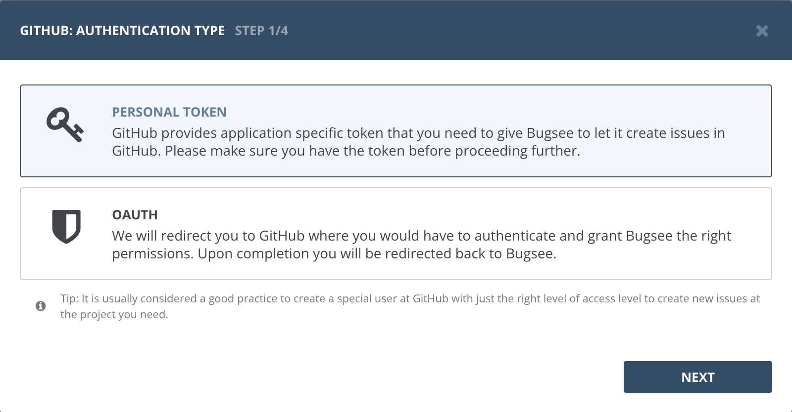
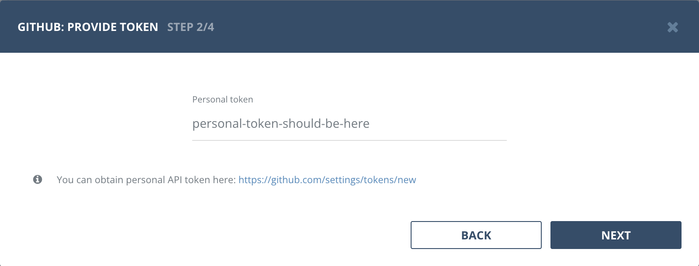
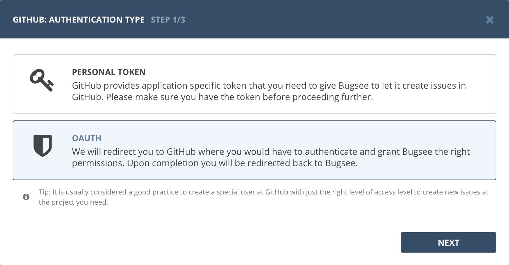
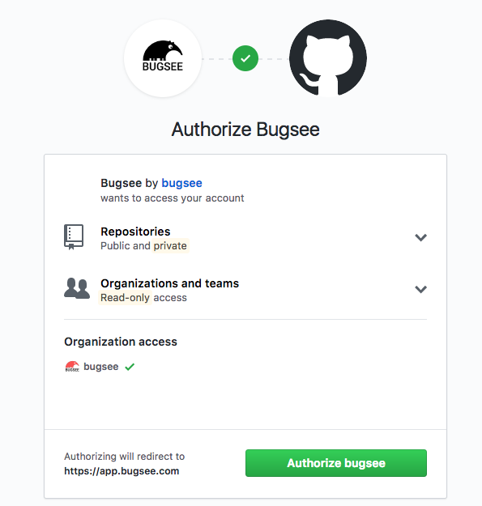
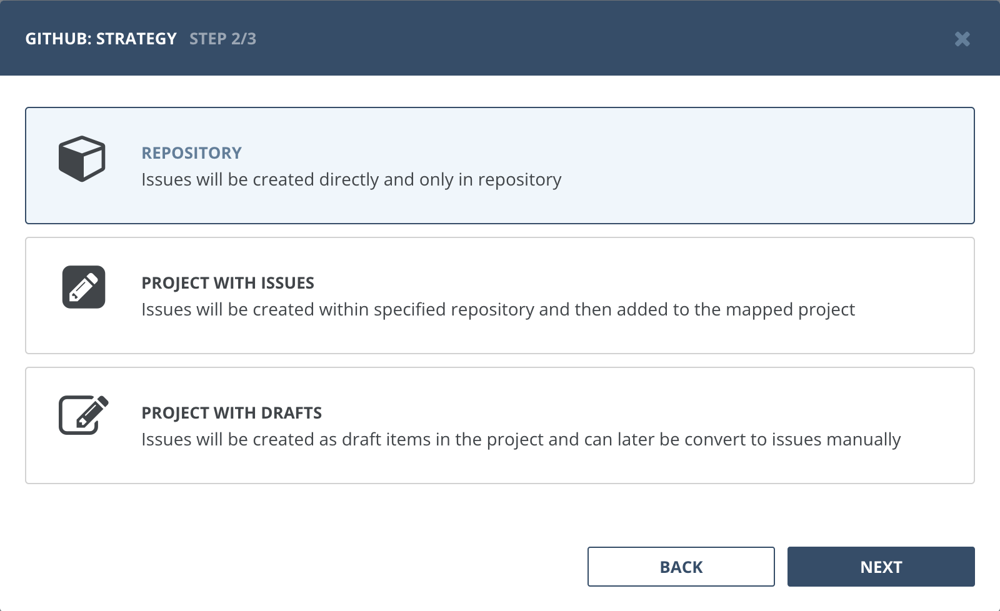
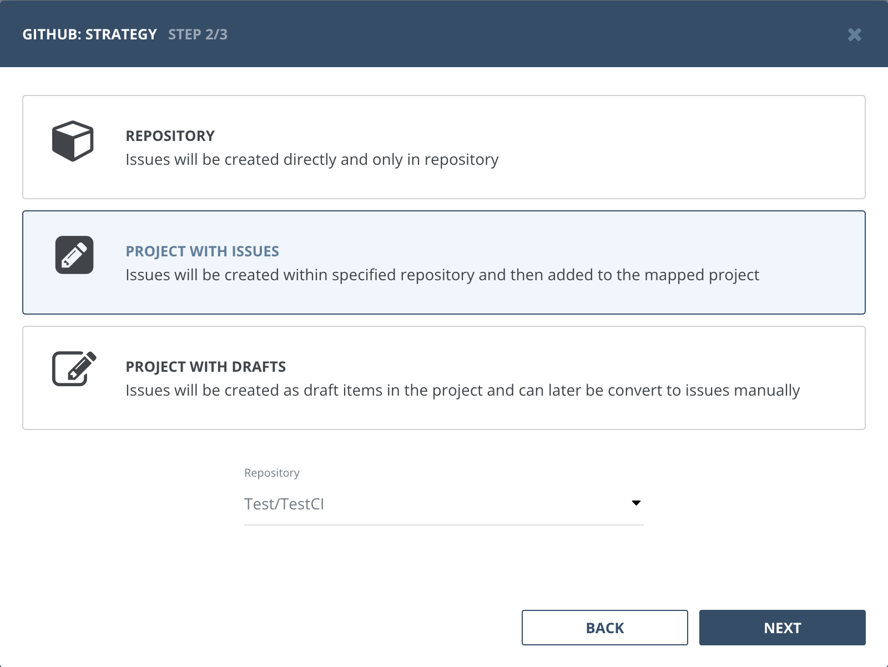

## Authentication

### Supported authentication methods

- [Personal token](#personal-token)
- [OAuth](#oauth)


### Personal token

Before using this method, please ensure you have the proper personal token. To generate it, navigate to [GitHub personal access tokens](https://github.com/settings/tokens/new). he following scopes must be selected for the `token:repo`, `repo:status`, `public_repo`, `read:org`, `project`.

Select "Personal token" in the first step of integration wizard. Click "Next".



Provide username and password.




### OAuth

Select "OAuth" in the first step of integration wizard. Click _Next_.



You will be presented with dialog asking you to authorize Bugsee. Click _Authorize_ to allow Bugsee access your GitHub.




## Configuration

After authentication, you will be presented with the following dialog with the request to choose strategy. Strategies include: Repository, Projects with issues, Projects with drafts. Please see the details for each strategy below.

### Strategy: Repository
  
With this strategy all issues will be created in the repository you map to the application at the last step of the wizard.



For custom fields you can use in [custom recipes](/integrations/recipes/recipes/), refer to GitHub documentation for the [issue object](https://docs.github.com/en/rest/issues/issues?apiVersion=2022-11-28#create-an-issue).

### Strategy: Project with issues

With this strategy all issues will be created in the repository selected in this step and they will also be added to the mapped project at the last step of the wizard (as an issue item). Note, that the projects to map in the last step will be fetched from the repository selected in this step.



For custom fields you can use in [custom recipes](/integrations/recipes/recipes/), refer to GitHub documentation for the [issue object](https://docs.github.com/en/graphql/reference/input-objects#createissueinput).

### Strategy: Project with drafts

With this strategy no issues are created in the repository, but rather they are added as drafts to the mapped project at the last step of the wizard. These draft items can later be converted to issues manually in GitHub. Note, that the projects to map in the last step will be fetched from the repository selected in this step.


For custom fields you can use in [custom recipes](/integrations/recipes/recipes/), refer to GitHub documentation for the [draft item](https://docs.github.com/en/graphql/reference/input-objects#addprojectv2draftissueinput).


## Custom recipes

Bugsee can accommodate all these customizations with the help of [custom recipes](/integrations/recipes/recipes/). This section provides a few examples of using custom recipes specifically with Github. For basic introduction, refer to custom recipe [documentation](/integrations/recipes/recipes/).

### Setting labels field

By default Bugsee creates and updates Github issues with Bugsee issue _labels_. But _labels_ list can be overridden inside your custom recipe. For example you can add some new _label_ to existing ones:

```javascript
function create(context) {
	// ....

    return {
    	// ...
    	labels: [...issue.labels, "My awesome label"]
    };
}

function update(context, changes) {
	const result = {};
	// ...
    
    if (changes.labels) {
        result.labels = [...changes.labels.to, "My awesome label"];
    }

	return {
        issue: {
            custom: {}
        },
        changes: result
    };
}
```
