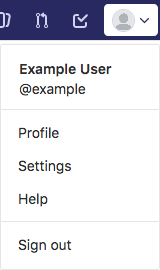
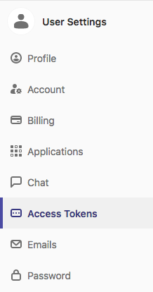
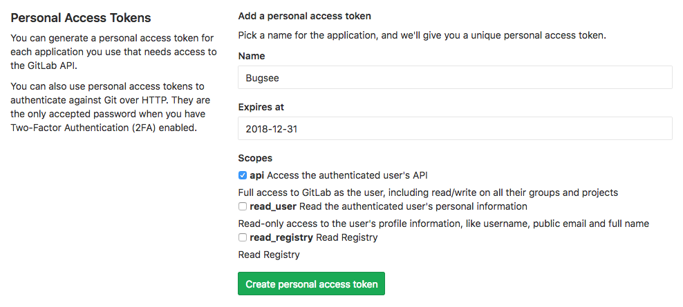
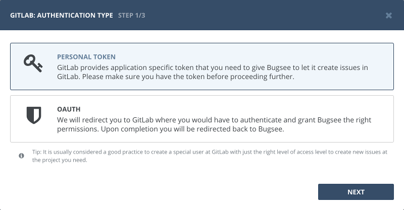
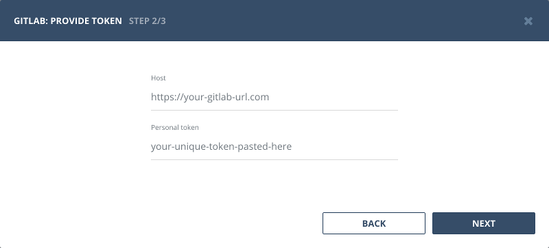
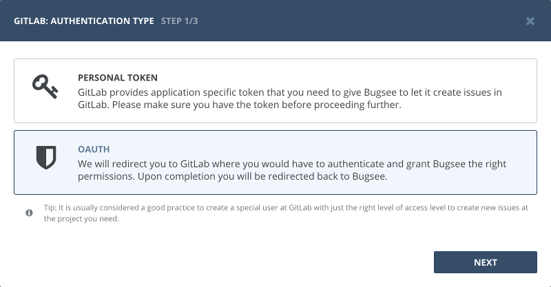
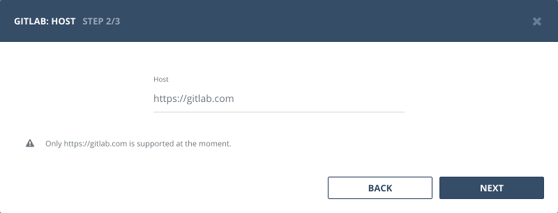
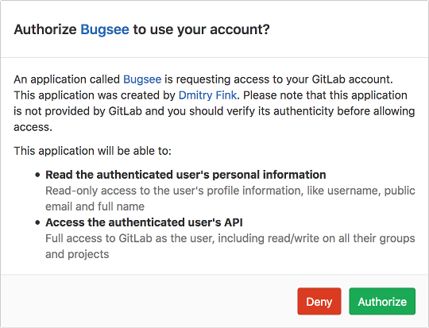

## Authentication

### Supported authentication methods

- [Personal token](#personal-token)
- [OAuth](#oauth)


### Personal token

To proceed with this authentication type you need to obtain API token from GitLab. Steps below will instruct you how to do that.

Click on your _"Profile Picture"_ in the top right and then click _"Settings"_ in revealed menu.



In the left pane, switch to _"Access Tokens"_ section.



Give your new token a unique name and specify its expiry date. Note, that once it will be reached, integration will not be able to push data to GitLab and eventually be marked as broken. Don't forget to check **api** scope, to let Bugsee access issues API in your GitLab. Finally, click _"Create personal access token"_ to generate new token. Don't forget to copy it.



Now, when you've obtained a token, let's configure integration in Bugsee.



Provide valid host (URL to your GitLab or ```https://gitlab.com``` if you're using cloud GitLab) and paste generated token.




### OAuth

Select "OAuth" in the first step of integration wizard. Click _"Next"_.



For now, we only support OAuth for Cloud GitLab. So, click _"Next"_ to continue.



You will be presented with dialog asking you to authorize Bugsee. Click _Authorize_ to allow Bugsee access your GitLab.




## Configuration

There are no any specific configuration steps for GitLab. Refer to <a href="/integrations/configuration/">configuration</a> section for description about generic steps.


## Custom recipes

Bugsee can accommodate all these customizations with the help of [custom recipes](/integrations/recipes/recipes/). This section provides a few examples of using custom recipes specifically with Gitlab. For basic introduction, refer to custom recipe [documentation](/integrations/recipes/recipes/).

### Setting labels field

By default Bugsee creates and updates Gitlab issues with Bugsee issue _labels_. But _labels_ list can be overridden inside your custom recipe. For example you can add some new _label_ to existing ones:

```javascript
function create(context) {
	// ....

    return {
    	// ...
    	labels: [...issue.labels, "My awesome label"]
    };
}

function update(context, changes) {
	const result = {};
	// ...
    
    if (changes.labels) {
        result.labels = [...changes.labels.to, "My awesome label"];
    }

	return {
        issue: {
            custom: {}
        },
        changes: result
    };
}
```
