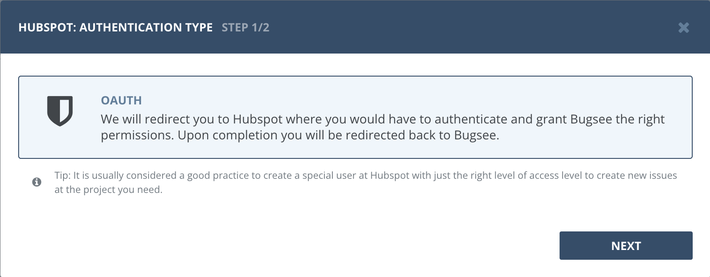
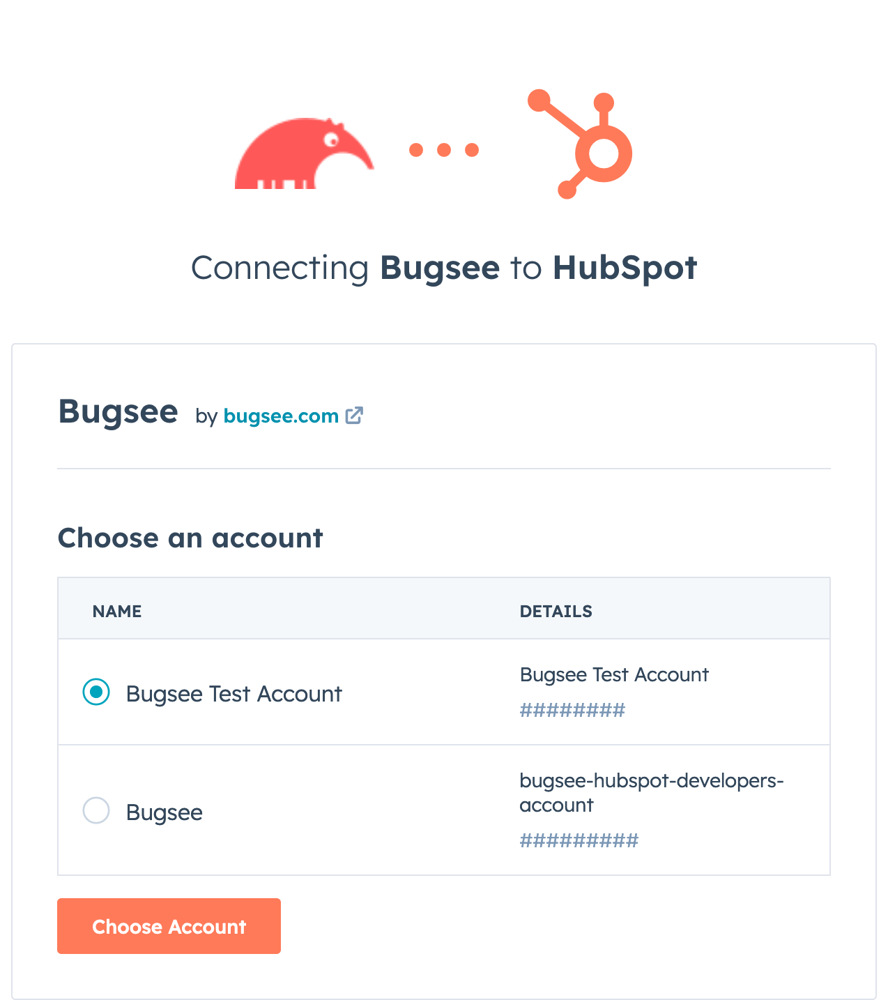
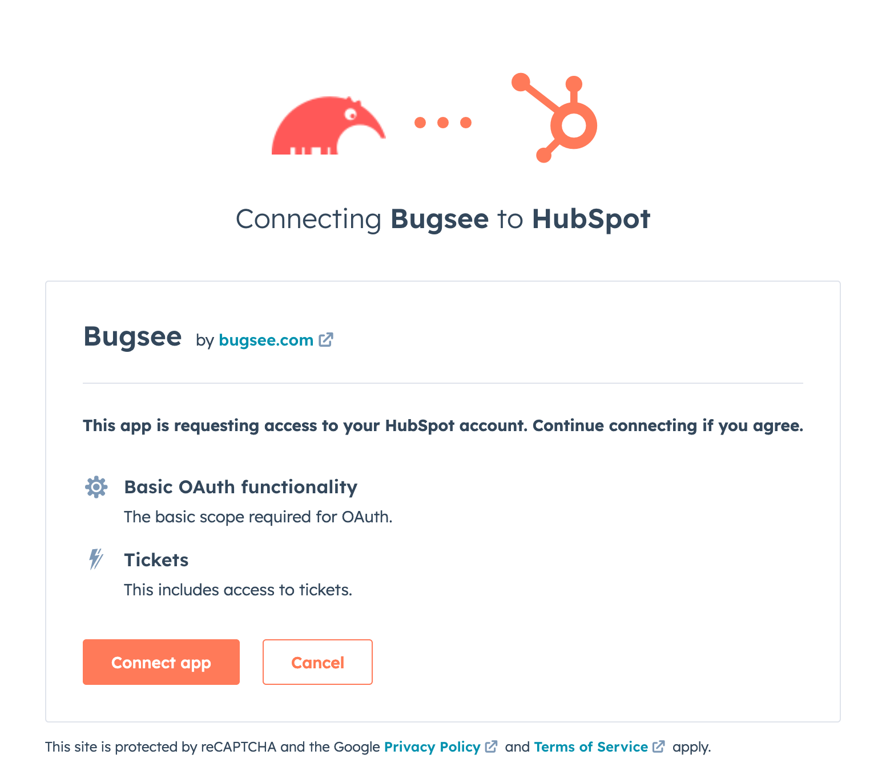
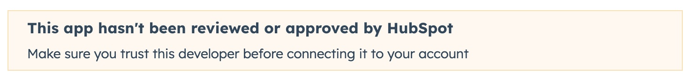

## Authentication

### Supported authentication methods

- [OAuth](#oauth)


### OAuth

Select _"OAuth"_ authentication type and click _"Next"_.



If you have multiple accounts, you'll be presented with the following dialog letting you pick the right account to integrate Bugsee with.



Next, you will be presented with the dialog asking you to authorize Bugsee. Click _Connect app_ to allow Bugsee access your Hubspot.



Note, that you may see a warning like shown in the picture below. You can safely ignore it.




## Custom recipes

Bugsee can accommodate all these customizations with the help of [custom recipes](/integrations/recipes/recipes/). This section provides a few examples of using custom recipes specifically with Hubspot. For basic introduction, refer to custom recipe [documentation](/integrations/recipes/recipes/).

When Bugsee pushes the issue data to Hubspot, it uses the [Tickets API](https://developers.hubspot.com/docs/api/crm/tickets). You can find all the details about on which fields you can set in their documentation.


### Recipe structure for Hubspot

According to the Hubspot [Tickets API](https://developers.hubspot.com/docs/api/crm/tickets) documentation, fields must be nested within the "properties" object in the data payload. This is to allow passing associations along with the ticket data.

```javascript
function create(context) {
	// ....

    return {
    	// ...
    	custom: {
            properties: {
                // put the fields here
            },
            // this one is optional
            associations: []
    	}
    };
}
```