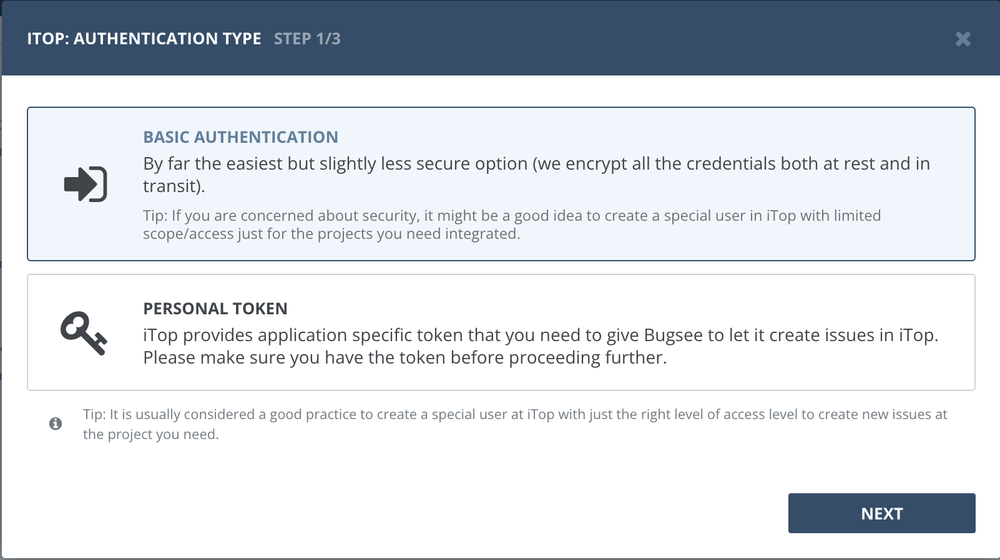
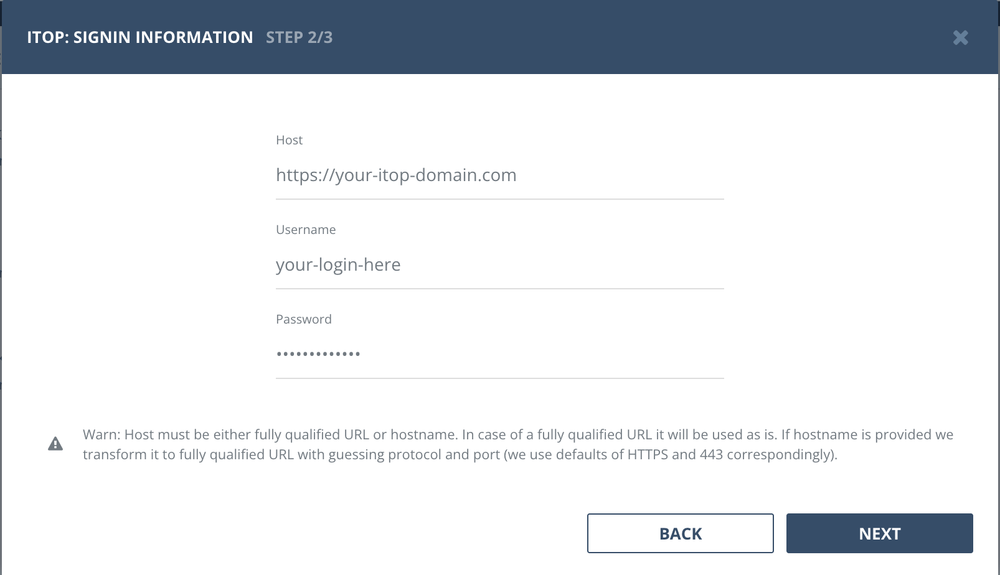
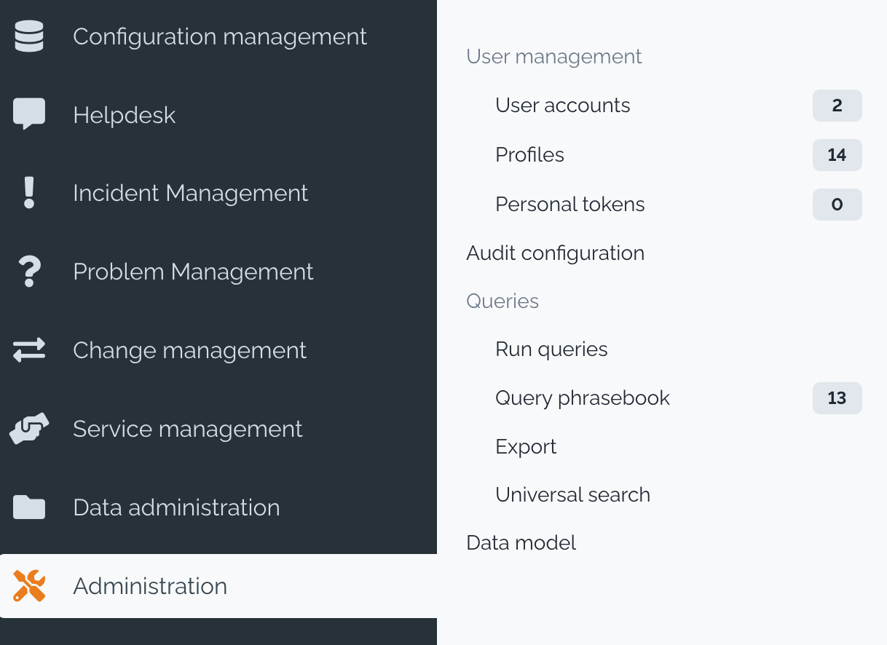
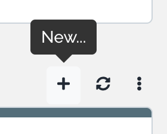
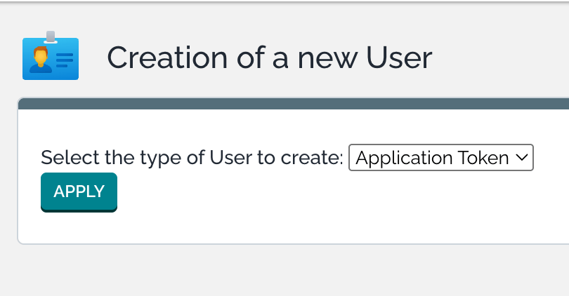
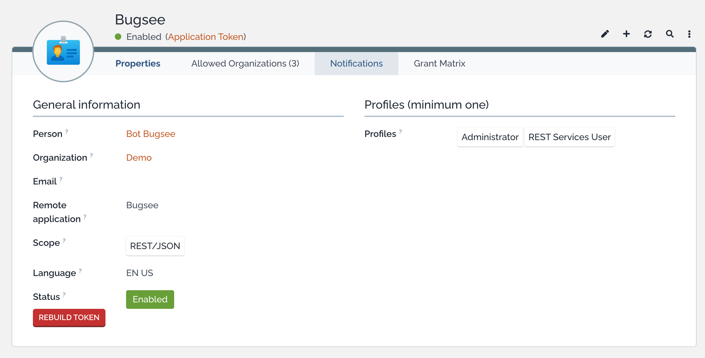
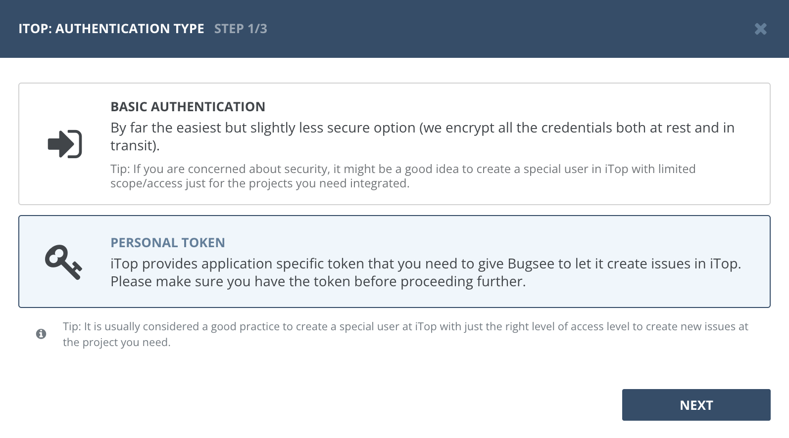
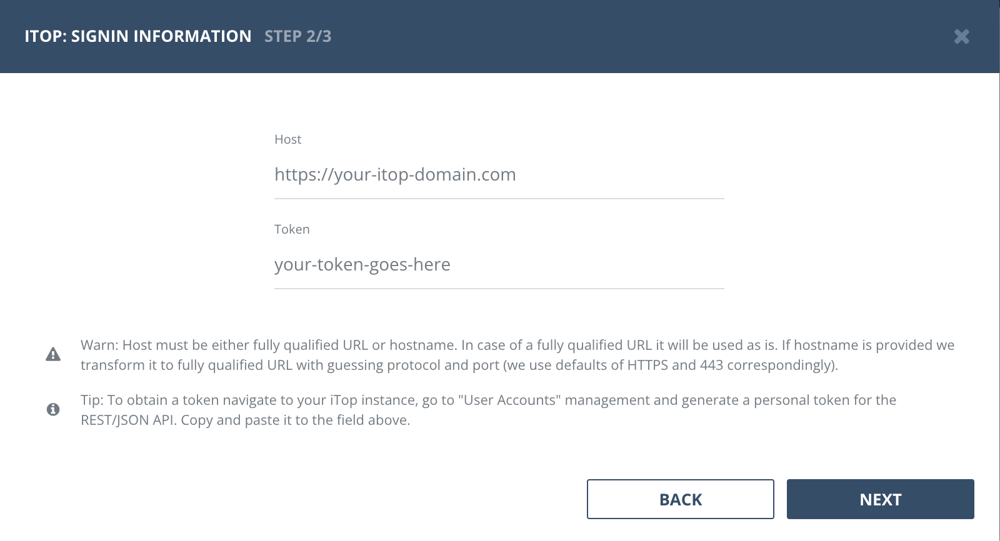

## Authentication

### Supported authentication methods

- [Basic (username and password)](#basic-authentication)
- [Personal token](#personal-token)

## Basic authentication

:::info
No custom configuration required in iTop for this type of authentication. The iTop user account you use must have sufficient permissions to create tickets via the REST API.
:::

Select "Basic authentication" in the first step of integration wizard. Click "Next".

Provide valid host (URL to your iTop instance), username and password. Click _"Next"_.

### Personal token

To integrate Bugsee with iTop using a personal token, you need to create an Application Token user with REST API access. Follow the steps below to set it up.

Log into your iTop instance and navigate to _"Administration"_ section. Under _"User management"_, click _"User accounts"_.

In the user accounts list, click the _"+"_ (New) button to create a new user.

In the _"Creation of a new User"_ dialog, select _"Application Token"_ from the dropdown and click _"Apply"_.

Fill in the token details. Assign the _"REST Services User"_ profile (required for API access) and any additional profiles needed for creating tickets. Set the _"Scope"_ to _"REST/JSON"_ and provide a descriptive name for the _"Remote application"_ field (e.g. "Bugsee"). Make sure the _"Status"_ is set to _"Enabled"_. Save the user and copy the generated token.

Now, when you've obtained a token, let's configure integration in Bugsee. Select _"Personal token"_ authentication type and click _"Next"_.

Specify the URL of your iTop instance in the _"Host"_ field and paste the generated token into the _"Token"_ field. Click _"Next"_ to proceed.

## Configuration

There are no any specific configuration steps for iTop. Refer to <a href="/integrations/configuration/">configuration</a> section for description about generic steps.
