## Authentication

### Supported authentication methods

- [Personal token](#personal-token)
- [OAuth](#oauth)


### Personal token

Navigate to your [Atlassian account security settings](https://id.atlassian.com/manage-profile/security). From there, in _"API token"_ section, click _"Create and manage API tokens"_.

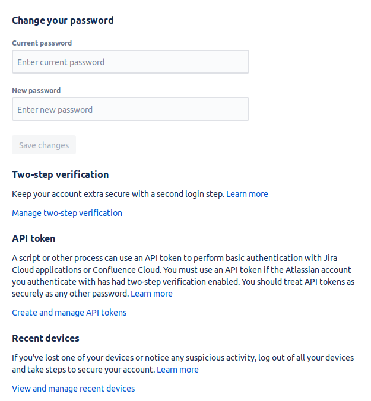

Click _"Create API token"_ to create new token for Bugsee.

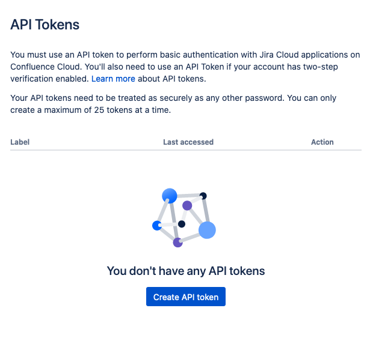

Specify _"Bugsee"_ (or whatever makes sense for you) for _"Label"_ field and click _"Create"_.

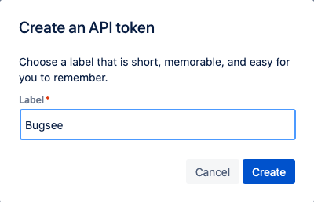

Your API token is now generated. Store it somewhere as it will not visible to you once you close the _"Your new API token"_ popup. Either click _"Copy"_ or eye icon to view it and copy it manually.

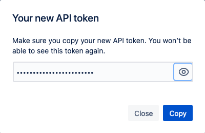

Now, as we have obtained the API token, it's time to setup JIRA integration in Bugsee.

Bring up the JIRA integration wizard. Select _"Personal token"_ in the first step of integration wizard. Click _"Next"_.

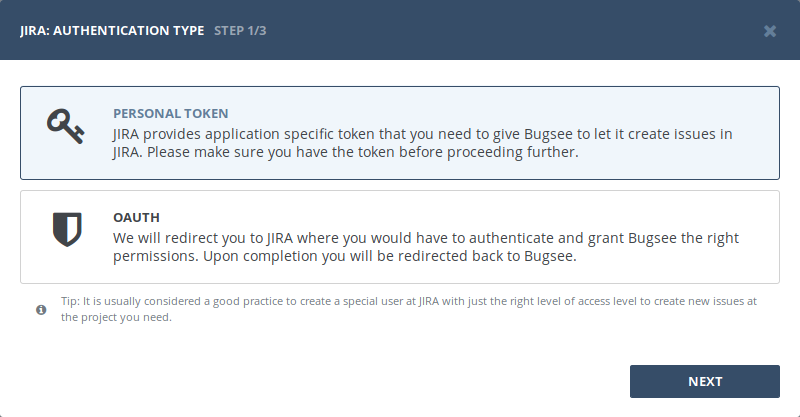

Provide username and personal token obtained in steps above.

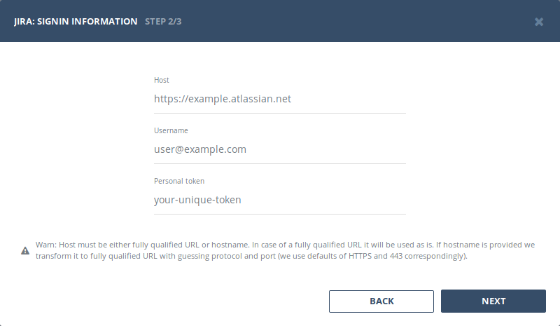


### OAuth 

Before we can start configuring integration in Bugsee, your JIRA instance need to be tuned a bit.

Click the _"Cog"_ icon to bring up the settings pane:

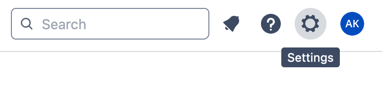

Click _"Products"_:

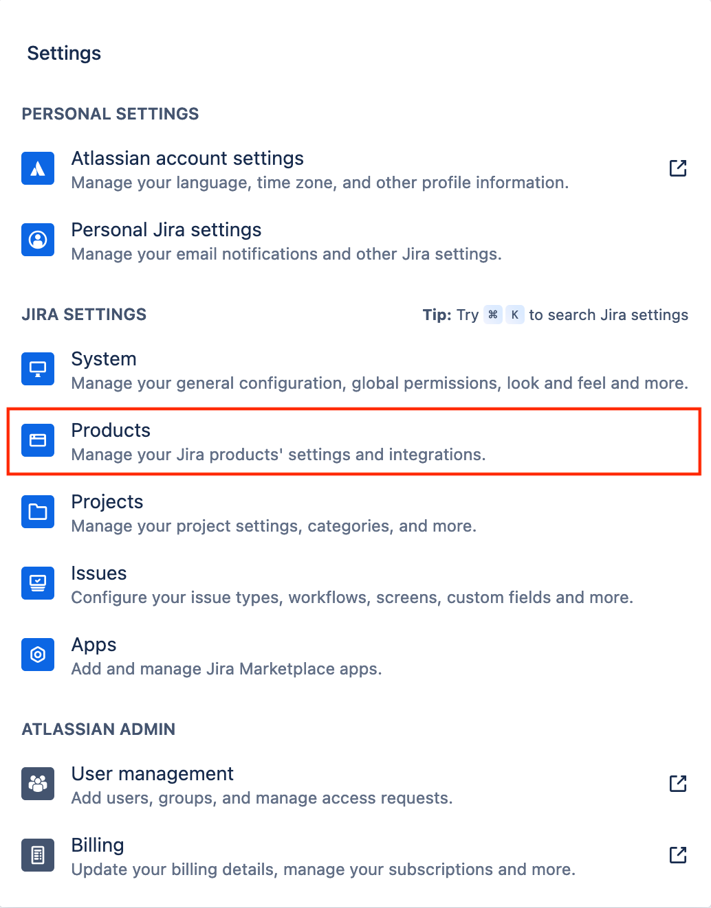

Switch to the _"Application links"_ section in the left pane:

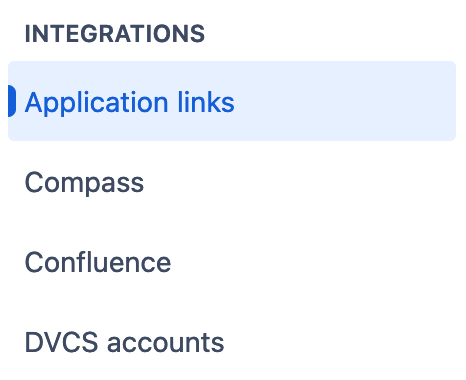

And then click _"Create link"_:

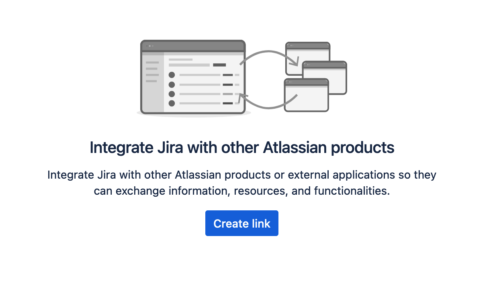

In the newly presented dialog window, put Bugsee URL into "Application URL" field. Use the following URL:

```
https://app.bugsee.com
```

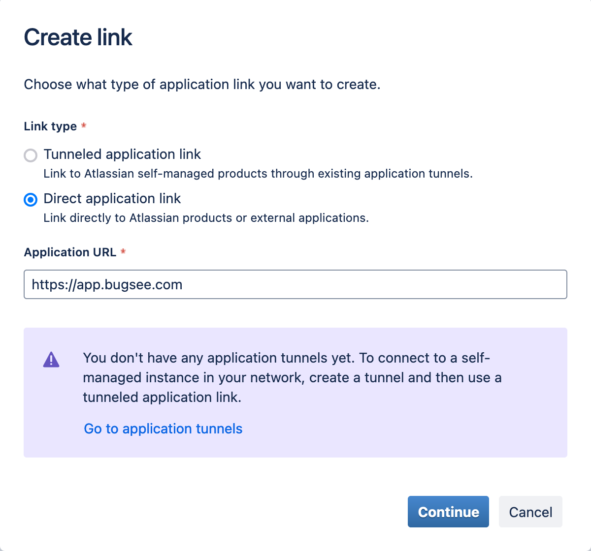

Click _"Continue"_:

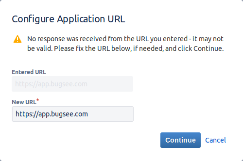

Ignore the warning and click "Continue". JIRA will bring you next dialog:

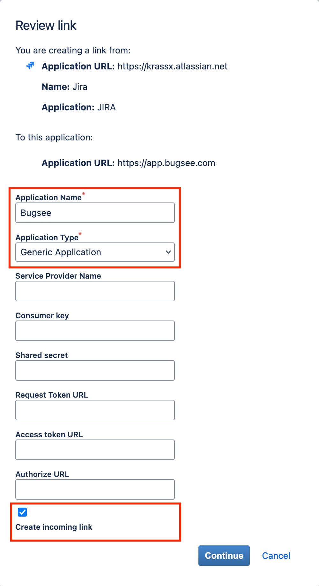

Fill application name field with the value that uniquely identifies Bugsee integration. Also don't forget to check "Create incoming link". When done click "Continue".

Finally, you will see the following dialog:

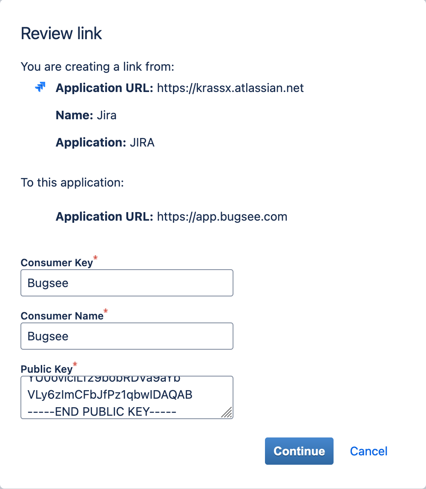

Supply Bugsee for both Consumer Name and Consumer Key and paste the following into public key:

```
-----BEGIN PUBLIC KEY-----
MIGfMA0GCSqGSIb3DQEBAQUAA4GNADCBiQKBgQCm9MCEVvMRwTGC+9lNrmWWhD03
UnSIPsxrLVVak700hZaV+hUgM8d7vNxx+C5640eFqHNOaba5FuveXr7JTXM9lCDf
te4pqldj59/lELQjjS9Y6uRk33TlJfJhDrUncNjMmYU0oviciLf29bobRDVa9aYb
VLy6zImCFbJfPz1qbwIDAQAB
-----END PUBLIC KEY-----
```

Now, when you've prepared your JIRA instance, let's configure integration in Bugsee.

Start Bugsee integration wizard and select "OAuth" in the first step of integration wizard. Click _Next_.

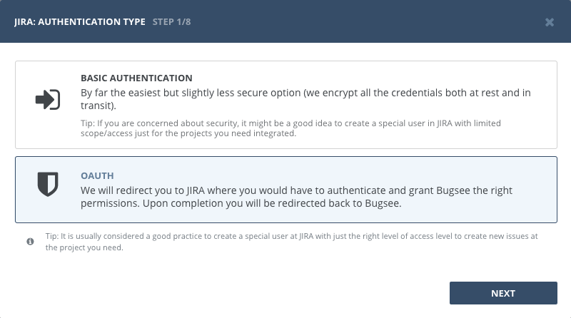

Skip instructional steps. Provide valid URL to your JIRA (if you're using JIRA Cloud, then it will be ```https://<domain>.atlassian.net```) and click _"Next"_.

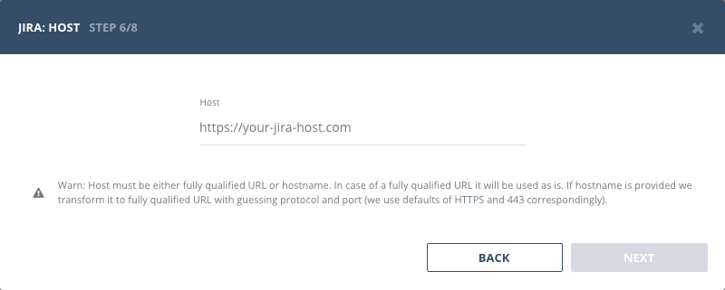

You will be presented with dialog asking you to grant Bugsee permissions. Click _Allow_ to allow Bugsee access your JIRA.

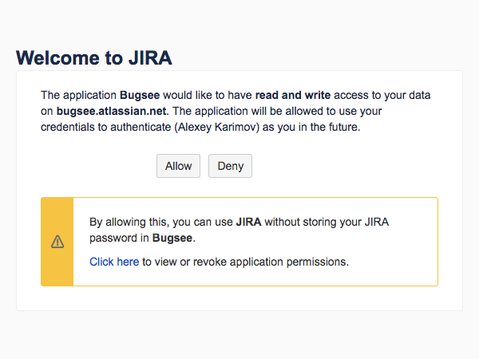

After completing this step, another screen will appear and will present you with a verification code. Copy the code, close the window.

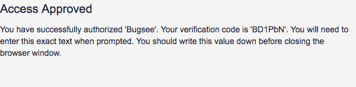

Paste the code you copied in previous step. Click _"Next"_.

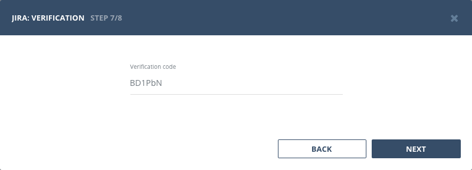


## Configuration

There are no any specific configuration steps for JIRA. Refer to <a href="/integrations/configuration/">configuration</a> section for description about generic steps.


## Custom recipes

JIRA is very customizable, fields can be made mandatory, new fields can be added, issue types, priorities and other default types can be changed. Bugsee can accommodate all these customizations with the help of [custom recipes](/integrations/recipes/recipes/). This section provides a few examples of using custom recipes specifically with JIRA. For basic introduction, refer to custom recipe [documentation](/integrations/recipes/recipes/).

Some fields in sent to Jira, require specifying _accountId_ field. You can find it by navigating to your Jira's _People_ section: ```https://<your-sub-domain>.atlassian.net/people```. From there, select the user you want to get accountId for and URL in browser will change to something like: ```https://<your-sub-domain>.atlassian.net/people/123456:44448ae7-90ce-4e62-bfda-e88abcde5555```. The last segment of URL, after "people/" is accountId, which in this particular case is ```123456:44448ae7-90ce-4e62-bfda-e88abcde5555```.

### Setting labels field

By default Bugsee creates and updates Jira issues with Bugsee issue _labels_. But _labels_ list can be overridden inside your custom recipe. For example you can add some new _label_ to existing ones (the 'label' field should added to the appropriate screen):

```javascript
function create(context) {
	// ....

    return {
    	// ...
    	labels: [...issue.labels, "My awesome label"]
    };
}

function update(context, changes) {
	const result = {};
	// ...
    
    if (changes.labels) {
        result.labels = [...changes.labels.to, "My awesome label"];
    }

	return {
        issue: {
            custom: {}
        },
        changes: result
    };
}
```

### Setting components field

```javascript
function create(context) {
	// ....

    return {
    	// ...
    	custom: {
    		// This example sets component by its ID
    		components: [{id: "12345"}]
    	}
    };
}
```

### Setting default priority for crashes

```javascript
function create(context) {
	const issue = context.issue;

    return {
    	// ...
    	custom: {
    		// Lets override the priority only for crashes and leave it untouched otherwise 
    		priority: (issue.type == 'crash') ? { id: "12345" } : undefined
    	}
    };
}
```

### Changing issue type for crashes

```javascript
function create(context) {
	const issue = context.issue;

    return {
    	// ...
    	custom: {
    		// Lets override the issuetype only for crashes and leave it untouched otherwise 
    		issuetype: (issue.type == 'crash') ? { id: "12345" } : undefined
    	}
    };
}
```

### Changing default reporter for an issue

User who has configured integration should have the rights to change the reporter (for example, the user is included in the 'Administrators' group). Also make sure that the 'reporter' field is added to the appropriate screen (which is used for new issues). 

```javascript
function create(context) {
	const issue = context.issue;

    return {
    	// ...
    	custom: {
    		reporter: (issue.type === 'crash') ? { accountId: "123456:44448ae7-90ce-4e62-bfda-e88abcde5555" } : { accountId: "654321:44448ae7-90ce-4e62-bfda-e88abcde2222" }
    	}
    };
}
```

### Changing default assignee for an issue

```javascript
function create(context) {
	const issue = context.issue;

    return {
    	// ...
    	custom: {
    		assignee: (issue.type === 'crash') ? { accountId: "123456:44448ae7-90ce-4e62-bfda-e88abcde5555" } : { accountId: "654321:44448ae7-90ce-4e62-bfda-e88abcde2222" }
    	}
    };
}
```

### Setting watchers for an issue

It requires the **Allow users to watch issues** option to be ON. This option is set in General configuration for Jira. See [Configuring Jira application options](https://confluence.atlassian.com/x/uYXKM) for details.

Permissions required:

- _Browse projects_ [project permission](https://confluence.atlassian.com/x/yodKLg) for the project that the issue is in.
- If [issue-level security](https://confluence.atlassian.com/x/J4lKLg) is configured, issue-level security permission to view the issue.
- To add users other than themselves to the watchlist, _Manage watcher list_ [project permission](https://confluence.atlassian.com/x/yodKLg) for the project that the issue is in.

You can provide a list of account IDs to add them as watchers to created issue.

```javascript
function create(context) {
	const issue = context.issue;

    return {
    	// ...
    	custom: {
    		watchers: [
				"123456:44448ae7-90ce-4e62-bfda-e88abcde5555",
				"654321:44448ae7-90ce-4e62-bfda-e88abcde2222"
			]
    	}
    };
}
```

### Setting version for an issue

```javascript
function create(context) {
	const issue = context.issue;
	const app = context.app;

    return {
    	// ...
    	custom: {
    		// We use default JIRA versions field, which is an array of available version in JIRA.
    		// Important: This assumes the version with that name is already created in JIRA prior to first issue
    		// being reported, otherwise integration will break.
            versions : [ 
                {
                    name : app.version
                }
            ],
            // To store the build number, we have a custom field created in JIRA, so lets store it there
            customfield_10308 : app.build
    	}
    };
}
```

### Setting custom fields values

```javascript
function create(context) {
	const issue = context.issue;
	const app = context.app;

    return {
    	// ...
    	custom: {
			// Notice, that depending on the custom field type, you have to pass
			// value as raw value or an object with the required field (value, id,
			// etc.)

            customfield_10408 : "value1",
			customfield_10409 : { value: "value2" },
			customfield_10410 : { id: "value3" }
    	}
    };
}
```
