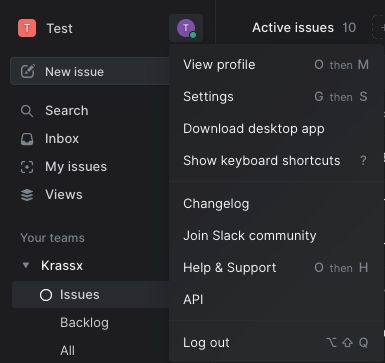
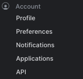
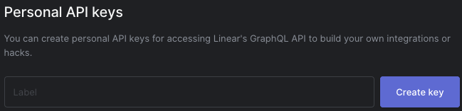
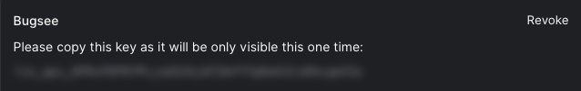
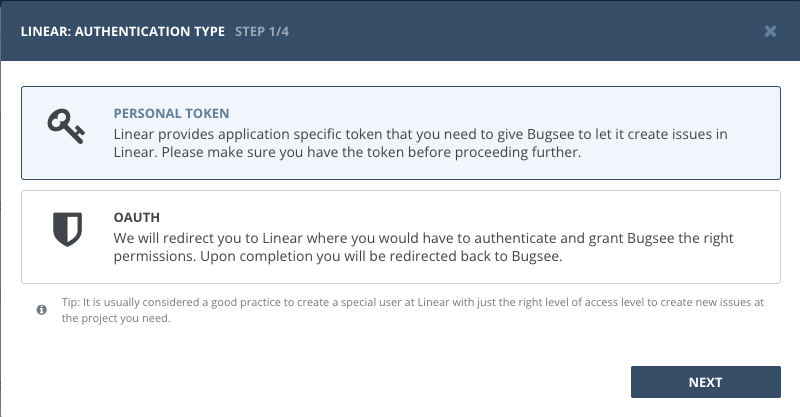
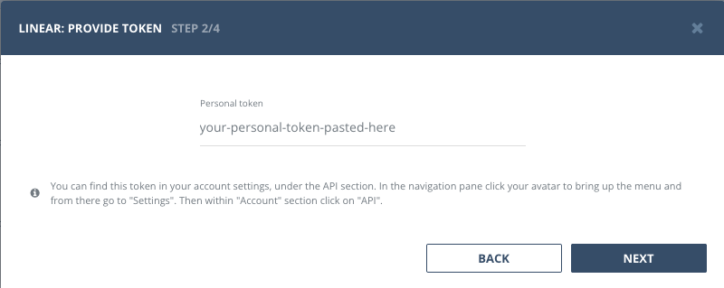
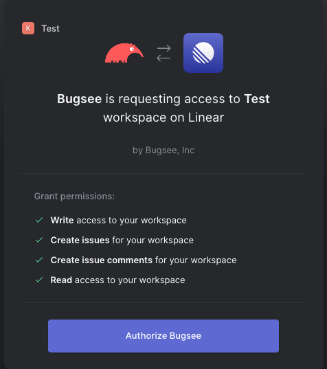

## Authentication

### Supported authentication methods

- [Personal token](#personal-token)
- [OAuth](#oauth)

### Personal token

Navigate to your Linear workspace. From there, in the navigation pane click your avatar to bring up the menu. Click "Settings".

Switch to the _"API"_ section inside the navigation pane under _"Account"_.

Under _"Personal API keys"_, specify _"Bugsee"_ (or whatever makes sense for you) for _"Label"_ field and click _"Create key"_.

Your API token is now generated. Store it somewhere as it will not be available once you navigate away from the page. Either click the token itself to copy it or select and copy it manually.

Now, as we have obtained the API token, it's time to setup Linear integration in Bugsee.

Bring up the Linear integration wizard. Select _"Personal token"_ in the first step of integration wizard. Click _"Next"_.

Paste the previously copied personal token into the corresponding field.

### OAuth 

Start Bugsee integration wizard and select "OAuth" in the first step of integration wizard. Click _Next_.

You will be presented with dialog asking you to grant Bugsee permissions. Click _Authorize Bugsee_ to allow Bugsee access your Linear workspace.

## Configuration

There are no any specific configuration steps for Linear. Refer to <a href="/integrations/configuration/">configuration</a> section for description about generic steps.
