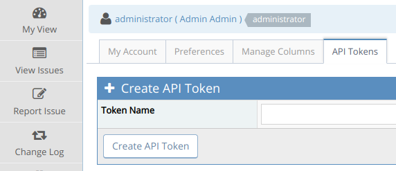
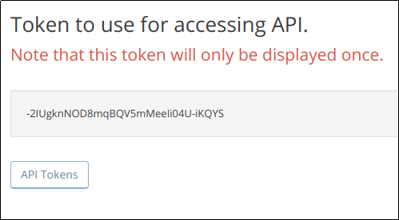
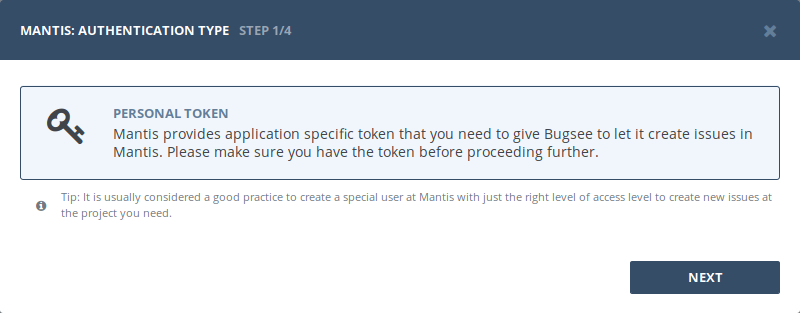
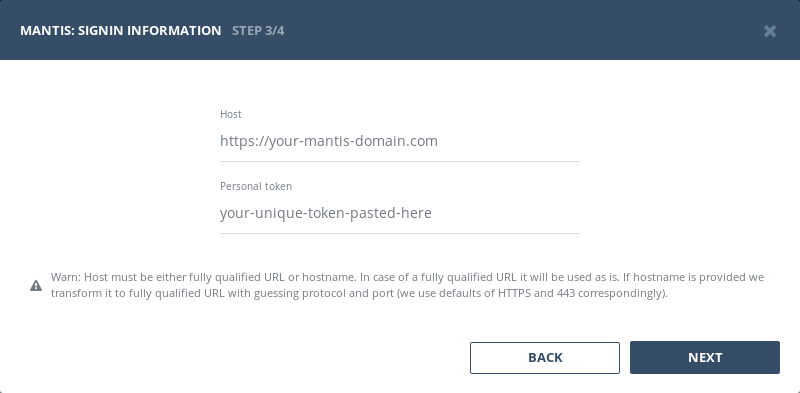

## Authentication

### Supported authentication methods

- [Personal token](#personal-token)


### Personal token

Log into your Mantis, click on your username in the top right hand corner and select _"My Account"_ from the drop down list. Then click on the "API Tokens" tab. Type in a descriptive name for the token and click _"Create API Token"_.



In _"My Profile Settings"_ popup switch to _Apps_ tab. Click _"Manage Developer Apps"_ at its bottom.



Copy and save the generated token. Be sure not to lose it as it will only displayed this one time. If you do mis-place it, you will need to revoke it and generate a new token.

Now, when you've obtained a token, let's configure integration in Bugsee. Select _"Personal token"_ authentication type and click _"Next"_.



Specify the URL of your Mantis in _"Host"_ field and paste generated token into _"Personal token"_ field and finally click _"Next"_ to proceed.




## Configuration

There are no any specific configuration steps for Mantis. Refer to <a href="/integrations/configuration/">configuration</a> section for description about generic steps.


## Custom recipes

Bugsee can accommodate all these customizations with the help of [custom recipes](/integrations/recipes/recipes/). This section provides a few examples of using custom recipes specifically with Mantis. For basic introduction, refer to custom recipe [documentation](/integrations/recipes/recipes/).

### Setting tags field

By default Bugsee creates Mantis issues with Bugsee issue _labels_ as Mantis _tags_. But _labels_ list can be overridden inside your custom recipe. For example you can add some new _label_ (Mantis _tag_) to existing ones:

```javascript
function create(context) {
	// ....

    return {
    	// ...
    	labels: [...issue.labels, "My awesome tag"]
    };
}
```
