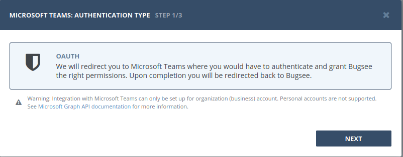
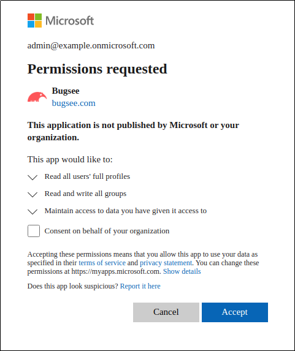
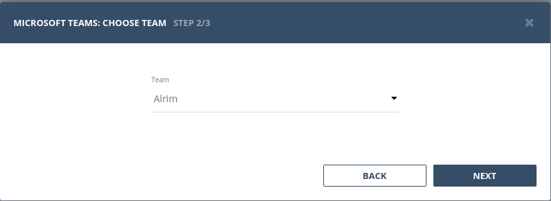

**Integration with Microsoft Teams can only be set up for organization (business) account. Personal accounts are not supported. See <a target="_blank" href="https://docs.microsoft.com/en-us/graph/api/group-list?view=graph-rest-1.0">Microsoft Graph API documentation</a> for more information.**

## Authentication
### Supported authentication methods

- [OAuth](#oauth)

### OAuth

You should be an admin in your Microsoft Teams organization to be able to set up integration with Microsoft Teams. Otherwise you will need to request your organization admin consent. See <a target="_blank" href="https://docs.microsoft.com/en-us/azure/active-directory/manage-apps/configure-admin-consent-workflow">configure admin consent guide</a> for more information.

Select "OAuth" in the first step of integration wizard. Click _"Next"_.

You will be presented with dialog asking you to authorize Bugsee. Click _Yes_ to allow Bugsee access your Microsoft Teams account.

Next you will need to choose the team.

## Configuration

There are no any specific configuration steps for Microsoft Teams. Refer to <a href="/integrations/configuration/">configuration</a> section for description about generic steps.