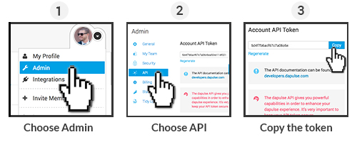
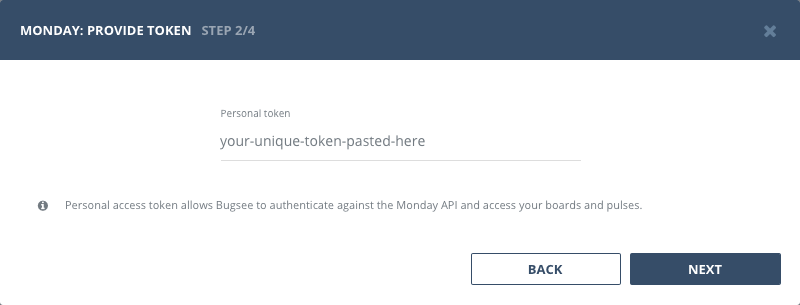
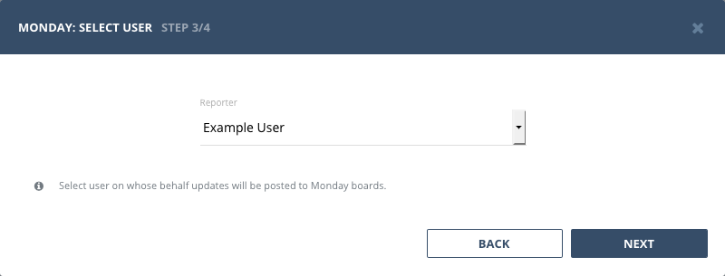

## Authentication

### Supported authentication methods

- [Personal token](#personal-token)


### Personal token

To proceed with this authentication type you need to obtain API token from Monday. Steps below will instruct you how to do that.



Now, when you've obtained a token, let's configure integration in Bugsee.

Start Bugsee integration wizard paste the token into. Click _"Next"_.




## Configuration

When issues are pushed to Monday, they must be bundled with proper reporter. You need to select user who will be set as reporter for all the issues coming from Bugsee




## Custom recipes

Bugsee can accommodate all these customizations with the help of [custom recipes](/integrations/recipes/recipes/). This section provides a few examples of using custom recipes specifically with Monday. For basic introduction, refer to custom recipe [documentation](/integrations/recipes/recipes/).

### Setting tags field

By default Bugsee creates and updates Monday pulses with Bugsee issue _labels_ as Monday _tags_. But _labels_ list can be overridden inside your custom recipe. For example you can add some new _label_ (Monday _tag_) to existing ones:

```javascript
function create(context) {
	// ....

    return {
    	// ...
    	labels: [...issue.labels, "My awesome tag"]
    };
}

function update(context, changes) {
	const result = {};
	// ...
    
    if (changes.labels) {
        result.labels = [...changes.labels.to, "My awesome tag"];
    }

	return {
        issue: {
            custom: {}
        },
        changes: result
    };
}
```
