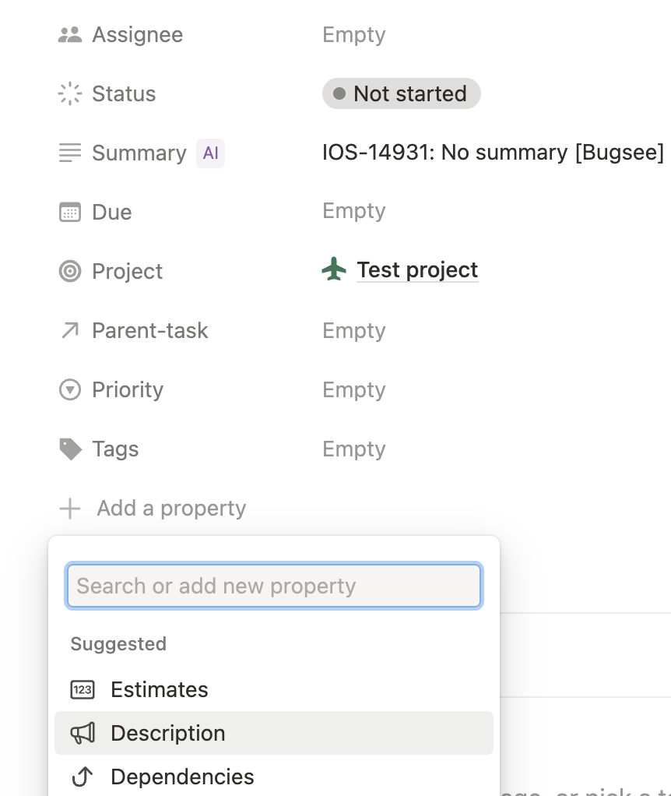
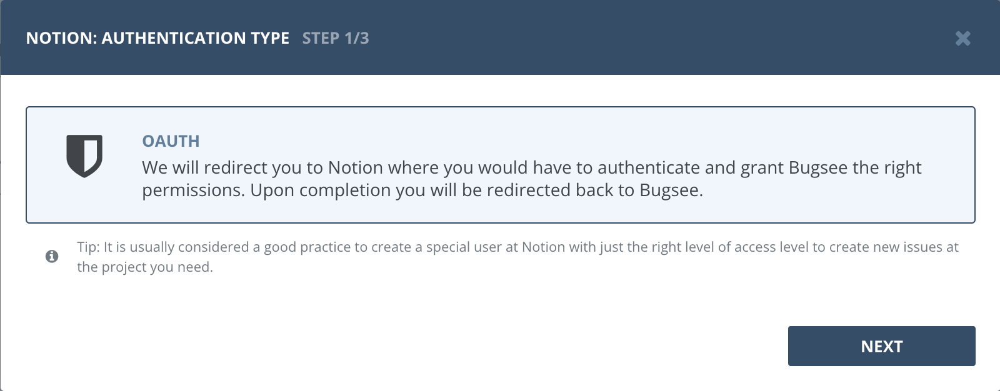
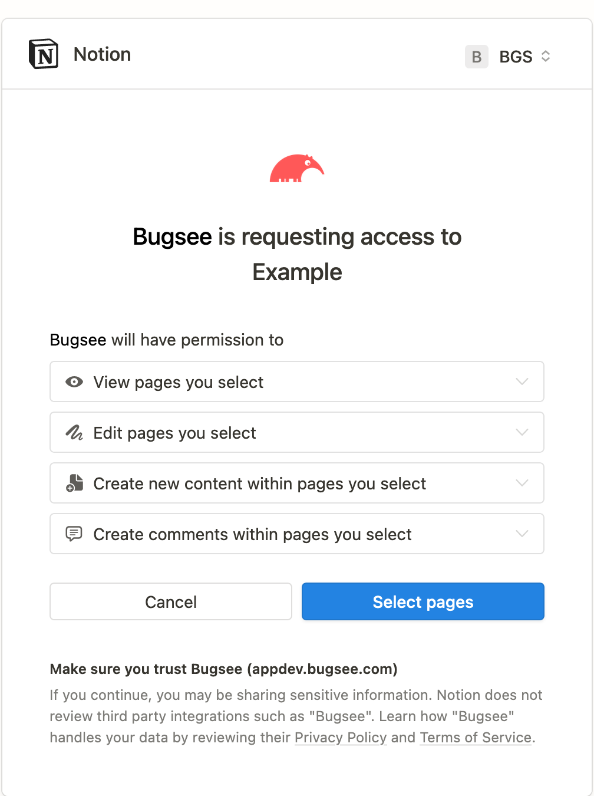
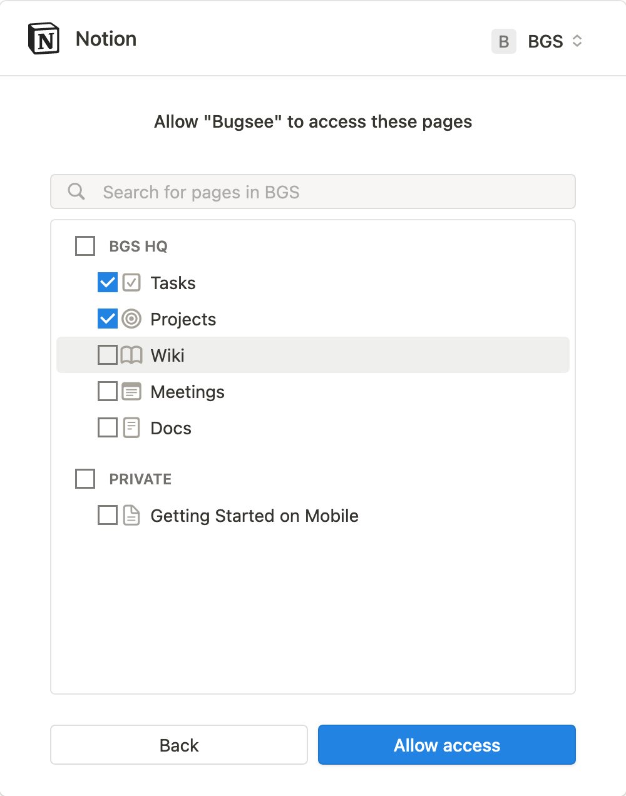
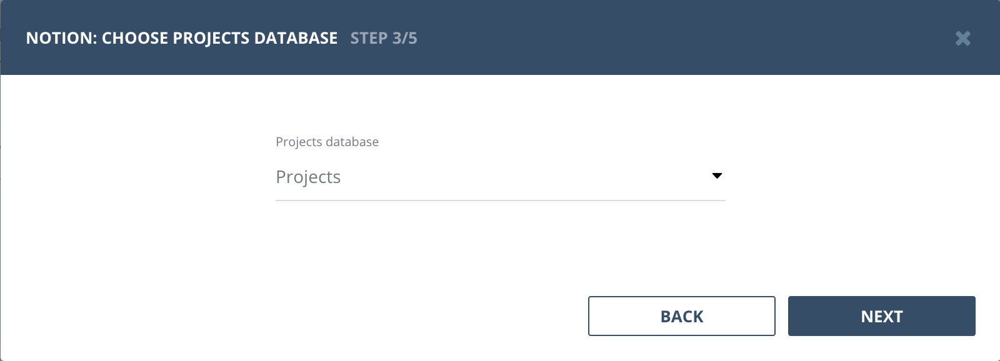

## Requirements

Bugsee requires the "Projects and tasks" template to be present in the workspace you want to integrate with. To learn more about that template, please refer to "<a href="https://www.notion.so/help/guides/getting-started-with-projects-and-tasks" target="_blank" rel="noopener noreferrer">Getting started with projects and tasks</a>" page in Notion documentation.

During the authentication process you will be asked to grant Bugsee the access to your workspace in Notion. Make sure you select both "Projects" and "Tasks" databases.

Once authenticated, you will need to add the "Description" field to the task template. You can do that by creating the dummy task, opening it and clicking on "Add a property" button below the task fields (not, that this button may be collapsed under the "# more property" toggle).



## Authentication

### Supported authentication methods

- [OAuth](#oauth)


### OAuth

Select "OAuth" in the first step of integration wizard. Click _"Next"_.



You will be presented with dialog asking you to authorize Bugsee. Click _Select pages_ to allow Bugsee access your Notion account.



Make sure you select both "Projects" and "Tasks" items in the next step to grant access to them. Click _"Allow access"_ to proceed.



Next you will need to choose the Projects database.



Then you will need to choose the Tasks database.


## Configuration

There are no any specific configuration steps for Microsoft Teams. Refer to <a href="/integrations/configuration/">configuration</a> section for description about generic steps.


## Custom recipes

## Field types

You can find all the field types and their description in the official [Notion developer documentation](https://developers.notion.com/reference/property-object#rich-text)

### Setting assignee

By default Bugsee does not set assignee for the task. You can override this behavior by using the following custom recipe:

```javascript
function create(context) {
    // ...

    return {
        // ...

    	custom: {
            Assignee: {
                type: "people",
                people: [
                    { id: "<notion-user-unique-id>" }
                ]
            }
        }
    };
}
```


### Setting custom text field

```javascript
function create(context) {
    // ...

    return {
        // ...

    	custom: {
            Sprint: {
                type: "rich_text",
                rich_text: [{ text: { content: "S-11-2" } }]
            }
        }
    };
}
```

### Setting formatted text into description

To apply formatting to the text pushed through the Notion API, it has to be specified in special format
described in the [Notion docs](https://developers.notion.com/reference/rich-text). Further, the assembled
sequence should be passed as an override to the `description` field in the `custom` section.

```javascript
function create(context) {
    // ...

    const issue = context.issue;

    let description = issue.description || '';

    // Add two newlines to separate other data from the description
    description += description ? '\n\n' : '';
    description += issue.reporter ? `Reported by ${issue.reporter}\n\n` : '';

    const formattedDescription = [{ text: { content: description } }]

    if (issue.attachments?.length) {
        // Bold title
        formattedDescription.push({
            text: { content: 'Attachments:' },
            annotations: { bold: true }
        });
        formattedDescription.push({ text: { content: `\n` } });

        // List of attachments with hyperlinks
        issue.attachments.forEach(attachment => {
            formattedDescription.push({ text: { content: `- ${attachment.name}: ` } });
            formattedDescription.push({ text: {
                content: 'Download attachment',
                link: { url: attachment.url }
            }});
            formattedDescription.push({ text: { content: `\n` } });
        });
        formattedDescription.push({ text: { content: `\n` } });
    }

    return {
        // ...

    	custom: {
            Description: { rich_text: formattedDescription }
        }
    };
}
```