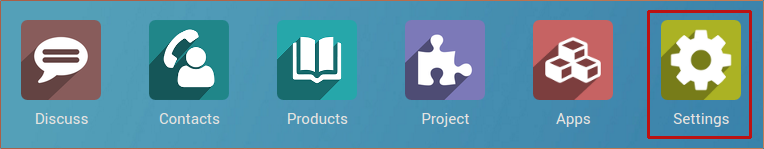
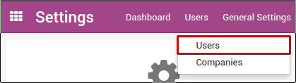
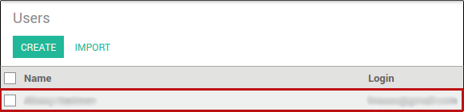
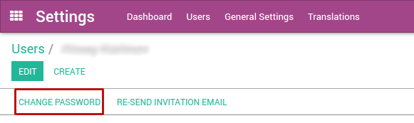
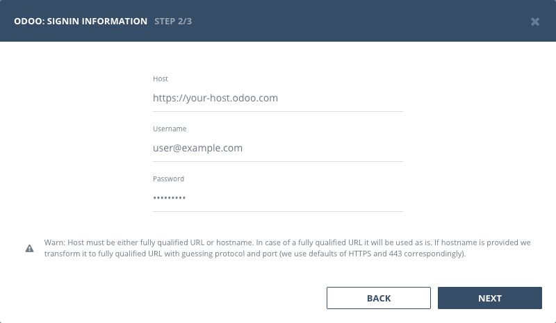

## Authentication

### Supported authentication methods

- [Basic (username and password)](#basic-authentication)

### Basic authentication

User accounts in Odoo Online instances (&lt;domain&gt;.odoo.com) are created without a local password. To use Odoo API there, you will need to set a password on the user account you want to use:

Log in your instance with an administrator account and click settings icon

Hover _"Users"_ menu and click _"Users"_ item in its drop-down

Click the row with user you want to use in Bugsee integration

Click the _"Change Password"_ button. Set a _"New Password"_ value and then click _"Change Password"_.

Now, when you've made required changes in your Odoo instance, let's configure integration in Bugsee.

Pass through instructional steps in wizard and stop at authentication step. Provide valid host (URL to your Odoo), username and password. Click _"Next"_.

## Configuration

There are no any specific configuration steps for Odoo. Refer to <a href="/integrations/configuration/">configuration</a> section for description about generic steps.