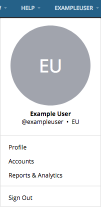
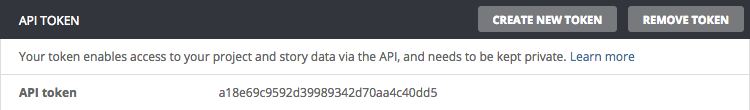
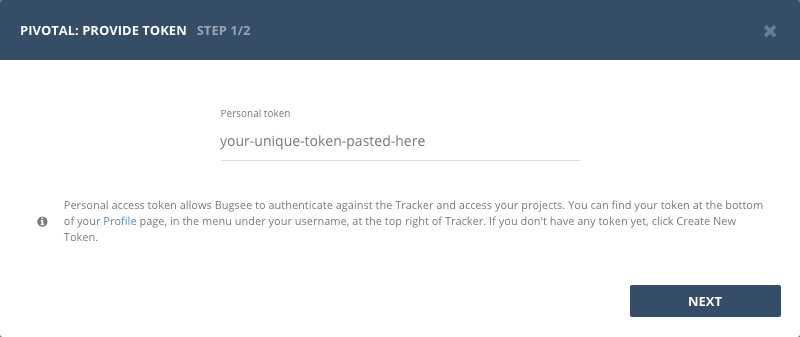

## Authentication

### Supported authentication methods

- [Personal token](#personal-token)


### Personal token

To proceed with this authentication type you need to obtain API token from Pivotal Tracker. Steps below will instruct you how to do that.

Navigate to your Pivotal Tracker. Reveal user menu by clicking on your avatar icon in header and then click _"Profile"_ there.



When navigated to profile page, scroll down to _"API Token"_ section and copy your token.




Now, when you've obtained a token, let's configure integration in Bugsee.

Start Bugsee integration wizard and paste token copied in previous step. Click _"Next"_.




## Configuration

There are no any specific configuration steps for Pivotal Tracker. Refer to <a href="/integrations/configuration/">configuration</a> section for description about generic steps.


## Custom recipes

Bugsee can accommodate all these customizations with the help of [custom recipes](/integrations/recipes/recipes/). This section provides a few examples of using custom recipes specifically with Pivotal. For basic introduction, refer to custom recipe [documentation](/integrations/recipes/recipes/).

### Setting labels field

By default Bugsee creates and updates Pivotal stories with Bugsee issue _labels_. But _labels_ list can be overridden inside your custom recipe. For example you can add some new _label_ to existing ones:

```javascript
function create(context) {
	// ....

    return {
    	// ...
    	labels: [...issue.labels, "My awesome label"]
    };
}

function update(context, changes) {
	const result = {};
	// ...
    
    if (changes.labels) {
        result.labels = [...changes.labels.to, "My awesome label"];
    }

	return {
        issue: {
            custom: {}
        },
        changes: result
    };
}
```
