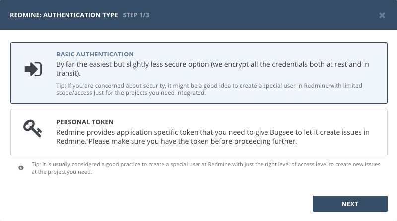
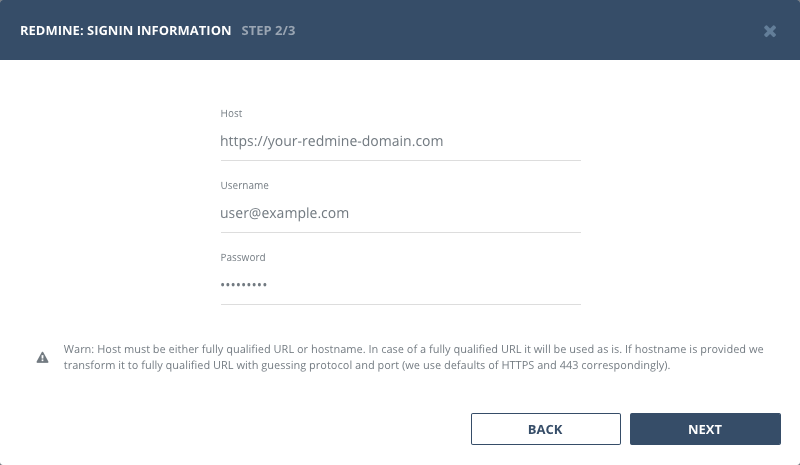
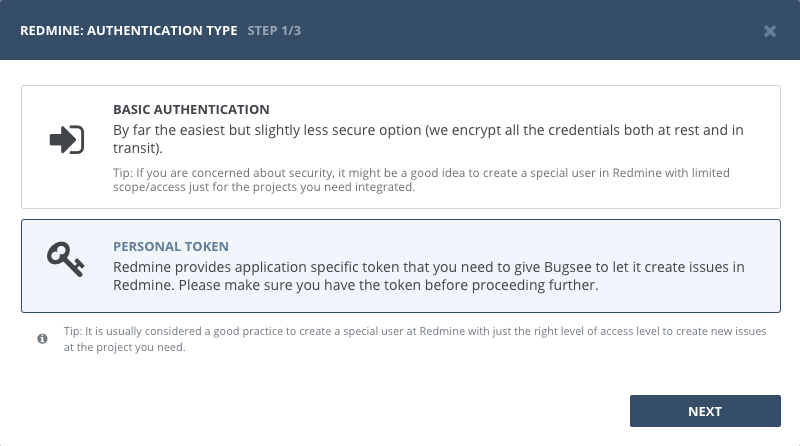
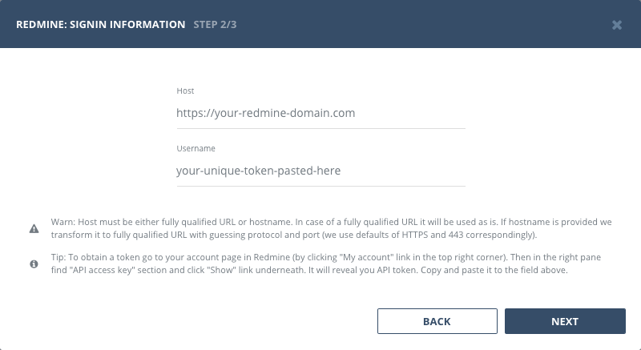

## Authentication

To let Bugsee integrate with your Redmine, you should enable REST API access. Enable it in *Administration -> Settings -> API*.

### Supported authentication methods

- [Basic (username and password)](#basic-authentication)
- [Personal token](#personal-token)

## Basic authentication

:::info
No custom configuration required in Redmine for this type of authentication.
:::

Select "Basic authentication" in the first step of integration wizard. Click "Next".

Provide valid host (URL to your Redmine), username and password.

### Personal token

You can find your personal API key on your account page (https://&lt;redmine-domain&gt;/my/account) when logged in, on the right-hand pane of the default layout.

Start Bugsee integration wizard and select _"Personal token"_ authentication type. Click _"Next"_.

Provide valid host (URL to your Redmine) and paste generated token.

## Configuration

There are no any specific configuration steps for Redmine. Refer to <a href="/integrations/configuration/">configuration</a> section for description about generic steps.