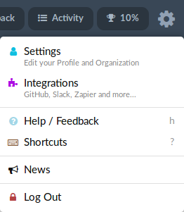
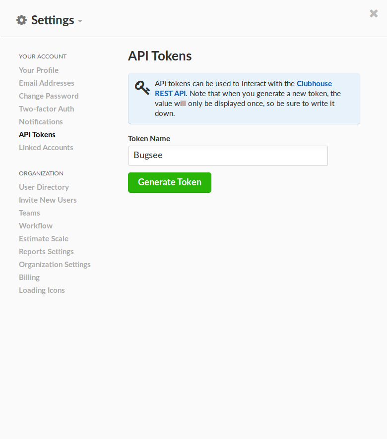
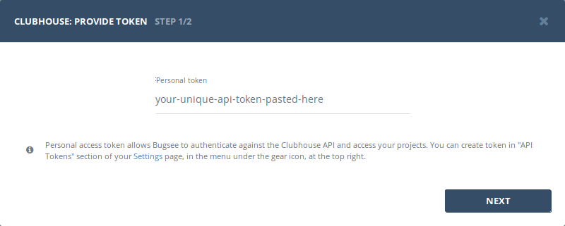

## Authentication


### Supported authentication methods

- [Personal token](#personal-token)


### Personal token

To proceed with this authentication type you need to obtain API token from Shortcut. Steps below will instruct you how to do that.

Navigate to your Shortcut and click on gear icon in the header to reveal the menu. Then click _"Settings"_.



In _"Settings"_ popup, go to _"API Tokens"_ section. Provide desired name for your new token in _"Token Name"_ field and click _"Generate Token"_ to create new token.



Note that when you generate a new token, the value will only be displayed once, so make sure to write it down.

Once you have the token, use it in Bugsee authentication wizard:




## Configuration

There are no any specific configuration steps for Shortcut. Refer to <a href="/integrations/configuration/">configuration</a> section for description about generic steps.


## Custom recipes

Bugsee can accommodate all these customizations with the help of [custom recipes](/integrations/recipes/recipes/). This section provides a few examples of using custom recipes specifically with Shortcut. For basic introduction, refer to custom recipe [documentation](/integrations/recipes/recipes/).

### Setting labels field

By default Bugsee creates and updates Shortcut bugs with Bugsee issue _labels_. But _labels_ list can be overridden inside your custom recipe. For example you can add some new _label_ to existing ones:

```javascript
function create(context) {
	// ....

    return {
    	// ...
    	labels: [...issue.labels, "My awesome label"]
    };
}

function update(context, changes) {
	const result = {};
	// ...
    
    if (changes.labels) {
        result.labels = [...changes.labels.to, "My awesome label"];
    }

	return {
        issue: {
            custom: {}
        },
        changes: result
    };
}
```
