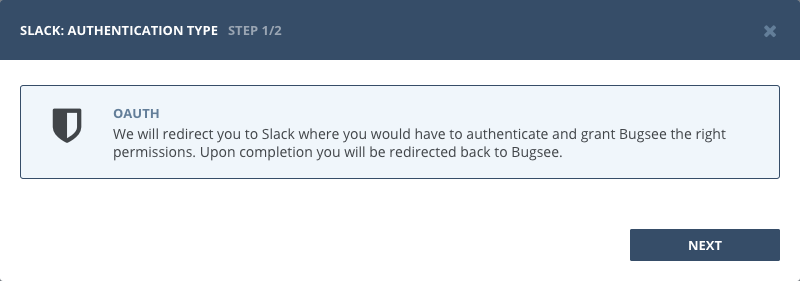
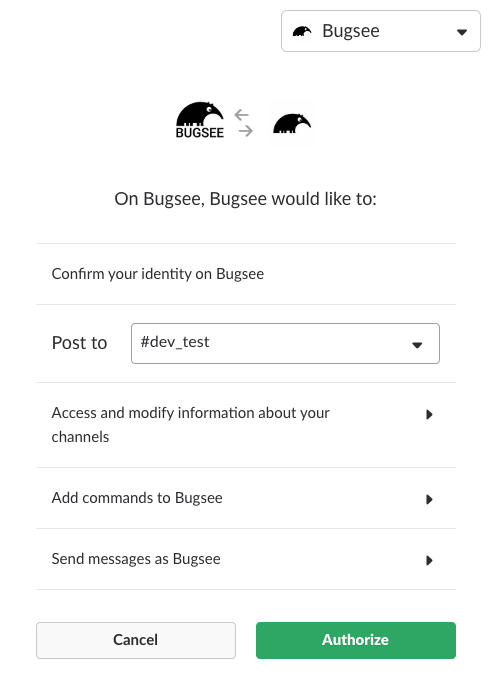

## Authentication

### Supported authentication methods

- [OAuth](#oauth)

### OAuth

Select "OAuth" in the first step of integration wizard. Click _"Next"_.

You will be presented with dialog asking you to authorize Bugsee. You need to select default channel you want to post messages from Bugsee to. Note, that you can change that in the last wizard step on a per application basis. Click _Authorize_ to allow Bugsee access your Slack.

## Configuration

There are no any specific configuration steps for Slack. Refer to <a href="/integrations/configuration/">configuration</a> section for description about generic steps.