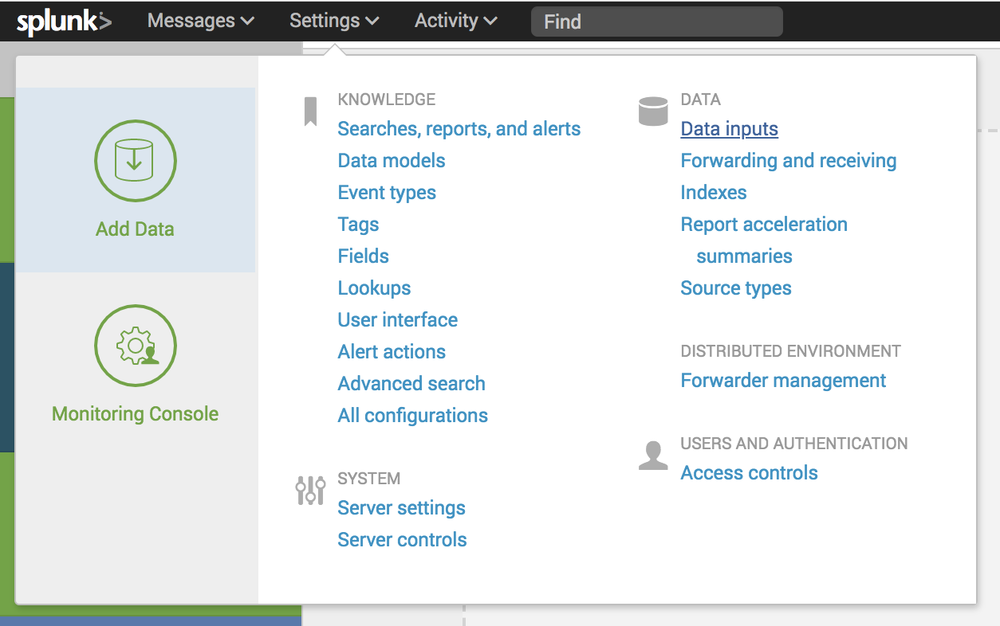
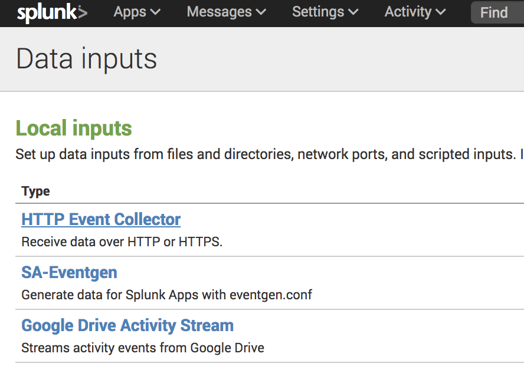
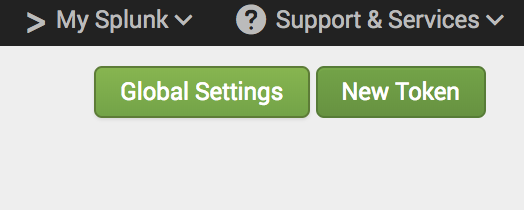
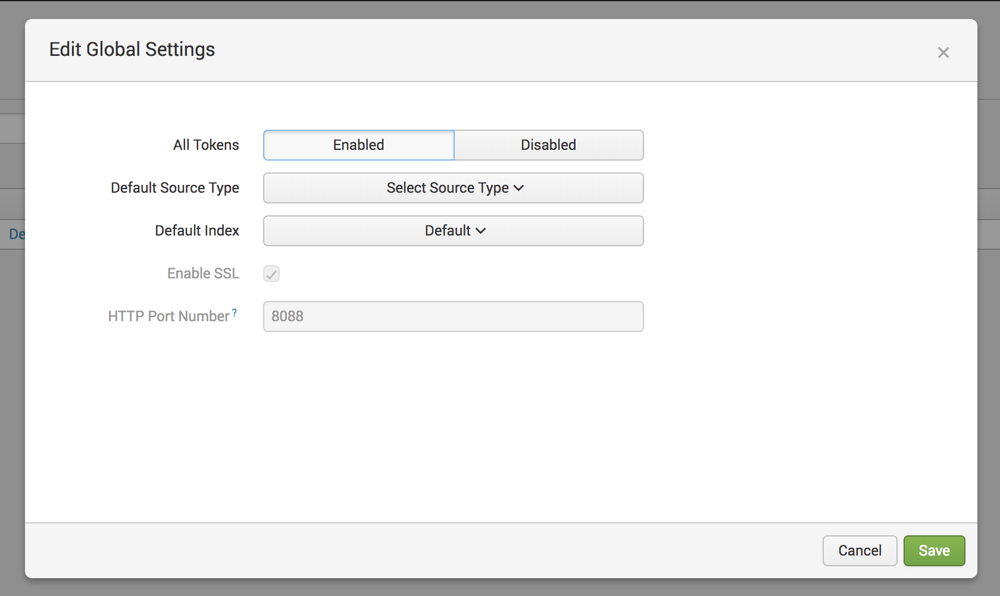
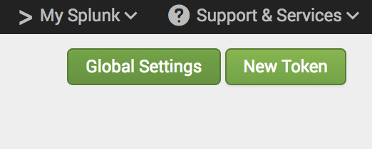
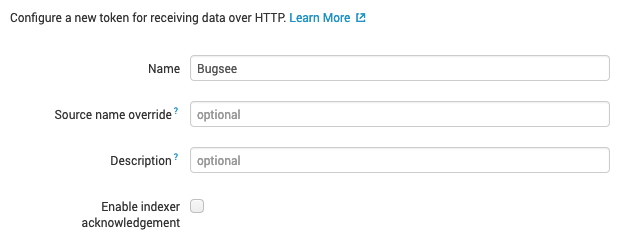
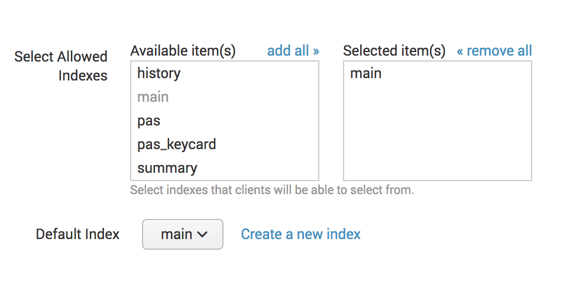
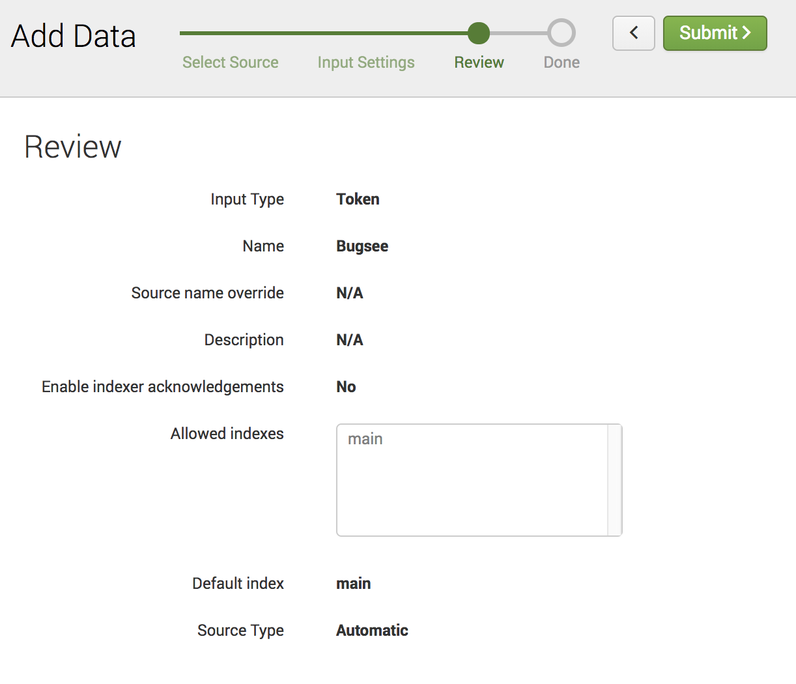
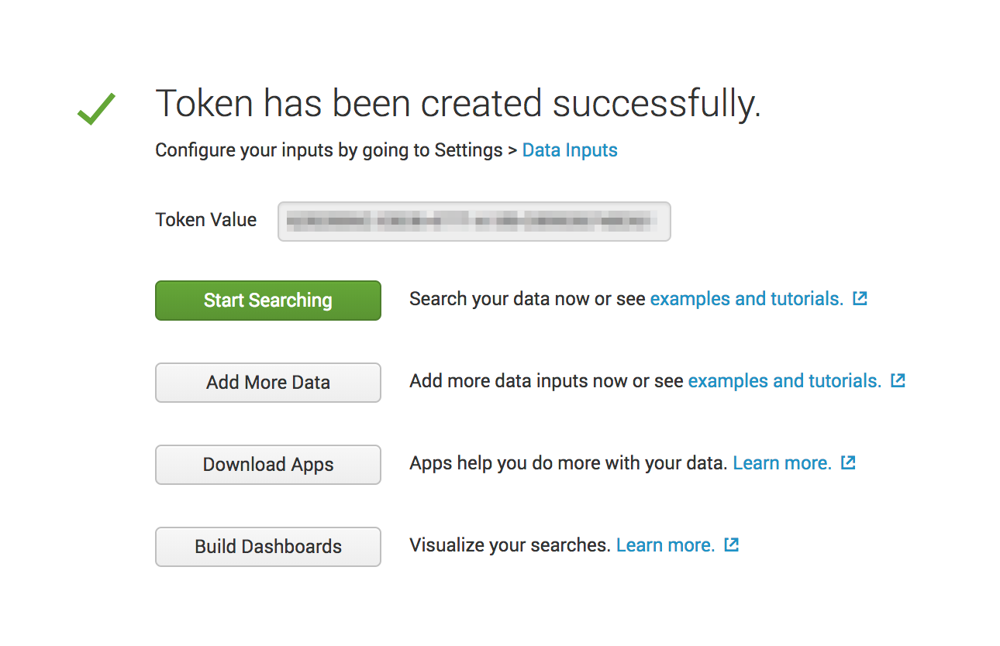
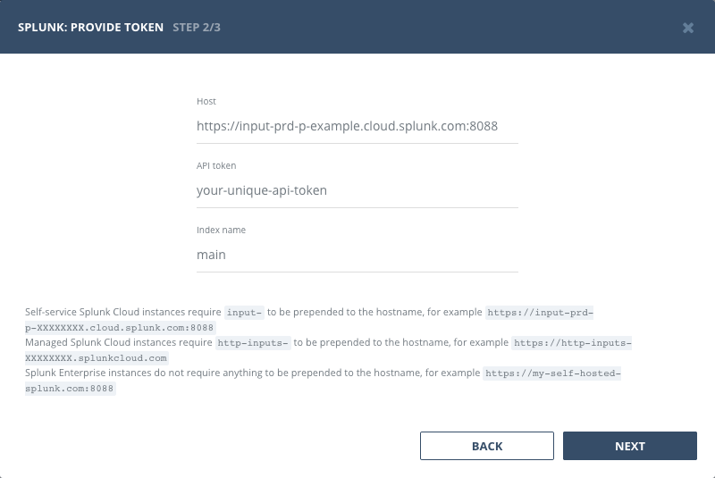

## Authentication

### Supported authentication methods

- [Personal token](#personal-token)


### Personal token

To proceed with this authentication type you need to obtain API token from Splunk. You need to configure your Splunk instance first to enable the _"HTTP Event Collector"_ and add a new data input for Bugsee. Steps below will instruct you how to do that.


In your Splunk Dashboard click _"Data Inputs"_ in the _"Settings"_ menu.



In the _"Data inputs"_ page click _"HTTP Event Collector"_



Click the _"Global Settings"_ button in the _"HTTP Event Collector"_ page



Make sure that _"All Tokens"_ are set to Enabled as it's set to Disabled by default. Also, Make a note of the _"HTTP Port Number"_ as this will be required configure Splunk integration in Bugsee.



Click the _"Save"_ button.

Back on the HTTP Event Collector page click the _"New Token"_ button. This will start the _"Add Data"_ wizard



On the _"Select Source"_ step add a _"Name"_ of "Bugsee" (or whatever name you want to associate the token being created with Bugsee). Also, make sure the _"Enable indexer acknowledgement"_ is not checked. Bugsee does not support that feature out of the box, however, you can make use of it by utilizing [Custom recipes](/integrations/recipes/recipes/) (we discuss that at the bottom of this page). Finally, click the _"Next"_ button



On the _"Input Setting"_ step select the index to use for storing the incoming data from Bugsee and click the _"Review"_ button



Check the details on the Review page and click _"Submit"_



A token value will be presented in the next step. This will be needed to configure Splunk integration in Bugsee



Now, when you've obtained a token, let's configure integration in Bugsee.

Start Bugsee integration wizard paste the token into. Click _"Next"_.



There are no any entities to which you can map Bugsee applications in Splunk. Instead, you will be offered with single static option of _"Events stream"_. You should select it for all the Bugsee applications you want to receive events for.


## Configuration

When setting the Splunk instance URL (_"Host"_ field in the integration wizard) make sure you follow the rules outlined below:

Self-service Splunk Cloud instances require ```input-``` to be prepended to the hostname, for example ```https://input-prd-p-XXXXXXXX.cloud.splunk.com:8088```

Managed Splunk Cloud instances require ```http-inputs-``` to be prepended to the hostname, for example ```https://http-inputs-XXXXXXXX.splunkcloud.com```

Splunk Enterprise instances do not require anything to be prepended to the hostname, for example ```https://my-self-hosted-splunk.com:8088```


## Custom recipes

You can utilize custom recipes with Splunk integration to update/enhance the sent data to your Splunk instance.

By default, we send the following object to the Splunk events collector endpoint

```json
{
    "sourcetype": "issue",
    "source": "BUGSEE",
    "index": "main",
    "event": {
        "summary": "Some summary",
        "description": "Some description",
        "labels": [],
        "priority": "blocker",
        "reporter": "johndoe@example.com"
    }
}
```

You can override all the fields, by filling the _"custom"_ section of the recipe with whatever values you feel appropriate. Note, that _"index"_ and _"event"_ fields are mandatory and will be included into the payload regardless of what you will specify in your _"custom"_ section. You can only override them, not remove.

If you want to add some specific fields to an actual event, provide them within an _"event"_ field, like:

```javascript
{
    custom: {
        // "event" object will be merged with the default "event" dictionary described above
        event: {
            some_other_field: 123,
            another_field: 'abc'
        }
    }
}
```

In case, if you want to push data to some other _"index"_ and/or change the _"source"_ string under which events arrive, you can do that quite easily:

```javascript
{
    custom: {
        index: "custom_index",
        source: "myCustomSource"
    }
}
```


## Custom recipes

Bugsee can accommodate all these customizations with the help of [custom recipes](/integrations/recipes/recipes/). This section provides a few examples of using custom recipes specifically with Splunk. For basic introduction, refer to custom recipe [documentation](/integrations/recipes/recipes/).

### Setting labels field

By default Bugsee creates Splunk events with Bugsee issue _labels_ as _labels_ field. But _labels_ list can be overridden inside your custom recipe. For example you can add some new _label_ to existing ones:

```javascript
function create(context) {
	// ....

    return {
    	// ...
    	labels: [...issue.labels, "My awesome label"]
    };
}
```
