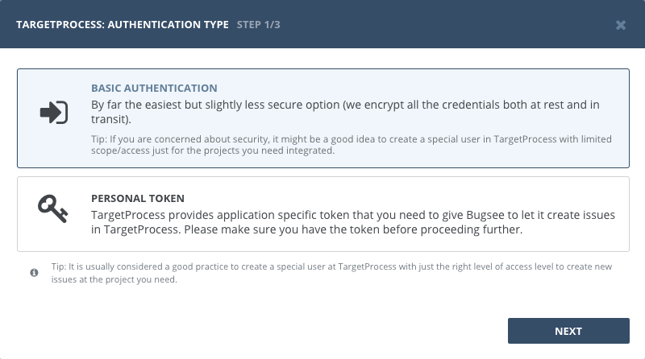
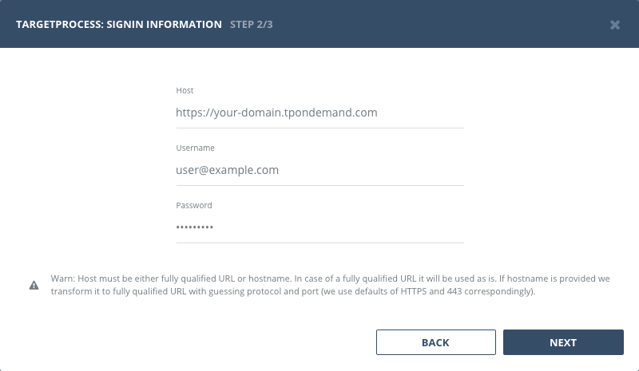
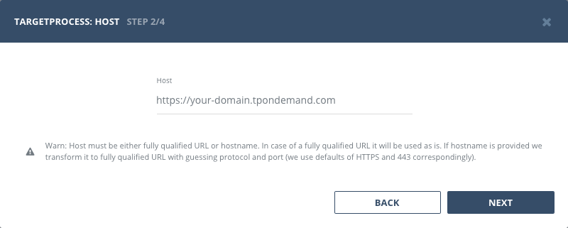
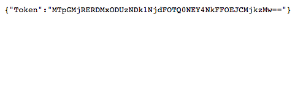
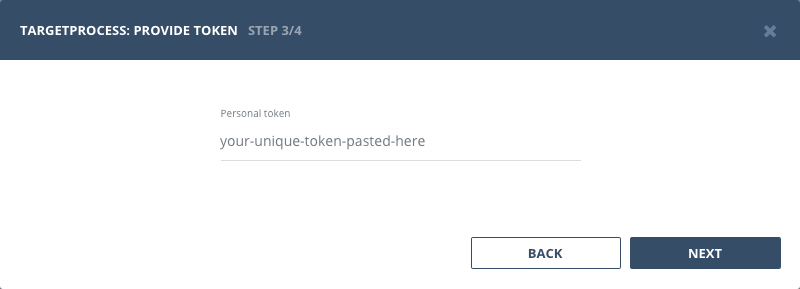

## Authentication

### Supported authentication methods

- [Basic (username and password)](#basic-authentication)
- [Personal token](#personal-token)

### Basic authentication

:::info
No custom configuration required in TargetProcess for this type of authentication.
:::

Select "Basic authentication" in the first step of integration wizard. Click _"Next"_.



Provide valid host (URL to your TargetProcess), username and password. Click _"Next"_.




### Personal token

:::info
No custom configuration required in TargetProcess for this type of authentication.
:::

Start Bugsee integration wizard and select _"Personal token"_ authentication type. Click _"Next"_.


Provide valid host (URL to your TargetProcess, usually in form of ```https://<domain>.tpondemand.com```).



You will be presented with a dialog with a token. Copy it and close the dialog.



Paste token copied in previous step. Click _"Next"_.




## Configuration

There are no any specific configuration steps for TargetProcess. Refer to <a href="/integrations/configuration/">configuration</a> section for description about generic steps.


## Custom recipes

Bugsee can accommodate all these customizations with the help of [custom recipes](/integrations/recipes/recipes/). This section provides a few examples of using custom recipes specifically with TargetProcess. For basic introduction, refer to custom recipe [documentation](/integrations/recipes/recipes/).

### Setting tags field

By default Bugsee creates and updates TargetProcess bugs with Bugsee issue _labels_ as TargetProcess _tags_. But _labels_ list can be overridden inside your custom recipe. For example you can add some new _label_ (TargetProcess _tag_) to existing ones:

```javascript
function create(context) {
	// ....

    return {
    	// ...
    	labels: [...issue.labels, "My awesome tag"]
    };
}

function update(context, changes) {
	const result = {};
	// ...
    
    if (changes.labels) {
        result.labels = [...changes.labels.to, "My awesome tag"];
    }

	return {
        issue: {
            custom: {}
        },
        changes: result
    };
}
```
