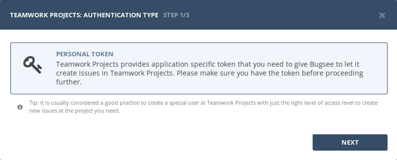
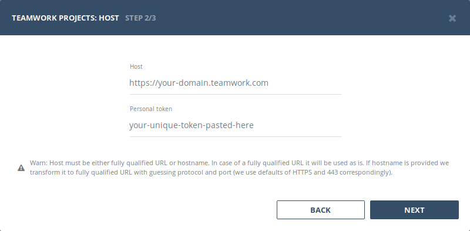
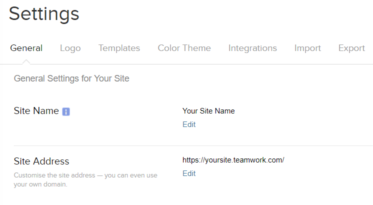
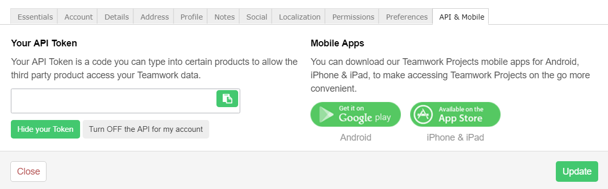

## Authentication

### Supported authentication methods

- [Personal token](#personal-token)


### Personal token

:::info
No custom configuration required in Teamwork Projects for this type of authentication.
:::

Start Bugsee integration wizard and select _"Personal token"_ authentication type. Click _"Next"_.



Provide valid host (URL to your Teamwork Projects, usually in form of ```https://<domain>.teamwork.com```). To obtain your site URL and api token look at the instructions below.



Your URL can be found in the settings of your teamwork projects site. If you navigate to the settings tab on the top right corner of your site and click on general. Your main project settings will appear you will see your URL there under 'Site Address'. You use this when pinging the API.



Your API token can be found by logging into your Teamwork Projects account, clicking your avatar in the top right and choosing Edit my details. On the API tab of the dialog click the "Show your token" at the bottom (under "API Authentication tokens").




## Configuration

There are no any specific configuration steps for Teamwork Projects. Refer to <a href="/integrations/configuration/">configuration</a> section for description about generic steps.


## Custom recipes

Bugsee can accommodate all these customizations with the help of [custom recipes](/integrations/recipes/recipes/). This section provides a few examples of using custom recipes specifically with Teamwork Projects. For basic introduction, refer to custom recipe [documentation](/integrations/recipes/recipes/).

### Setting tags field

By default Bugsee creates and updates Teamwork Projects tasks with Bugsee issue _labels_ as Teamwork Projects _tags_. But _labels_ list can be overridden inside your custom recipe. For example you can add some new _label_ (Teamwork Projects _tag_) to existing ones:

```javascript
function create(context) {
	// ....

    return {
    	// ...
    	labels: [...issue.labels, "My awesome tag"]
    };
}

function update(context, changes) {
	const result = {};
	// ...
    
    if (changes.labels) {
        result.labels = [...changes.labels.to, "My awesome tag"];
    }

	return {
        issue: {
            custom: {}
        },
        changes: result
    };
}
```
