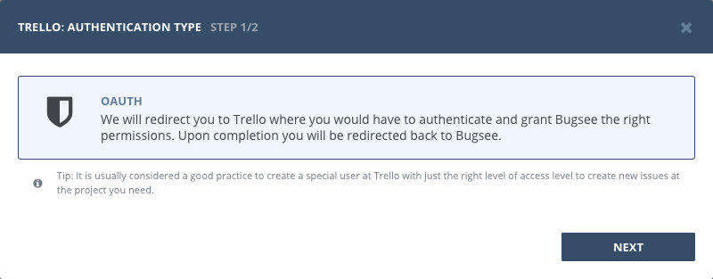
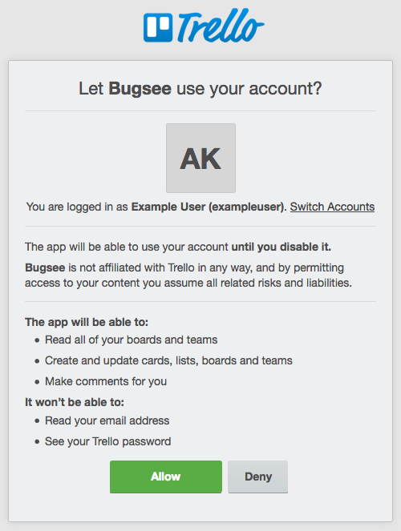
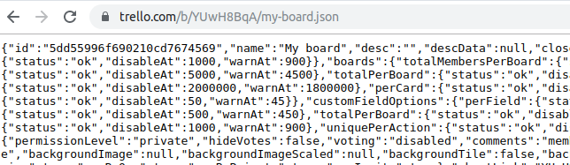
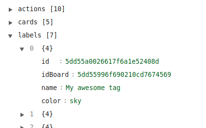

## Authentication

### Supported authentication methods

- [OAuth](#oauth)


### OAuth

Select "OAuth" in the first step of integration wizard. Click _"Next"_.



You will be presented with dialog asking you to authorize Bugsee. You need to select default channel you want to post messages from Bugsee to. Note, that you can change that in the last wizard step on a per application basis. Click _Authorize_ to allow Bugsee access your Trello.




## Configuration

There are no any specific configuration steps for Trello. Refer to <a href="/integrations/configuration/">configuration</a> section for description about generic steps.


## Custom recipes

Bugsee can accommodate all these customizations with the help of [custom recipes](/integrations/recipes/recipes/). This section provides a few examples of using custom recipes specifically with Trello. For basic introduction, refer to custom recipe [documentation](/integrations/recipes/recipes/).

### Setting labels field

Bugsee can't map its own issues _labels_ field to Trello _labels_. But you can specify appropriate _idLabels_ via _custom_ field inside custom recipes:

```javascript
function create(context) {
	// ....

    return {
    	// ...
    	custom: {
    		// This example sets label by its ID (idLabels)
    		idLabels: ["5dd55a0026617f6a1e52408d"]
    	}
    };
}
```


You can add _.json_ into URL of your Trello board to get JSON view:



Then you can find _labels_ list inside the JSON that includes all your labels with keys _name_, _color_ and _id_ that should be used in the recipe above:

