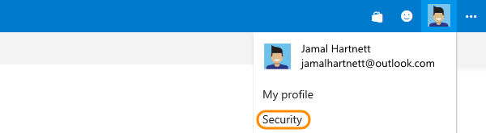
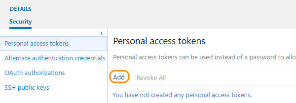
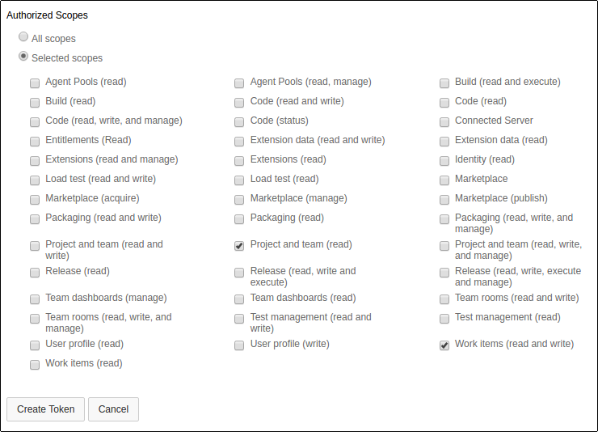
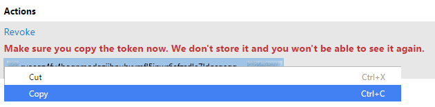
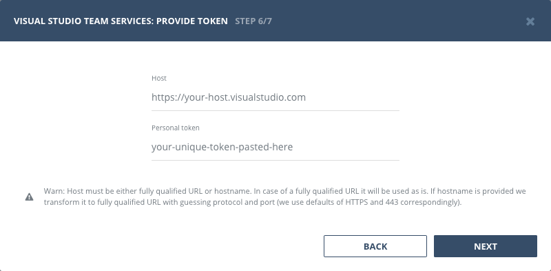

:::info
Visual Studio Team Services (VSTS) was renamed to Azure DevOps in September 2018. If you are using Azure DevOps cloud, please refer to the [Azure DevOps integration](/integrations/providers/azure-devops) instead. This page covers VSTS and on-premise Azure DevOps Server installations.
:::

## Authentication

### Supported authentication methods

- [Personal token](#personal-token)


### Personal token

To proceed with this authentication type you need to obtain API token from VSTS. Steps below will instruct you how to do that.

Sign in to either your Azure DevOps account (https://{youraccount}.visualstudio.com) or your Azure DevOps Server web portal (https://{server}:8080/tfs/). For older TFS installations, the URL format may vary.

From your home page, open your profile. Go to your security details.



Create a personal access token.



Name your token. Select a lifespan for your token. If you're using Team Services, and you have more than one account, you can also select the Team Services account where you want to use the token.

Now you need to specify permissions that token will grant. Bugsee requires **Project and team (read)** and **Work items (read and write)** scopes to function properly.



When you're done, make sure to copy the token. You'll use this token as your password.



Now, when you've obtained a token, let's configure the integration in Bugsee.

Provide valid host (URL to your VSTS) and paste generated token.




## Configuration

There are no any specific configuration steps for Visual Studio Team Services. Refer to <a href="/integrations/configuration/">configuration</a> section for description about generic steps.

## Custom recipes

Bugsee can accommodate all the customizations required for your VSTS with the help of [custom recipes](/integrations/recipes/recipes/). This section provides a few examples of using custom recipes with Azure DevOps. For basic introduction, refer to custom recipe [documentation](/integrations/recipes/recipes/).

### Setting tags field

By default Bugsee creates and updates VSTS bugs with Bugsee issue _labels_ as VSTS _tags_. But _labels_ list can be overridden inside your custom recipe. For example you can add some new _label_ (VSTS _tag_) to existing ones:

```javascript
function create(context) {
	// ....

    return {
    	// ...
    	labels: [...issue.labels, "My awesome tag"]
    };
}

function update(context, changes) {
	const result = {};
	// ...
    
    if (changes.labels) {
        result.labels = [...changes.labels.to, "My awesome tag"];
    }

	return {
        issue: {
            custom: {}
        },
        changes: result
    };
}
```

### Setting custom fields

Custom fields for VSTS must be set as an array of objects ({ op, path, value }) inside the "fields" attribute, like shown below:

```javascript
function create(context) {
	// ....

    return {
    	// ...
    	custom: {
    		fields: [
                {
                    op: 'add',
                    path: '/fields/System.Reason',
                    value: 'New task'
                }
            ]
    	}
    };
}
```
