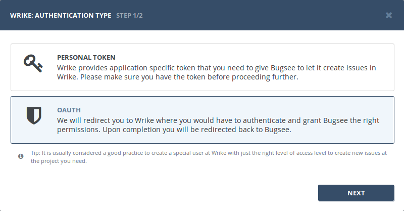
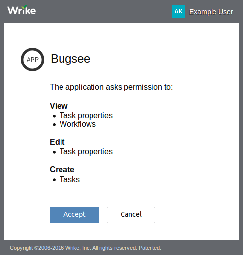

## Authentication

### Supported authentication methods

- [OAuth](#oauth)

### OAuth

Start Bugsee integration wizard and select  "OAuth" at the first step. Click _"Next"_.

You will be presented with dialog asking you to authorize Bugsee. Click _Authorize_ to allow Bugsee access your GitLab.

## Configuration

There are no any specific configuration steps for Wrike. Refer to <a href="/integrations/configuration/">configuration</a> section for description about generic steps.