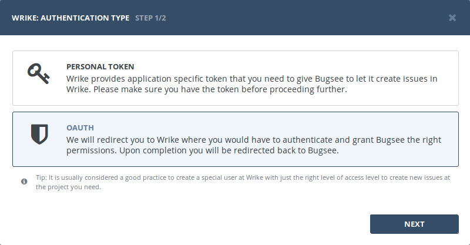
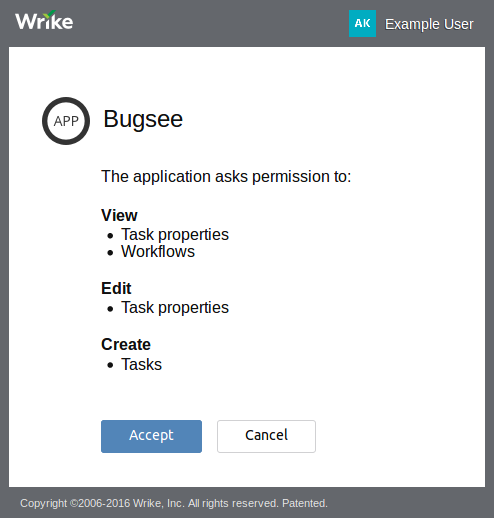

## Authentication

### Supported authentication methods

- [Personal token](#personal-token)
- [OAuth](#oauth)

### Personal token

Generate a permanent access token in Wrike (**Apps & Integrations** → **API**), then start the Bugsee integration wizard, select _"Personal token"_ at the first step and paste the token when prompted.

### OAuth

Start Bugsee integration wizard and select "OAuth" at the first step. Click _"Next"_.

You will be presented with dialog asking you to authorize Bugsee. Click _Authorize_ to allow Bugsee access your Wrike.

## Configuration

There are no specific configuration steps for Wrike. Refer to <a href="/integrations/configuration/">configuration</a> section for description about generic steps.