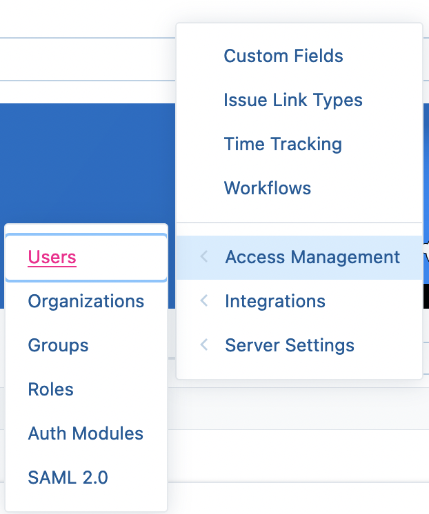
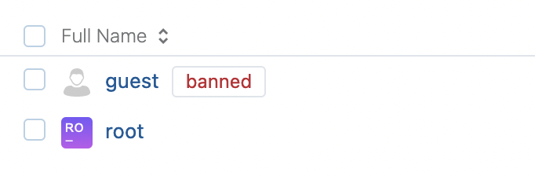
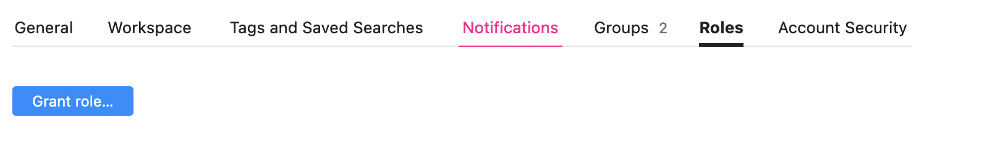
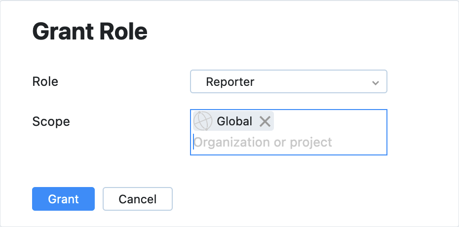
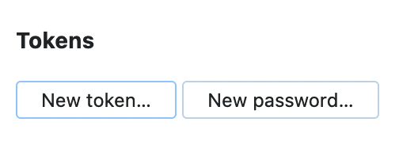
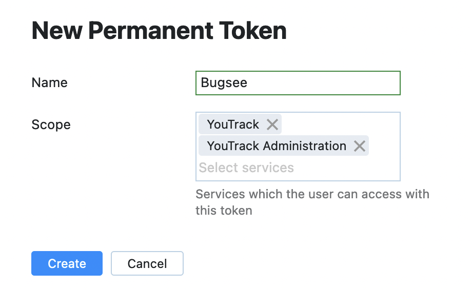
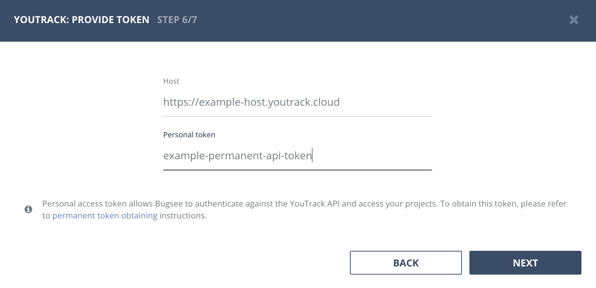

## Authentication

### Supported authentication methods

- [Basic (username and password)](#basic-authentication)

### Basic authentication

To create issues in YouTrack you need to ensure that YouTrack account you will be using to integrate Bugsee has _"Reporter"_ role assigned to it. Please, follow steps below to do that.

Login to your YouTrack instance and go to user management page

Click on _"Full Name"_ of the user you want to add _"Reporter"_ role to

Switch to _"Roles"_ tab

Click _"Grant role..."_ button

Select the project to grant access to (selecting _"Global"_ will grant access to all projects) and _"Reporter"_ role, finally click _"Add Role"_ button.

Next, we need to create a personal/API token for the user we have assigned the _"Reporter"_ role for. To do that, switch to the _"Account Security"_ tab

In the _"Tokens"_ area, click _"New token..."_

In the dialog, specify the name of the token and its scope (the required one is "YouTrack")

Finally, click _"Create"_ to generate your new token. Don't forget to copy and save it. You will need it to configure YouTrack integration in Bugsee.

Now, when you've made required changes in your YouTrack instance, let's configure integration in Bugsee.

Pass through instructional steps in wizard and stop at authentication step. Provide valid host (URL to your YouTrack), the token you generated in the steps above. Click _"Next"_.

## Configuration

There are no any specific configuration steps for YouTrack. Refer to <a href="/integrations/configuration/">configuration</a> section for description about generic steps.