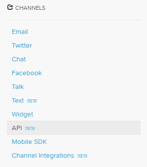
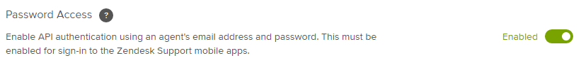
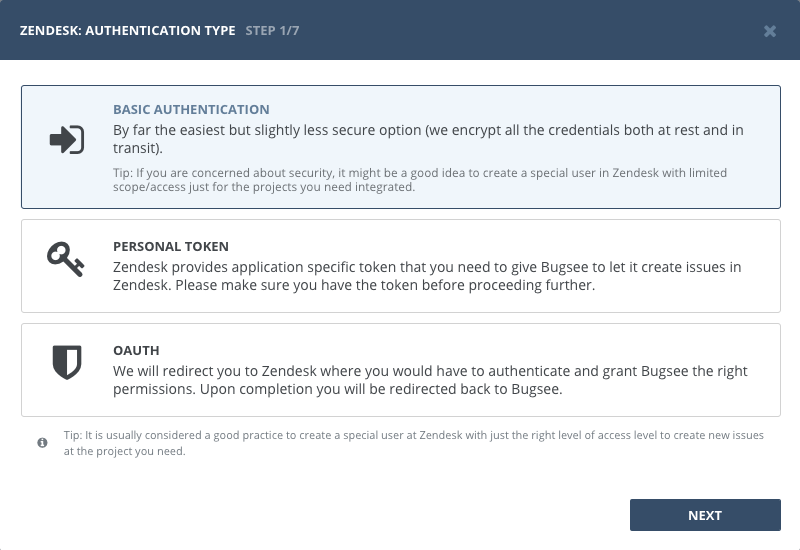
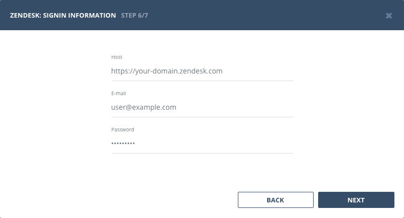
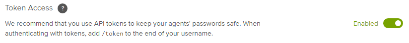
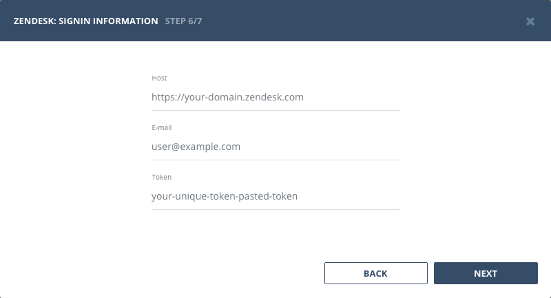
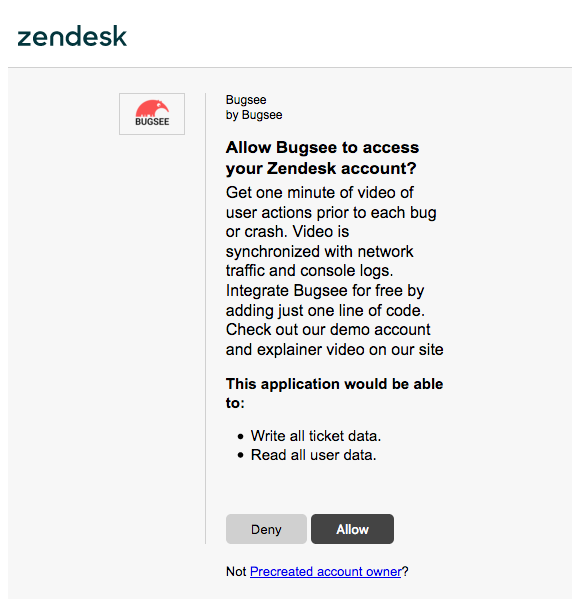

## Authentication

### Supported authentication methods

- [Basic (username and password)](#basic-authentication)
- [Personal token](#personal-token)
- [OAuth](#oauth)


### Basic authentication

In order to use Basic authentication, you need to enable _"Password access"_ in Zendesk. Follow steps below to do that.

Navigate to your Zendesk and switch to **Admin** area.


Locate the *Channels* section and click on *API* item there



Switch *Password Access* to **Enabled**.



Now, when you've enabled basic authentication in Zendesk, let's configure integration in Bugsee.

Start Bugsee integration wizard and select "Basic authentication" in the first step of integration wizard. Click "Next".



Provide valid host (URL to your Zendesk), username and password.




### Personal tokens

In order to use Personal tokens, you need to enable _"Token access"_ in Zendesk. Follow steps below to do that.

Navigate to your Zendesk and switch to **Admin** area.


Locate the *Channels* section and click on *API* item there


Switch *Token Access* to **Enabled**.



Now, when you've enabled token access in Zendesk, let's configure integration in Bugsee.

Start Bugsee integration wizard and select "Personal token" in the first step of integration wizard. Click "Next".


Provide valid host (URL to your Zendesk), and paste your token. Click _"Next"_.




### OAuth

Select "OAuth" in the first step of integration wizard. Click _Next_.


You will be presented with dialog asking you to authorize Bugsee. Click _"Allow"_ to allow Bugsee access your Zendesk.




## Configuration

There are no any specific configuration steps for Zendesk. Refer to <a href="/integrations/configuration/">configuration</a> section for description about generic steps.

## Custom recipes

Bugsee can accommodate all the customizations required for your Zendesk with the help of [custom recipes](/integrations/recipes/recipes/). This section provides a few examples of using custom recipes specifically with Zendesk. For basic introduction, refer to custom recipe [documentation](/integrations/recipes/recipes/).

### Setting tags field

By default Bugsee creates and updates Zendesk tickets with Bugsee issue _labels_ as Zendesk _tags_. But _labels_ list can be overridden inside your custom recipe. For example you can add some new _label_ (Zendesk _tag_) to existing ones:

```javascript
function create(context) {
	// ....

    return {
    	// ...
    	labels: [...issue.labels, "My awesome tag"]
    };
}

function update(context, changes) {
	const result = {};
	// ...
    
    if (changes.labels) {
        result.labels = [...changes.labels.to, "My awesome tag"];
    }

	return {
        issue: {
            custom: {}
        },
        changes: result
    };
}
```

### Setting resource type

Bugsee creates Zendesk _tickets_ by default. But also allows to create entities with different resource type, for example _requests_. You just need to tweak _custom_ field inside your custom recipe:

```javascript
function create(context) {
	// ....

    return {
    	// ...
    	custom: {
          as: "request"
      }
    };
}
```