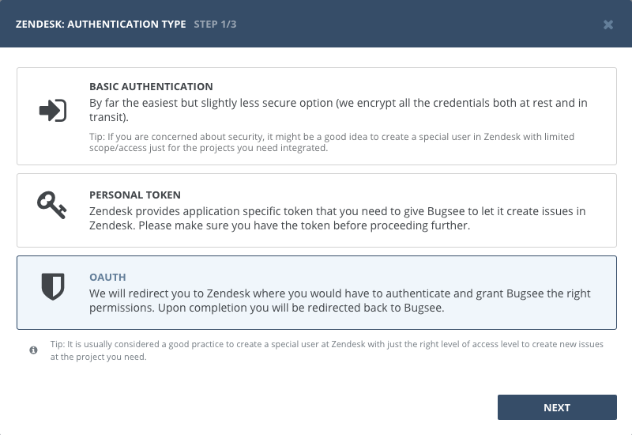
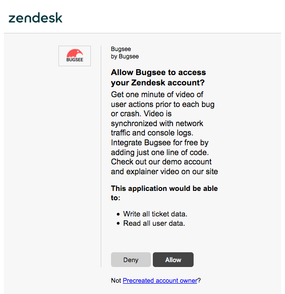

## Authentication

### Supported authentication methods

- [OAuth](#oauth)

:::info
Zendesk removed email and password authentication on 12 January 2026, and new Bugsee integrations are connected with OAuth. An existing integration that authenticates with an API token keeps working; one that still uses a password must be reconnected.
:::


### OAuth

Select "OAuth" in the first step of integration wizard. Click _Next_.



You will be presented with dialog asking you to authorize Bugsee. Click _"Allow"_ to allow Bugsee access your Zendesk.




## Configuration

There are no specific configuration steps for Zendesk. Refer to <a href="/integrations/configuration/">configuration</a> section for description about generic steps.

## Custom recipes

Bugsee can accommodate all the customizations required for your Zendesk with the help of [custom recipes](/integrations/recipes/recipes/). This section provides a few examples of using custom recipes specifically with Zendesk. For basic introduction, refer to custom recipe [documentation](/integrations/recipes/recipes/).

### Setting tags field

By default Bugsee creates and updates Zendesk tickets with Bugsee issue _labels_ as Zendesk _tags_. But _labels_ list can be overridden inside your custom recipe. For example you can add some new _label_ (Zendesk _tag_) to existing ones:

```javascript
function create(context) {
	// ....

    return {
    	// ...
    	labels: [...issue.labels, "My awesome tag"]
    };
}

function update(context, changes) {
	const result = {};
	// ...
    
    if (changes.labels) {
        result.labels = [...changes.labels.to, "My awesome tag"];
    }

	return {
        issue: {
            custom: {}
        },
        changes: result
    };
}
```

### Setting resource type

Bugsee creates Zendesk _tickets_ by default. But also allows to create entities with different resource type, for example _requests_. You just need to tweak _custom_ field inside your custom recipe:

```javascript
function create(context) {
	// ....

    return {
    	// ...
    	custom: {
          as: "request"
      }
    };
}
```