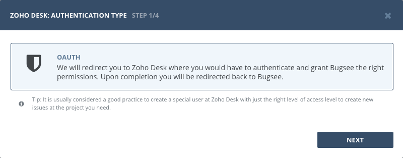
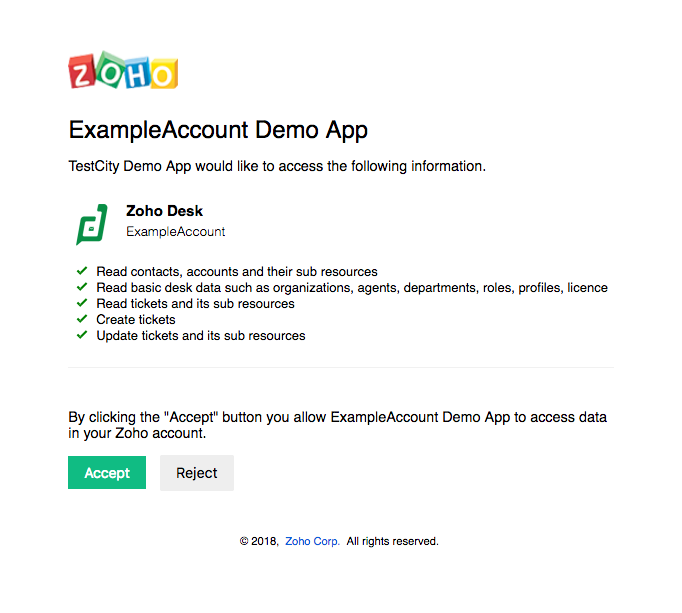
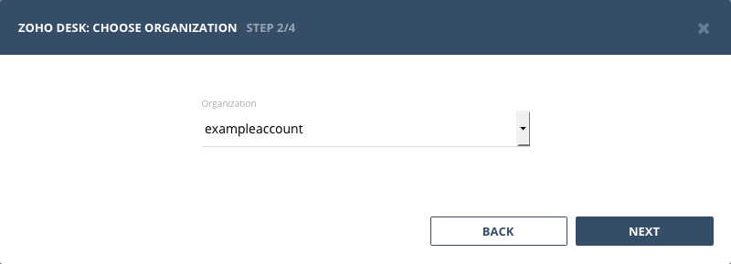
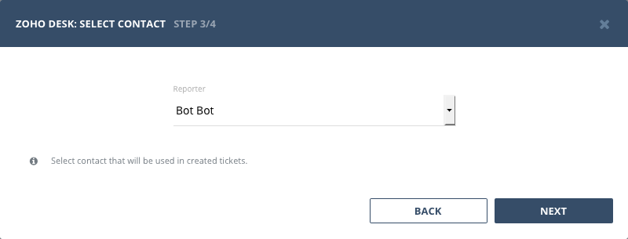

## Authentication

### Supported authentication methods

- [OAuth](#oauth)


### Personal tokens

:::info
No custom configuration required in Zoho Desk for this type of authentication.
:::

Start Bugsee integration wizard and select "OAuth" in the first step of integration wizard. Click "Next".

## OAuth



You will be presented with dialog asking you to authorize Bugsee. Click _"Allow"_ to allow Bugsee access your Zoho Desk.




## Configuration

:::info
We describe here only specific configuration steps for Zoho Desk. Generic steps are described in [configuration](/integrations/configuration/) section. Refer to it for more details.
:::

Zoho Desk allows user to be a member of different organizations at the same time. To let us know which organization you want to use in integration you need to select it during configuration steps.



To create ticket in Zoho Desk we need to fill _"Contact"_ field (which is mandatory). You need to select contact you want to be assigned when ticket created during configuration steps:




## Custom recipes

Bugsee can accommodate all these customizations with the help of [custom recipes](/integrations/recipes/recipes/). This section provides a few examples of using custom recipes specifically with Zoho Desk. For basic introduction, refer to custom recipe [documentation](/integrations/recipes/recipes/).

### Setting tags field

By default Bugsee creates and updates Zoho Desk tickets with Bugsee issue _labels_ as Zoho Desk _tags_. But _labels_ list can be overridden inside your custom recipe. For example you can add some new _label_ (Zoho Desk _tag_) to existing ones:

```javascript
function create(context) {
	// ....

    return {
    	// ...
    	labels: [...issue.labels, "My awesome tag"]
    };
}

function update(context, changes) {
	const result = {};
	// ...
    
    if (changes.labels) {
        result.labels = [...changes.labels.to, "My awesome tag"];
    }

	return {
        issue: {
            custom: {}
        },
        changes: result
    };
}
```
