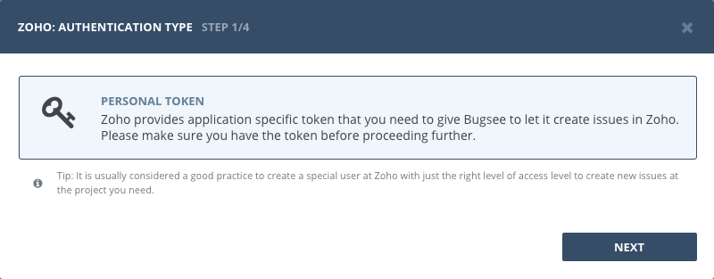
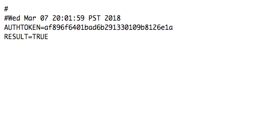
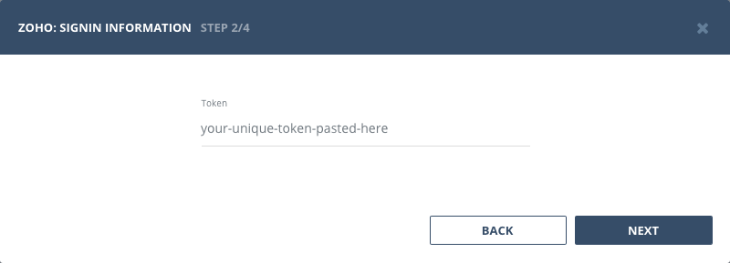
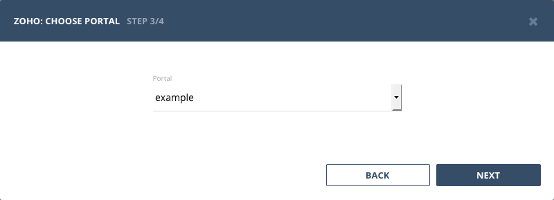

## Authentication

### Supported authentication methods

- [Personal token](#personal-token)

### Personal tokens

:::info
No custom configuration required in Zoho Projects for this type of authentication.
:::

Start Bugsee integration wizard and select "Personal token" in the first step of integration wizard. Click "Next".

You will be presented with the window where your token will be printed. Copy it and close the window.

:::info
If you receive EXCEEDED_MAXIMUM_ALLOWED_AUTHTOKENS instead of actual token, then you've reached maximum number of tokens you can generate. Log in to [https://accounts.zoho.com](https://accounts.zoho.com), then *Click Active Authtoken* and remove unwanted authtokens, so that you could generate new authtoken.
:::

Paste the token copied in previous step. Click _"Next"_.

## Configuration

:::info
We describe here only specific configuration steps for Zoho Projects. Generic steps are described in [configuration](/integrations/configuration/) section. Refer to it for more details.
:::

All the projects in Zoho Projects reside within portals. That's why we have one extra step that asks you to select portal you want to load projects from:

