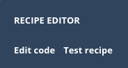
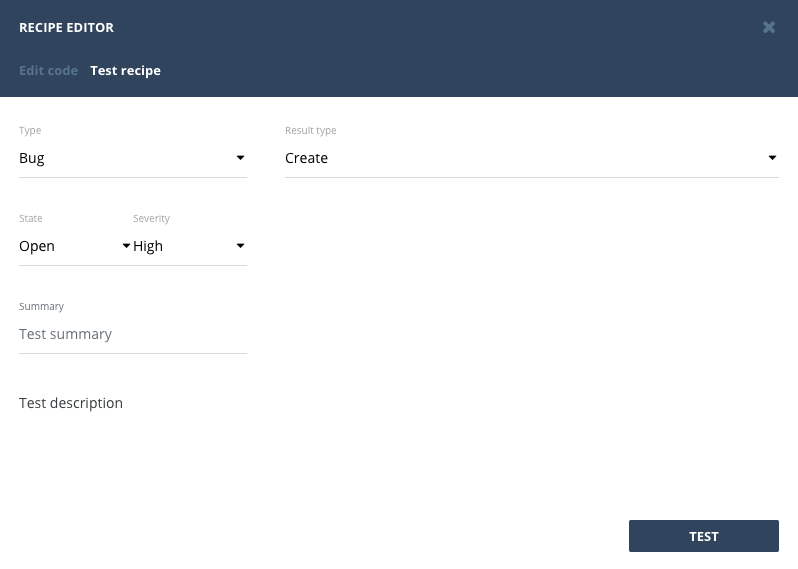
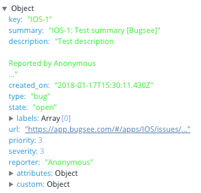

Recipes are just little pieces of code, and as any code they also may contain bugs or just unhandled corner cases. To assist you in debugging those Bugsee provides you with a playground where you can try and check various options and execute recipe in test environment.

To ease testing we've placed test controls right next to recipe editor itself. You can find them in "Test recipe" tab in "Recipe editor" dialog.

After clicking on "Test recipe" you will be presented with the following dialog

In the left pane you can find all the recipe inputs you can change. Below is a table describing each field.

|Input|Recipe field|Description|
|---|---|---|
|Type|type|Issue type. Can be one of: 'bug', 'crash' or 'error'|
|State|state|Issue state. Can be one of: 'open' or 'closed'|
|Severity|severity|Issue severity. Ranges from 1 through 5.|
|Summary|summary|Short line of text that briefly describes an issue|
|Description|description|Detailed multi-line description for issue|

All the inputs are set to some dummy defaults, so you can click "Test" button at the bottom right away to check out how things work.

After setting desired values to inputs and clicking "Test" button at the bottom of dialog, you will shortly receive result in the right pane. Unlike the normal integration flow that either creates or updates an item in remote system, test recipe flow does both simultaneously. Hence, the testing response will also contain results for both and you need to switch between the two. And that is what "Result type" drop down is designed for. It lets you display either of the results.

### Test results: Create

Creation result is quite straightforward. You get the issue object that will be used to push data to remote service.

### Test results: Update

Update result is a bit more complicated. It is represented by array with three objects:

- resulting issue
- changes
- final updates

<code>Resulting issue</code> is the same object to what you may discover for "Create" case. <code>Changes</code> contains the fields with values of <code>{ from: '', to: '' }</code> which denotes what value was before and what became after the update. And the last object contains the actually updated fields (it's just a subset of the first one which shows what was actually changed).