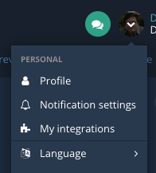

There are two ways to connect an MCP client to the Bugsee MCP server. Pick whichever your client supports — the resulting capabilities are identical.

- **OAuth 2.1** — paste a single URL (`https://api.bugsee.com/mcp`) into the client. The client opens a browser, you sign in to Bugsee, approve the connection once, and the client receives a scoped, rotating access token. No long-lived secret lives on the user's machine. Recommended for any client that supports it.
- **Personal access token** — generate a token from the Bugsee dashboard and paste a URL that embeds it (`https://api.bugsee.com/mcp/<token>`) into the client config. Use this for clients that don't yet support OAuth, or for unattended setups (CI agents, scripts).

The base URL `https://api.bugsee.com/mcp` is the same for both flows; only the auth differs.

:::warning[Treat token-bearing URLs like a password]
The token-embedded form (`/mcp/<token>`) carries credentials in the URL. Anyone who obtains that URL gets the same access to your Bugsee data as you do. Never share it, never commit it to a repository, and prefer OAuth where the client supports it.
:::

## Option 1: OAuth (recommended)

Most MCP clients now support OAuth. The first time the client calls the Bugsee MCP server it discovers the OAuth metadata (`/.well-known/oauth-authorization-server` and `/.well-known/oauth-protected-resource/mcp`), registers itself via Dynamic Client Registration ([RFC 7591](https://datatracker.ietf.org/doc/html/rfc7591)), and walks the user through an interactive sign-in.

To connect:

1. In your MCP client, add a new MCP server with the URL `https://api.bugsee.com/mcp`.
2. The client opens your browser and prompts you to sign in to Bugsee.
3. Bugsee asks you to confirm the connection and shows the application name supplied by the client.
4. Approve. The client receives an access token (typically valid 1 hour, refreshed silently) and is now connected.

The granted scope is **`mcp:read`** — read-only access to your Bugsee account. See [Security](/mcp/security) for details on the OAuth flow, scopes, and revocation.

### Managing OAuth sessions

You can view and revoke active OAuth sessions from the Bugsee dashboard at **My Integrations**. Each session shows the connecting application's name, the date it was authorized, and a button to revoke. Revoking immediately invalidates both the access token and any pending refresh token; the client will need to walk through sign-in again.

## Option 2: Personal access token

For clients that don't yet support OAuth, create a long-lived personal access token from the dashboard.

1. Open **My Integrations** in the Bugsee user menu, or navigate to it directly: [app.bugsee.com/#/settings/user/integrations](https://app.bugsee.com/#/settings/user/integrations).
2. Click **New token**, give it a recognizable name (e.g., `home-laptop-cursor`, `ci-bot`).
3. Copy the resulting URL — `https://api.bugsee.com/mcp/<token>`. The token is shown once.
4. Paste that URL into your MCP client (see per-client snippets below).



Personal tokens do not expire on their own. Revoke them from the same page when no longer needed.

## Per-client setup

The URL you paste depends on which auth flow you chose. Replace `<MCP-URL>` below with either:

- OAuth: `https://api.bugsee.com/mcp`
- Personal token: `https://api.bugsee.com/mcp/<your-token>`

### Claude Desktop

**Via Connectors (recommended, OAuth):**

1. Open Claude Desktop.
2. Go to **Settings** → **Connectors**.
3. Click **Add** and paste `https://api.bugsee.com/mcp`.

**Via JSON config** (token-bearing URL or `mcp-remote` wrapper if OAuth isn't yet supported in your Claude version):

1. **Settings** → **Developer** → **Edit Config** to open `claude_desktop_config.json`.
2. Add:

   ```json
   {
       "mcpServers": {
           "bugsee": {
               "command": "npx",
               "args": [
                   "-y",
                   "mcp-remote",
                   "<MCP-URL>"
               ]
           }
       }
   }
   ```

3. Restart Claude Desktop.

The JSON path requires Node.js (specifically `npx`) on your machine. If `npx` lives outside the default `$PATH` (e.g., under `asdf`), use the absolute path returned by `asdf which npx` instead of bare `npx`.

### Cursor

**Automatic:** The **My Integrations** dialog in the Bugsee dashboard generates a one-click `cursor://` install URL for personal-token connections.

**Manual:**

1. **Settings** → **Cursor Settings** → **Tools & MCP**.
2. Click **New MCP server** and add:

   ```json
   {
       "mcpServers": {
           "bugsee": {
               "url": "<MCP-URL>"
           }
       }
   }
   ```

### Windsurf

1. **Settings** → **Windsurf Settings** → **Cascade** → **MCP Servers** → **View raw config**.
2. Add:

   ```json
   {
       "mcpServers": {
           "bugsee": {
               "serverUrl": "<MCP-URL>"
           }
       }
   }
   ```

### Visual Studio Code (GitHub Copilot Chat)

1. Open the Command Palette (`Cmd/Ctrl + Shift + P`).
2. Run **MCP: Add Server**.
3. Choose **HTTP (HTTP or Server-Sent Events)** and paste `<MCP-URL>`.

Manual config equivalent (`.vscode/mcp.json` or user settings):

```json
{
    "servers": {
        "bugsee": {
            "type": "http",
            "url": "<MCP-URL>"
        }
    }
}
```

VS Code supports OAuth; paste the bare `https://api.bugsee.com/mcp` URL and it will handle the handshake.

### Cline

1. Click the Cline icon in the VS Code sidebar.
2. From the dropdown, choose **MCP Servers** → **Remote Servers**.
3. Enter a server name (`bugsee`) and `<MCP-URL>`.
4. Click **Add Server**.

### Zencoder

1. Go to **Agent Tools** → **Add Custom MCP**.
2. Name the server `bugsee` and paste:

   ```json
   {
       "mcpServers": {
           "bugsee": {
               "url": "<MCP-URL>"
           }
       }
   }
   ```

3. Click **Install**.

### Antigravity

1. In the **Agent Panel**, open the `...` menu.
2. Choose **MCP Servers** → **Manage MCP Servers** → **View raw config**.
3. Edit `mcp_config.json`:

   ```json
   {
       "mcpServers": {
           "bugsee": {
               "serverUrl": "<MCP-URL>"
           }
       }
   }
   ```

4. Restart Antigravity.

## Other MCP clients

The Bugsee MCP server uses the standard HTTP transport and announces its OAuth metadata via [RFC 8414](https://datatracker.ietf.org/doc/html/rfc8414) well-known endpoints. Any MCP client that follows the spec should be able to connect — paste the base URL and either let the client run the OAuth handshake, or fall back to the token-bearing URL form.

If you connect a client we haven't listed, we'd love to hear about it. File an issue or reach out via the support chat.
