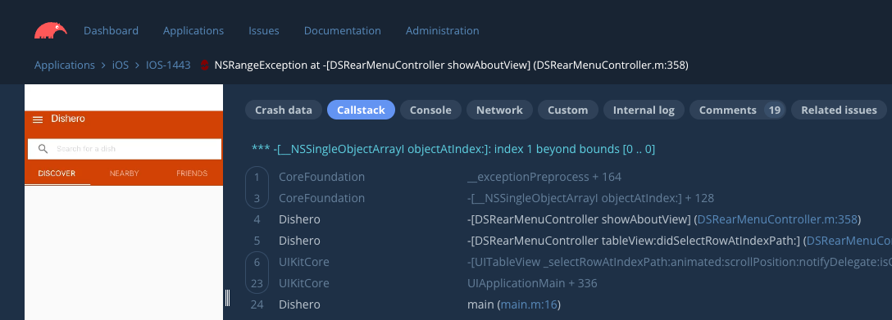
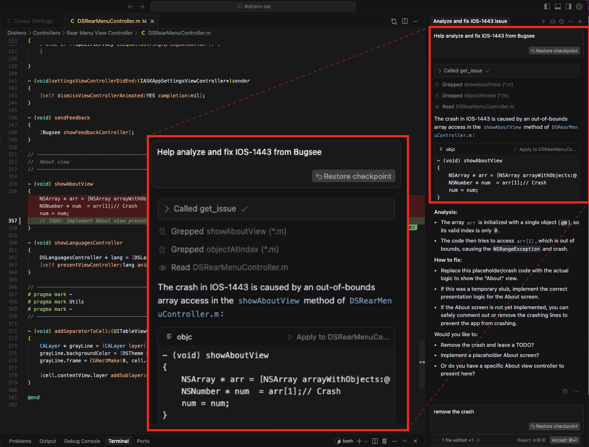

## Tools

The Bugsee MCP server exports eleven tools across three resource families. All are read-only except `trigger_build_vuln_scan`, which queues a vulnerability scan against an existing build.

| Family | Tool | Purpose |
|---|---|---|
| Applications | [`list_applications`](#list_applications) | Discover application keys |
| Issues | [`list_issues`](#list_issues) | Paginated issue listing with filters |
| Issues | [`get_issue`](#get_issue) | Full issue report with optional logs and per-thread stacks |
| Issues | [`get_issue_resource`](#get_issue_resource) | Presigned URL for an issue resource (video, screenshot, network log, attachment, native crash artifact, …) |
| Builds | [`list_builds`](#list_builds) | Paginated build listing with filters |
| Builds | [`list_latest_builds`](#list_latest_builds) | One build per `(package_id, format, build_configuration)` lineup |
| Builds | [`get_build`](#get_build) | Single build, light by default with opt-in heavy fields |
| Builds | [`get_build_by_commit`](#get_build_by_commit) | Build lookup by VCS commit SHA |
| Builds | [`get_build_regressions`](#get_build_regressions) | Flat regression view: size / deps / timings vs baseline |
| Builds | [`list_build_vulnerabilities`](#list_build_vulnerabilities) | Vulnerability-scan summary + diff for a build |
| Builds | [`trigger_build_vuln_scan`](#trigger_build_vuln_scan) | Queue a vulnerability scan against a build (mutating) |

### list_applications

List all applications accessible to the current user. Takes no parameters.

**Response fields:**

| Field | Description |
|---|---|
| `id` | Application ID (Mongo ObjectId hex) |
| `key` | Application key used in issue keys (e.g., `MYAPP` in `MYAPP-123`) |
| `name` | Display name |
| `description` | Free-form description (may be empty) |
| `type` | `ios`, `android`, or `web` |
| `subtype` | Wrapper / framework if any (e.g., `react_native`, `flutter`, `unity`, `dotnet`, `xamarin`, `cordova`, `kmp`) |

Use this tool first when the agent doesn't yet know which application key to query.

### list_issues

List issues for a given application. Returns a paginated response (50 issues per page).

**Parameters:**

| Parameter | Type | Required | Description |
|---|---|---|---|
| `application_id_or_key` | string | Yes | The application ID or key (e.g., `"MYAPP"`) |
| `type` | string | No | Filter by issue type: `"bug"`, `"error"`, or `"crash"` |
| `status` | string | No | Filter by issue status: `"open"` or `"closed"` |
| `version` | string | No | Filter by application version (e.g., `"1.2.3"`) |
| `reporter_email` | string | No | Filter by reporter email address |
| `sort` | string | No | Sort order. One of: `"date_desc"` (default), `"date_asc"`, `"events_desc"`, `"events_asc"`, `"users_desc"`, `"users_asc"` |
| `cursor` | string | No | Pagination cursor from a previous response to fetch the next page |

**Response fields:**

- `issues` — array of issues, each containing `id`, `key`, `type`, `status`, `severity`, `summary`, `created_on`, `updated_on`; plus `events_count` and `users_count` for crashes/errors, or `description` for bugs
- `total` — total number of matching issues
- `nextCursor` — present if more pages exist; pass it as `cursor` to fetch the next page

### get_issue

Get a single issue by its key (e.g., `"MYAPP-123"`). Returns a plain-text report with markdown sections covering timing, environment, summary, exception details, and optionally per-thread stacks and logs.

**Parameters:**

| Parameter | Type | Required | Description |
|---|---|---|---|
| `issue_key` | string | Yes | The issue key in `"APPKEY-NUMBER"` format (e.g., `"MYAPP-123"`). Use `list_issues` first to discover available keys. |
| `include_all_threads` | boolean | No | When `true`, include stack traces for **all** threads in the crash dump, not just the crashed/target thread. Useful for diagnosing deadlocks, thread-related crashes, or cases where the crashed thread alone does not explain the failure. Native iOS/Android dumps may contain dozens of threads, so response size grows accordingly. No effect on bug-type issues. Default: `false`. |
| `include_logs` | object | No | Log filter configuration. If omitted, logs are **not** included. See below. |

**Log filter options** (`include_logs`):

| Parameter | Type | Description |
|---|---|---|
| `entries` | string | **Required.** Which log entries to include: `"all"`, `"errors"`, or `"range"`. |
| `max_log_entries` | number | Maximum number of log entries to return. For `"all"`, keeps the last N entries (closest to crash). For `"errors"` and `"range"`, keeps the first N. Recommended: start with 50–100 for initial triage. |
| `deduplicate_errors` | boolean | When `true` and `entries="errors"`, groups identical error messages and returns a count summary. |
| `errors_surrounding` | object | Context around error entries (only with `entries="errors"`). Fields: `entries_before`, `entries_after` (number of entries), `time_before`, `time_after` (milliseconds). |
| `range` | object | Range specification (only with `entries="range"`). Fields: `from_index`, `to_index` (entry positions), `from_time`, `to_time` (timestamps in ms). |

:::tip[Recommended workflow]
1. Call `get_issue` **without** `include_logs` to inspect the issue first.
2. If logs are needed, use `entries="errors"` with `deduplicate_errors=true` or `max_log_entries` to limit output.
3. Use `entries="all"` only when you specifically need the full session log.
:::

**Response sections:**

- **Issue timing** — start/end timestamps
- **Environment** — device, OS, app version (YAML format)
- **Runtime** — React Native, Flutter, Unity, etc. (if applicable)
- **Summary** — issue title
- **Description** — bug reports only
- **Exception** — crash/error type, signal, reason, stack trace of the crashed/target thread
- **All threads** — only when `include_all_threads=true`; one subsection per thread with the crashed thread marked
- **Logs** — only when `include_logs` is provided

### get_issue_resource

Returns a presigned, time-limited (24h) URL for a specific resource attached to an issue. Use this for content `get_issue` does not surface inline — raw video of the session, the captured screenshot, the full network traffic log, user-supplied attachments, or low-level native crash artifacts.

For `"attachment"` the response always contains a **list** (an issue may carry multiple attachments). For every other type a single entry is returned.

**Parameters:**

| Parameter | Type | Required | Description |
|---|---|---|---|
| `issue_key` | string | Yes | The issue key in `"APPKEY-NUMBER"` format. |
| `resource_type` | string | Yes | One of: `"video"`, `"screenshot"`, `"log"`, `"network"`, `"breadcrumbs"`, `"viewtree"`, `"input"`, `"events.system"`, `"events.user"`, `"traces.system"`, `"traces.user"`, `"attachment"`, `"crash"`, `"minidump"`, `"crash.trace"`, `"crash.tombstone"`, `"performance"`. |

For text-based log analysis prefer `get_issue` with `include_logs` — it returns filtered log entries inline without an HTTP fetch round trip.

### list_builds

List builds for a given application. Returns a paginated response (50 builds per page) of light per-build records.

**Parameters:**

| Parameter | Type | Required | Description |
|---|---|---|---|
| `application_id_or_key` | string | Yes | The application ID or key. |
| `size_analysis_status` | string | No | Filter by size-analysis pipeline status: `"uploading"`, `"processing"`, `"ready"`, `"failed"`, `"unavailable"`. |
| `format` | string | No | Filter by artifact format: `"aab"`, `"apk"`, `"ipa"`. |
| `build_configuration` | string | No | Filter by build configuration (e.g., `"release"`, `"debug"`). |
| `version` | string | No | Filter by application version string. |
| `package_id` | string | No | Filter by package identifier (e.g., `"com.example.app"`). |
| `query` | string | No | Free-text search across `version`, `package_id`, `uuid`, and `build_configuration` (case-insensitive substring). |
| `sort` | string | No | Sort order. One of: `"date_desc"` (default), `"date_asc"`, `"size_desc"`, `"size_asc"`. |
| `cursor` | string | No | Pagination cursor from a previous response. |

**Per-build fields (light projection):**

| Field | Description |
|---|---|
| `id` | Build ID (Mongo ObjectId hex) |
| `uuid` | Plugin-supplied build UUID; stable across re-uploads; empty when unset |
| `package_id`, `version`, `build`, `build_configuration` | Identification |
| `format` | `"aab"`, `"apk"`, `"ipa"`, or empty |
| `size_analysis_status` | Size-analysis pipeline state |
| `vuln_scan_status` | Vulnerability-scan state (`"never"`, `"queued"`, `"scanning"`, `"ready"`, `"failed"`) |
| `artifact_size` | Raw artifact byte count; `0` when unknown |
| `size_diff_artifact_trend` | `"regression"`, `"improvement"`, `"unchanged"`, or empty when no baseline |
| `has_size_summary`, `has_size_diff_summary`, `has_vuln_scan_summary` | Discoverability flags — true when `get_build` can return the corresponding heavy field |
| `vcs_commit_sha`, `vcs_branch`, `created_on` | VCS and timing |

Use `list_builds` first to discover build IDs and surface status; then use `get_build` (with `include`) for full summaries on the builds the user asks about.

### list_latest_builds

Returns the **latest build per lineup** — one entry per `(package_id, format, build_configuration)` tuple — within an application. Same per-build shape as `list_builds`.

**Parameters:**

| Parameter | Type | Required | Description |
|---|---|---|---|
| `application_id_or_key` | string | Yes | The application ID or key. |
| `limit` | number | No | Cap on lineups returned. Default `50`, max `200`. |

**When to prefer this over `list_builds`:** the user asks "what's the current state?", "which apps need attention?", "show me the latest release of each variant", or any other question that wants a snapshot of the head of every release line. `list_builds` is for paging through history or filtering by version / status / commit; `list_latest_builds` is for one-row-per-lineup current-state queries.

### get_build

Fetch a single build by ID. By default returns the **light projection** — identification (`id`, `uuid`, `package_id`, `version`, `build`, `build_configuration`, `format`), pipeline status (`size_analysis_status`, `dependencies_status`, `timings_status`, `vuln_scan_status`), the size headline (`artifact_size`, `size_diff_artifact_trend`), VCS metadata (`vcs_commit_sha`, `vcs_branch`, `vcs_provider`, `vcs_repo`), timestamps (`created_on`, `updated_on`, `vuln_scan_at`), and the `has_*` discoverability flags telling you which heavy summaries exist on the build. Heavy fields are opt-in via the `include` array — supply only the tags you need to keep token usage flat.

**Parameters:**

| Parameter | Type | Required | Description |
|---|---|---|---|
| `application_id_or_key` | string | Yes | The application ID or key. |
| `build_id` | string | Yes | Build ID — typically obtained via `list_builds`. |
| `include` | string[] | No | Heavy fields to include. See tags below. Default: empty (light only). |

**Include tags:**

| Tag | Adds |
|---|---|
| `"size_summary"` | Size analysis (artifact bytes, install size, breakdown by category, …) |
| `"size_diff_summary"` | Size regression vs the baseline build |
| `"dependencies_summary"` | Dependency mix on this build |
| `"dependencies_diff_summary"` | Dependency added/removed/changed vs the baseline |
| `"timings_diff_summary"` | Build-timings regression (per-task wall-clock deltas) |
| `"vuln_scan_summary"` | Vulnerability counts (critical/high/medium/low/info), sources, scanned-at |
| `"vuln_scan_diff_summary"` | New/resolved/unchanged vuln counts vs the previous scan of this build |
| `"build_metadata"` | Gradle/CocoaPods metadata |
| `"urls"` | Presigned S3 URLs for the detail blobs |
| `"all"` | Shorthand for every tag above |

:::tip
For the flat "did this regress?" answer prefer [`get_build_regressions`](#get_build_regressions). For vulnerability-specific queries prefer [`list_build_vulnerabilities`](#list_build_vulnerabilities). `get_build` is the full-detail catch-all.
:::

### get_build_by_commit

Look up the build associated with a specific VCS commit SHA within an application. Useful when the user references a build by its commit (`"the build for commit abc1234"`). Returns the light projection — call `get_build` with the returned ID for full detail. Returns a not-found error when no build carries that commit.

**Parameters:**

| Parameter | Type | Required | Description |
|---|---|---|---|
| `application_id_or_key` | string | Yes | The application ID or key. |
| `commit_sha` | string | Yes | VCS commit SHA (7–64 hex characters). |

### get_build_regressions

Surface size / dependencies / timings regressions for a build vs its baseline in a single flat response. Cheaper than `get_build` + multiple `include` tags when the agent just needs the "did this regress?" answer.

**Parameters:**

| Parameter | Type | Required | Description |
|---|---|---|---|
| `application_id_or_key` | string | Yes | The application ID or key. |
| `build_id` | string | Yes | Build ID. |

**Response shape:**

- `build_id` — echoed
- `has_regressions` — `true` when at least one of `size`/`deps`/`timings` carries a baseline-comparison summary
- `size` — `{ present: false }` when no baseline, otherwise `present: true` plus `artifact_trend` (`"regression"`/`"improvement"`/`"unchanged"`), `artifact_size_delta`, `artifact_size_pct`, `download_size_delta`, `download_size_pct`, `install_size_delta`, `install_size_pct`, `base_artifact_size`, `incomparable_tree`, `base_build_id`
- `deps` — `{ present: false }` or `{ present: true, compatible, incompatible_reason, added_count, removed_count, changed_count, unchanged_count, base_build_id }`
- `timings` — `{ present: false }` or `{ present: true, compatible, incompatible_reason, previous_wall_clock_ms, current_wall_clock_ms, wall_clock_delta_ms, regressed_count, improved_count, added_count, removed_count, unchanged_count, base_build_id }`

### list_build_vulnerabilities

Surface the vulnerability-scan summary for a build. Severity-bucket counts, scan status and last-scanned timestamp, the optional diff vs the **previous** scan of the **same** build, and a presigned URL the agent can fetch via HTTP for per-CVE detail.

**Parameters:**

| Parameter | Type | Required | Description |
|---|---|---|---|
| `application_id_or_key` | string | Yes | The application ID or key. |
| `build_id` | string | Yes | Build ID. |

**Response shape:**

| Field | Description |
|---|---|
| `build_id` | Echoed build ID |
| `vuln_scan_status` | `"never"`, `"queued"`, `"scanning"`, `"ready"`, `"failed"` |
| `vuln_scan_at` | ISO 8601 timestamp of the most recent scan; empty when never scanned |
| `summary.scanned_at` | ISO 8601 timestamp of the scan |
| `summary.sources` | Vuln databases queried (e.g. `["osv", "github_advisory"]`) |
| `summary.total` | Total advisories across the resolved dep graph |
| `summary.critical` / `high` / `medium` / `low` / `info` | Counts per severity |
| `summary.affected_entries_count` | Distinct dependencies that carry at least one advisory |
| `diff_summary` | `null` on the first scan, otherwise `{ previous_scanned_at, new_count, resolved_count, unchanged_count }` |
| `full_findings_url` | Presigned S3 URL for per-advisory detail (advisory IDs, affected paths, fix versions); empty when not yet produced |

Prefer this over `get_build` + `include: ["vuln_scan_summary"]` when the question is specifically about vulnerabilities — the response shape is flattened for direct consumption. Use the summary counts in-band; only fetch `full_findings_url` when the user asks for specific CVEs.

### trigger_build_vuln_scan

Queue a vulnerability scan against a specific build's resolved dependency graph (OSV + GitHub Advisory). The scan runs asynchronously in the worker; this tool returns as soon as the build is admitted to the queue.

:::caution[Mutating tool]
This is the only mutating tool the MCP server exports today. It writes the build doc and enqueues a worker message. It is **not** idempotent — repeated calls within the cooldown window are rejected, not no-op. Trigger only when the agent (or the user) has a concrete reason: the user explicitly asks for a re-scan, the advisory databases were just refreshed, or the build has never been scanned and the user wants vulnerability data.
:::

**Parameters:**

| Parameter | Type | Required | Description |
|---|---|---|---|
| `application_id_or_key` | string | Yes | The application ID or key. |
| `build_id` | string | Yes | Build ID. |

**Response: soft-outcome envelope.** Rather than failing hard for expected business states, the response carries an `outcome` discriminator the agent should branch on:

| `outcome` | Meaning | Side fields |
|---|---|---|
| `"queued"` | Accepted, worker will scan shortly. | `vuln_scan_status="queued"`, `build_id` |
| `"not_found"` | Either the application could not be resolved from the key, the resolved organization has no applications, or no such build exists under the resolved application. The `message` field disambiguates. | — |
| `"dependencies_not_ready"` | `dependencies_status != "ready"`; the deps pipeline must complete first. Read `get_build` to learn the current `dependencies_status`. | — |
| `"already_in_progress"` | A scan is currently queued / scanning. Do **not** re-trigger — poll for the result via `list_build_vulnerabilities` or `get_build`. | — |
| `"cooldown"` | A recent scan blocked this trigger. `retry_after_minutes` tells the agent how long to wait. `cooldown_reason` is `"success_cooldown"` (3h after a successful scan) or `"failure_backoff"` (shorter window after a failed attempt). | `retry_after_minutes`, `cooldown_reason` |
| `"invalid_input"` | Input failed validation (typically a malformed `build_id`, or another input-validation rejection from the service). | — |
| `"access_denied"` | User lacks `modify` permission on the application. | — |

After a `"queued"` response, poll `list_build_vulnerabilities` (or `get_build` with `include: ["vuln_scan_summary"]`) to read the result — the scan typically completes within a few minutes.

## Prompts

> Note: While most AI agents that support the MCP Protocol also support tools, prompts are less widely adopted and may not be available in your AI agent of choice.

* **/bugsee_fix** — when invoked from an agent that supports MCP prompts, pulls the supplied issue key and walks the agent through analyzing and proposing a fix.

## Example prompts by workflow

The patterns below are what most users will write into their agent of choice. They map naturally onto the tools above, so an MCP-aware model can handle them without any custom wiring on your side.

### 1. Triage overnight crashes

Start the day knowing which crashes spiked or are blocking the most users — without leaving the editor for the dashboard.

> *"Show me the open crashes in MyApp from the last 24 hours, sorted by affected users."*
>
> *"List the top 5 crashes in MyApp version 1.2.3 by event count."*

### 2. Root-cause a single crash report

Take a specific issue key (often from support or a webhook notification), pull the full crash dump, and let the agent map the stack trace onto your source files.

> *"Pull up MYAPP-1234 with the error log from the 5 seconds before the crash, then read the files in the stack trace and explain what's going wrong."*
>
> *"Get MYAPP-4567 including all threads — I think we're deadlocking on the main thread."*

The second example uses `include_all_threads=true`, which adds an "## All threads" section to the response — useful when the crashed thread alone doesn't explain the failure.

### 3. Regression hunting across releases

Diff issues between two versions of the app to spot what's new in the next build.

> *"What crash types appeared in MyApp 1.2.2 that didn't exist in 1.2.1? Show me counts."*
>
> *"Compare the open issues in MyApp 1.2.2 vs 1.2.3 — which ones are new in 1.2.3?"*

The agent issues two `list_issues` calls (one per `version` filter) and diffs the results. Follow up with "now pull the full crash for each new one and find the suspect commit" to chain `get_issue` calls.

### 4. Bug report to code change

Turn a user-submitted bug report into a proposed fix in the same conversation.

> *"Show me the latest 5 bug reports in MyApp from real users. For each, look at the relevant files and suggest a fix."*
>
> *"Find bug reports in MyApp mentioning 'login' filed by jane@example.com — pull the most recent and explain how I'd fix it."*

`list_issues` filtered by `type="bug"` plus `reporter_email` scopes down to user-submitted reports; `get_issue` returns the description and device context; the agent proposes the fix against your working tree.

### 5. Snapshot the head of every release line

When the user asks "what's the current state?" or "show me the latest of each variant", the agent should reach for `list_latest_builds` rather than `list_builds` — the former returns one row per lineup (`package_id` × `format` × `build_configuration`), which is what most "current state" questions want.

> *"List the latest release build of every variant of MyApp."*
>
> *"What's the current head of each lineup in MyApp? Highlight any with vulnerabilities."*

### 6. Did this build regress?

Use `get_build_regressions` for a flat answer across size, dependencies, and timings vs the build's baseline. Avoid `get_build` with multiple `include` tags unless the user wants the raw summary blobs.

> *"Did build 65ab… regress vs its baseline? Show size, dependency, and timing deltas."*
>
> *"Find me the latest release build of MyApp and tell me whether it's a regression."*

The second prompt chains `list_latest_builds` → `get_build_regressions`.

### 7. Trace a build from a commit

When the user mentions a commit SHA, use `get_build_by_commit` instead of paging through `list_builds`.

> *"What does the build for commit a1b2c3d look like? Did size or dependencies change?"*

The agent calls `get_build_by_commit` then chains `get_build` (with `include: ["size_diff_summary", "dependencies_diff_summary"]`) or `get_build_regressions` on the returned ID.

### 8. Audit a build's vulnerabilities

`list_build_vulnerabilities` returns the flattened severity counts plus a diff vs the previous scan of the same build — typically enough to answer "did this introduce new vulns?". For per-CVE detail, fetch the presigned `full_findings_url`.

> *"How many vulnerabilities are in the latest release build of MyApp? Are any new vs the previous scan?"*
>
> *"List the critical and high CVEs in build 65ab… — I need the advisory IDs."*

The first prompt is answered entirely from the in-band counts. The second triggers an HTTP fetch of `full_findings_url`.

### 9. Re-scan a build for fresh advisories

If the user wants to re-check a build against the current advisory databases (e.g. a new OSV publication just landed), the agent calls `trigger_build_vuln_scan`. Read the `outcome` field to decide the next move:

> *"Trigger a fresh vulnerability scan on the latest release build of MyApp and let me know when it's done."*

A `"queued"` outcome means the agent should poll `list_build_vulnerabilities` after a few minutes. `"cooldown"` means wait `retry_after_minutes`. `"already_in_progress"` means another scan is in flight — poll, don't re-trigger.

## Worked example

A crash was deliberately planted within a test iOS app that had Bugsee pre-configured. Once triggered, the crash was intercepted and symbolicated by Bugsee, and a new issue was created (**IOS-1443**):

Having a working folder open in **Cursor**, and the Bugsee MCP server [configured](/mcp/configuration), using it is as simple as asking the agent:

> *"Help analyze and fix IOS-1443 from Bugsee."*

Cursor fetches the full context (stack traces, environment, optional logs) from the Bugsee MCP server, locates the relevant files and methods in the workspace, analyzes the issue, and proposes a fix:

