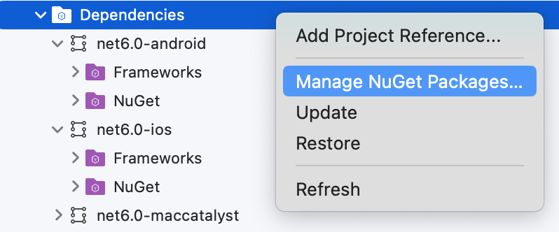
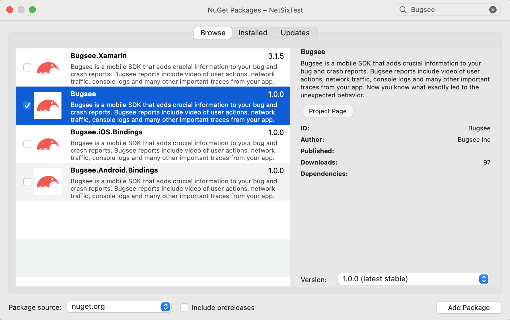

import Tabs from '@theme/Tabs';
import TabItem from '@theme/TabItem';

:::info Agent-Assisted Setup
Ask your AI coding assistant:

```text
Use curl to download, read and follow: https://docs.bugsee.com/ai/agent-skills/sdk/dotnet/SKILL.md
```

Works with Claude Code, Cursor, Copilot, Codex, and more. [Learn more](/ai/agent-skills/)
:::

Bugsee .NET SDK is currently supported on pure iOS, Android or MAUI. It supports .NET 6 and up. The recommended way to install Bugsee is using [NuGet](https://www.nuget.org).

## NuGet installation

Open your solution, select "Dependencies" within the project you want to add Bugsee package to and open its context menu. Click "Manage NuGet packages...".



Type "Bugsee" into search field, select Bugsee package and click "Add Package" button at the bottom right.



## Initialization

:::warning
iOS/iPadOS: Since v6.0.0 the underlying Bugsee iOS SDK supports the simulator; crash capture is excluded. For full functionality, launch your app with Bugsee on a real device.
:::

When possible, Bugsee provides unified API across platforms for accessing Bugsee features. Initialization, however, can be performed either from a unified (cross-platform) code or a platform-specific code, depending on your needs.


<Tabs groupId="platform">
  <TabItem value="ios" label="iOS">

```csharp
// Your AppDelegate.cs file

namespace YourNameSpace
{
  [Register("AppDelegate")]
  public class AppDelegate : MauiUIApplicationDelegate
  {
    protected override MauiApp CreateMauiApp() => MauiProgram.CreateMauiApp();

    public override bool FinishedLaunching(UIApplication application, NSDictionary launchOptions)
    {
      // Launch Bugsee
      BugseePlugin.Bugsee.Launch("<your-app-token>");

      return base.FinishedLaunching(application, launchOptions);
    }
  }
}
```

  </TabItem>
  <TabItem value="android" label="Android">

```csharp
// Your MainApplication.cs file - a subclassed Application

namespace YourNameSpace
{
  [Application]
  public class MainApplication : MauiApplication
  {
    public MainApplication(IntPtr handle, JniHandleOwnership ownership)
      : base(handle, ownership)
    {
    }

    protected override MauiApp CreateMauiApp() => MauiProgram.CreateMauiApp();

    public override void OnCreate()
    {
      base.OnCreate();

      // Launch Bugsee
      BugseePlugin.Bugsee.Launch("<your-app-token>");
    }
  }
}
```

  </TabItem>
  <TabItem value="unified" label="Unified">

```csharp
// Your MauiProgram.cs file

namespace YourNameSpace
{
	public static class MauiProgram
	{
		private static void LaunchBugsee()
		{
			var launchToken = "";
			if (DeviceInfo.Current.Platform == DevicePlatform.Android)
			{
				launchToken = "<...>";
			}
			else if (DeviceInfo.Current.Platform == DevicePlatform.iOS)
			{
				launchToken = "<...>";
			}

			BugseePlugin.Bugsee.Launch(launchToken);
		}

		public static MauiApp CreateMauiApp()
		{
			LaunchBugsee();

			var builder = MauiApp.CreateBuilder();
			builder
				.UseMauiApp<App>()
				.ConfigureFonts(fonts =>
				{
					fonts.AddFont("OpenSans-Regular.ttf", "OpenSansRegular");
					fonts.AddFont("OpenSans-Semibold.ttf", "OpenSansSemibold");
				});

			return builder.Build();
		}
	}
}
```

  </TabItem>
</Tabs>

If you need to launch Bugsee outside of the application startup sequence (e.g. later during application run time upon a user gesture),
you should use the `Launch()` method variant which accepts `BugseeLaunchContextProviderHandler`. This delegate must return the current
context of the running application. This is required on Android, where that delegate must return current activity.


```csharp
namespace YourNameSpace
{
  public partial class MainPage : ContentPage
  {
    public MainPage()
    {
      InitializeComponent();
    }

    private void OnButtonClicked(object sender, EventArgs e)
    {
      var options = new AndroidLaunchOptions();
      // Set any desired options
      options.monitorNetwork = true;

      // Platform below is from Microsoft.Maui.ApplicationModel namespace
      Bugsee.Launch(() => Platform.CurrentActivity, "<your-application-token>", options);
    }
  }
}
```