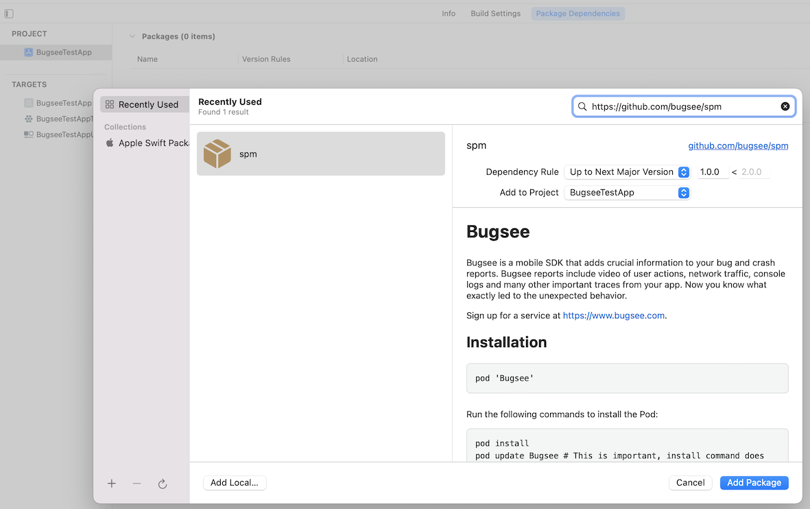

import Tabs from '@theme/Tabs';
import TabItem from '@theme/TabItem';

:::info Agent-Assisted Setup
Ask your AI coding assistant:

```text
Use curl to download, read and follow: https://docs.bugsee.com/ai/agent-skills/sdk/ios/SKILL.md
```

Works with Claude Code, Cursor, Copilot, Codex, and more. [Learn more](/ai/agent-skills/)
:::

The recommended way to install Bugsee is to use [Swift Package Manager](https://developer.apple.com/documentation/swift_packages/adding_package_dependencies_to_your_app), [CocoaPods](https://www.cocoapods.org), or [Carthage](https://github.com/Carthage/Carthage). You can also add it to your project manually by following the instructions below.

## CocoaPods


Add the following line to your project's `Podfile`.

```bash
pod 'Bugsee'
```

Run the following commands to install the Pod.

```bash
pod install
pod update Bugsee # This is important, as the install command does not guarantee you will get the latest version
```

If you are using CocoaPods you can now skip directly to [initialization](#initialization)

## Swift Package Manager

Navigate to the SPM section in your project, add a new package, point it to

```
https://github.com/bugsee/spm
```

and select the latest version.



## Carthage

Add the following line to your project’s `Cartfile`.

```bash
binary “https://download.bugsee.com/sdk/ios/dynamic/Bugsee.json”
```

Run the following commands to update the library.

```bash
carthage update --use-xcframeworks
```

Drag Bugsee.xcframework from Carthage/Build to your project’s Frameworks, Libraries, and Embedded Content section in Xcode.

For more information refer to [Carthage Documentation](https://github.com/Carthage/Carthage)

## Manual

Download the latest version from [here](https://download.bugsee.com/sdk/ios/dynamic/Bugsee-stable.xcframework.zip) and extract it.
Copy `Bugsee.xcframework` to your project by drag and dropping it into the right location:


## Initialization

:::warning
Since v6.0.0 the Bugsee iOS SDK supports the simulator; crash capture is excluded. For full functionality, launch your app with Bugsee on a real device.
:::

Locate your app delegate and initialize the framework in the _application:didFinishLaunchingWithOptions_ method:


<Tabs groupId="lang-ios">
  <TabItem value="objective-c" label="Objective-C">

```objectivec
@import Bugsee;

//...

- (BOOL)application:(UIApplication *)application
    didFinishLaunchingWithOptions:(NSDictionary *)launchOptions {
    // ...other initialization code

    [Bugsee launchWithToken:@"<your_app_token>"];

    return YES;
}
```

  </TabItem>
  <TabItem value="swift" label="Swift">

```swift
import Bugsee

//...

func application(_ application: UIApplication, didFinishLaunchingWithOptions launchOptions: [UIApplicationLaunchOptionsKey: Any]?) -> Bool {
    // ...other initialization code

    Bugsee.launch(token:"<your_app_token>")

    return true
}
```

  </TabItem>
</Tabs>

## Debug builds

If you want to build and enable Bugsee only in debug builds, there are a few things you need to do.

If you are using CocoaPods, add the following line to your project's Podfile.

```bash
pod 'Bugsee', :configurations => ['Debug']
```

For SPM or Carthage, exclude the Bugsee dependency from release configurations in your Xcode build settings.

Then you have to wrap every reference to Bugsee in your code with conditional compilation flags as the following examples show:

<Tabs groupId="lang-ios">
  <TabItem value="objective-c" label="Objective-C">

```objectivec
#ifdef DEBUG
#import <Bugsee/Bugsee.h>
#endif

// ...

#ifdef DEBUG
[Bugsee launchWithToken:@"<your_app_token>"];
#endif
```

  </TabItem>
  <TabItem value="swift" label="Swift">

```swift
#if DEBUG
import Bugsee
#endif

// ...

#if DEBUG
Bugsee.launch(token: "<your_app_token>")
#endif
```

  </TabItem>
</Tabs>

## TestFlight builds

It makes sense in some cases to enable Bugsee on builds distributed through TestFlight
but keep it disabled on builds distributed through the App Store. There is an easy way to
detect a TestFlight build at runtime. You might come up with a more complex use case
where Bugsee is enabled for both TestFlight and Release builds but with different
[configuration](/sdk/ios/configuration/) options. The example below shows a simple
case of completely disabling it in the production build.

:::warning
Application crashes can be intercepted by the system instead of Bugsee for builds installed via TestFlight.
You can disable "Share With App Developers" system option on test devices in *Settings > Privacy & Security > Analytics & Improvements*.
:::


<Tabs groupId="lang-ios">
  <TabItem value="objective-c" label="Objective-C">

```objectivec
- (BOOL)application:(UIApplication *)application
    didFinishLaunchingWithOptions:(NSDictionary *)launchOptions {
    // ...other initialization code

    if ([[[[NSBundle mainBundle] appStoreReceiptURL] lastPathComponent] isEqualToString:@"sandboxReceipt"]) {
        // We are in TestFlight, enable Bugsee!
        [Bugsee launchWithToken:@"<your_app_token>"];
    }

    return YES;
}
```

  </TabItem>
  <TabItem value="swift" label="Swift">

```swift
func application(_ application: UIApplication, didFinishLaunchingWithOptions launchOptions: [UIApplicationLaunchOptionsKey: Any]?) -> Bool {
    // ...other initialization code

    let isRunningTestFlightBeta = Bundle.main.appStoreReceiptURL?.lastPathComponent == "sandboxReceipt"
    if isRunningTestFlightBeta {
        Bugsee.launch(token:"<your_app_token>")
    }

    return true
}
```

  </TabItem>
</Tabs>

